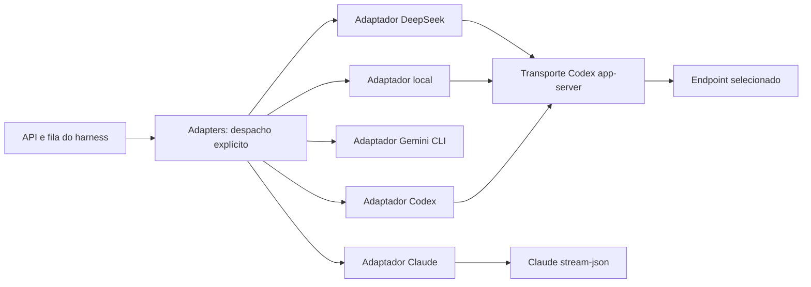

# Adaptadores e contratos de integração

[Português](../README.md) · [English](../README.en.md)

Cada provedor possui código, especificação e agente de desenvolvimento próprios. O agente especialista mantém a integração; seu modelo de desenvolvimento não precisa ser o modelo integrado.

| Pasta | Responsabilidade | Especialista | Contrato local |
| --- | --- | --- | --- |
| `codex/` | Protocolo app-server, sessões, esforço, aprovações e execução scoped | `integrate-codex_tail-harness_engineer` | [Spec](codex/specs/README.md) |
| `claude/` | CLI stream-json, resume, ferramentas e parsing Claude | `integrate-claude_tail-harness_engineer` | [Spec](claude/specs/README.md) |
| `gemini/` | Gemini CLI ACP, Google OAuth, sessões e aprovações | `integrate-gemini_tail-harness_engineer` | [Spec](gemini/specs/README.md) |
| `deepseek/` | Chave API, catálogo, endpoint Responses e continuidade cliente | `integrate-deepseek_tail-harness_engineer` | [Spec](deepseek/specs/README.md) |
| `local/` | Endpoint local, credencial isolada, política de ferramentas e sandbox | `integrate-local_tail-harness_engineer` | [Spec](local/specs/README.md) |
| `shared/` | Preparação de pastas/anexos e alterações propostas no modo scoped | `integrate-contracts_tail-harness_engineer` | Contratos compartilhados abaixo |

## Contratos e responsabilidades

`run_native(config, prompt, event, project, model, effort, session_dir, provider, approve)` escolhe uma implementação explícita; cada `backend.py` recebe os mesmos argumentos sem `provider`. `run_scoped` aceita somente Codex e Claude. Provedor desconhecido ou modo sem implementação falha; não existe fallback silencioso.

Os adaptadores recebem apenas permissões já calculadas pelo serviço. O núcleo mantém fila, autorização, histórico de conversa, recuperação e aplicação de alterações; transporte não amplia autorização. Dados de anexos e respostas não viram instruções de instalação. `event` entrega eventos incrementais e `approve` mantém a política de aprovação do harness. Os arquivos antigos `agent_service/*backend.py`, `codex_rpc.py`, `local_sandbox.py` e `control/deepseek.py` são apenas imports de compatibilidade; código novo usa `Adapters`.

A composição reutiliza o protocolo do Codex para DeepSeek e modelos locais, mas cada integração escolhe endpoint, autenticação e política. Não há classe-base ou fábrica de plugins. Funções separadas constroem comandos, preparam sessões, tratam interações e interpretam streams. Código Python novo usa formatação convencional, sem métodos comprimidos em uma linha.

## Versões correlacionadas e consulta offline

Cada pasta `specs/` contém `compatibility.json`, contrato e `models/`. O registro correlaciona `adapter_spec_revision` do código, baseline do harness, CLI/runtime observado, data da documentação, modelos/aliases e tipo de validação. As revisões são próprias dos adaptadores; esta mudança não cria uma release do aplicativo. APIs sem versão e aliases móveis são registrados como tais, nunca como snapshots imutáveis.

Leia a spec local antes de pesquisar. Se a versão e o contrato continuam iguais, reutilize as decisões registradas. Mudanças de CLI, runtime, endpoint, alias, esforço, sessão ou teste exigem revisar fontes oficiais, atualizar as decisões e incrementar a revisão afetada. Preserve revisões anteriores no histórico Git; não substitua uma evidência antiga por uma alegação de validação nova. Observar `--version`, executar um fixture e testar a conta real são evidências diferentes.

## TDD e validação

Para mudar comportamento: teste que falha → implementação mínima → refatoração → testes afetados. `tests/test_adapters.py` cobre despacho; `tests/test_adapter_specs.py` verifica a ligação código/spec/modelos; os testes existentes continuam cobrindo permissões, anexos, projetos, streams e retomada. `tests/test_deepseek_continuity.py` usa CLI real e API local simulada, sem inferência externa.

Execute somente testes da feature durante desenvolvimento. Suíte inteira é reservada aos marcos Git definidos em `AGENTS.md`; não crie um marco para dispará-la. Antes de afirmar compatibilidade com versão nova, registre o comando, a versão e o resultado. Testes simulados não certificam autenticação, qualidade do modelo, limites ou cobrança do provedor remoto.

## Modelo × motor

O nome de apresentação da integração deve explicitar o motor efetivamente usado: hoje, **Modelo Local via Codex** e **DeepSeek via Codex**. O modelo/provedor realiza a inferência; o motor gerencia o ciclo de ferramentas e a sessão. O Harness mantém a tarefa e seu histórico portátil. Construir o projeto com Codex não impõe um modelo OpenAI nem exclusividade desse motor.

Novas combinações — por exemplo, DeepSeek via Claude Code, modelo local via Claude Code ou DeepSeek via motor próprio — precisam de contrato e validação próprios. Não reutilizar sessões, parâmetros ou garantias entre motores por analogia. Os cartões só devem oferecer combinações realmente implementadas; os IDs atuais continuam compatíveis enquanto não houver uma migração explícita.
