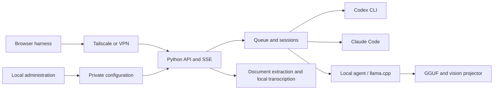
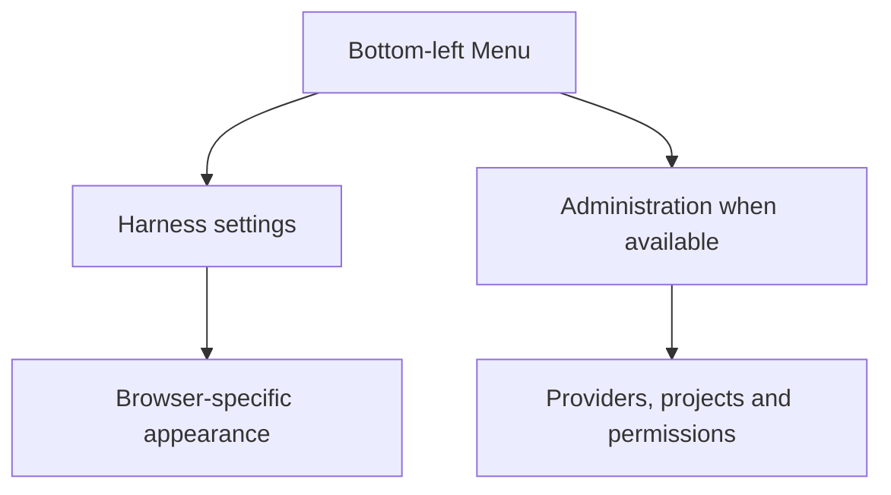

# Tail Harness

[Português (Brasil)](README.md) · [English](README.en.md)

A local Python control panel for discovering, configuring and running Codex CLI, Claude Code, Gemini CLI and local AI models, with a conversational harness accessible through Tailscale or another VPN. Python 3.11+, MIT license, version **0.5.0**.


The file panel uses Material Icon Theme (MIT), with extension-specific icons and colored folders matched by name, served locally. Each message accepts up to **20 attachments**, through uploads or file/folder selection. Icons identify formats; reading their contents still depends on the formats supported by the service.

## AI-guided installation

Tail Harness is installed by an AI agent that inspects the server, reuses existing CLIs and credentials, configures provider panels and runs post-installation checks. Follow the [AI installation specification and checkpoints (Portuguese)](dossie/installation-agent-spec.md).

Ask the agent: **“Install Tail Harness following `dossie/installation-agent-spec.md`, report progress, ask about unresolved decisions and deliver test evidence.”**

The procedure covers port conflicts, available models, provider capabilities, connectors, plugins, artifacts, persistence, startup and error recovery. The agent performs and verifies each step; legacy installers still present in the repository are not the recommended installation workflow.

Default addresses are **http://127.0.0.1:8094/** for administration and **http://127.0.0.1:8095/** for conversations. The agent must check availability and ask which alternative to use on conflict. Administration stays on loopback; VPN sharing requires authorized configuration. By default, the agent discovers and enables existing models and resources that are available, authenticated when required, and supported by the integration. It records incompatible or unauthenticated resources; entries merely available in a catalog are not installed automatically.

## Configure providers

1. Add a provider from the dashboard and inspect discovered services.
2. Complete the CLI's official authorization flow using the link shown in Operations.
3. Choose models and integrations; configure permissions for local models.
4. Save an enabled model; the harness starts automatically.
5. For remote access, authorize Tailscale identities or configure a private VPN address and access key.

Discovery does not grant permissions. DeepSeek supports bringing your own API key; credentials are stored privately and excluded from exports. Codex and Claude inference uses their respective cloud services. The local backend uses Codex as an agent with a local inference endpoint; enabled internet tools and integrations can still make external requests.

## Conversations and navigation

The harness supports persisted SSE streaming, conversation history, model/effort selection, cancellation, attachments, approval prompts and tool activity. Reasoning summaries, compaction and token metrics are shown only when provided by the executor. Codex account quota is refreshed before/after execution and periodically in the header; Claude quota appears when its CLI events supply utilization, labeled with the last observation time.

The bottom-left **Menu** groups **Settings** and **Administration**. Administration is shown only when its URL is available. Settings retains the independent harness theme preference. The sidebar no longer has separate Reload screen or Collapse buttons; the header navigation toggle remains useful on mobile. Automatic refresh waits until it can preserve the current work.

## Local models and attachments

The inventory discovers local llama.cpp processes and Ollama models. Model weights and runtime binaries remain outside the package. Saved CPU/GPU and permission profiles belong to their model, rather than every local model collectively. The agent adapter requires a compatible endpoint and tool-capable model; discovery alone does not demonstrate successful inference.

Supported attachment paths include text/source files, CSV/TSV, selectable-text PDF, EPUB without DRM, DOCX/PPTX/XLSX and OpenDocument text extraction. Large documents have a labeled excerpt plus a full local text file for bounded tool reads. Image forwarding requires a compatible native executor; local vision is checked against the running server. Optional whisper.cpp performs offline speech transcription. Uploaded folder workspaces use a separate extraction path and do not automatically inherit all single-file transformations.

Limits include 50 MiB per document, 5 MiB per image, and two hours / 256 MiB per audio upload. The increased audio and context limits have not been load-tested. Scanned PDFs, encrypted/DRM documents, legacy binary Office formats and native audio reasoning are not automatically supported. See the [attachment specification](dossie/UC-004-multimodal-attachments.md).

## Permissions and integrations

Outside a project, local model permissions and folders apply. Inside a project, explicit project grants and folders are added to the model grants. Upload permission does not imply vision or tool compatibility.

Register compatible MCP HTTPS/stdio servers and select integrations for supported CLI executors. OAuth links are surfaced by the panel; accounts must still be authorized with their provider. Client-side connectors do not automatically transfer to the server. Generic Codex/Claude native execution is not a filesystem jail; the local executor has additional Linux sandbox isolation. Internet permission is not a universal firewall for arbitrary external processes.

Authorized clients have separate histories and approvals, but this is not a strong isolation boundary for mutually untrusted users sharing operating-system credentials. Use separate OS users or isolated instances for that scenario.

## MCP on another computer

Open **Connection / MCP** in the harness and download the installer. On Linux/macOS with Python, curl and Claude Code installed:

```sh
cd ~/Downloads
chmod +x setup-mcp.sh
./setup-mcp.sh 'https://YOUR-TAILSCALE-SERVER'
```

Use the URL displayed by your installation and check `/mcp` in Claude Code. Other MCP clients can launch `agent_service/mcp_bridge.py` with an appropriate Python interpreter and `LOCAL_AGENT_URL`. VPN keys belong in a private file, never in Git or prompts.

The bridge supports model/project discovery, file and workspace transfer, tasks, compact progress, artifacts, cancellation and approvals. Continue a session with the latest `job_id` as `parent_job_id`. Optional Maestro plans bounded sequential tasks among eligible executors; otherwise automatic execution chooses the configured default or an eligible service. Registered project systemd units can be controlled only through the corresponding permissions and explicit requests.

## Architecture





## Persistence and portable configuration

Production state defaults to `~/.local/share/tail-harness`: settings, model profiles, conversations and attachments. Temporary previews using `/tmp` do not replace production state. Export and import settings through the dashboard when moving installations; moving only the code or database does not migrate every permission.

Configuration exports omit credentials but may contain local paths and authorized identities. Treat them as private. Conversation deletion in the UI is logical, not guaranteed physical erasure. Administrators are responsible for backups and retention. Editable installs follow the checkout; Python changes require a service restart. Wheels require explicit package updates.

When Tailscale sharing is configured with authorized identities, opening the chat through `127.0.0.1` or `localhost` redirects to the configured Tailscale address. This preserves history identity and browser panel preferences across restarts. Local API/MCP callers retain their own identity; histories are not merged. Without sharing, the UI remains local. If Tailscale is unavailable, reconnect it: the browser does not silently fall back to another history.

## Development and releases

```sh
.venv/bin/python -m pip install '.[test]'
.venv/bin/python -m pytest -q
.venv/bin/python -m build
PYTHON="$PWD/.venv/bin/python" PLAYWRIGHT_MODULE=/path/to/playwright ./scripts/test-ui.sh
```

UI fixtures avoid cloud inference and model downloads. A passing mocked suite does not prove third-party authentication, physical reboot or full-context performance. For an isolated installer check, use `TAIL_HARNESS_VENV="$(mktemp -d)/venv" ./install.sh --check-only`.

Every new version requires an English specification at `dossie/releases/v<VERSION>.md`, with behavior, acceptance criteria, relevant diagrams, migration notes and actual validation. Update both READMEs and version identifiers together. See [version 0.5.0](dossie/releases/v0.5.0.md), the [dossier](dossie/README.md), [extraction audit](docs/AUDIT.md) and [validation notes](docs/VALIDATION.md).

The GitLab project is private unless its administrator changes its visibility. Grant collaborators access through GitLab. This is an independent implementation inspired by T3 Code; it does not claim feature parity or incorporate its visual assets.

Version 0.4.4 adds throughput beside context usage. When the provider does not report a direct generation rate, output tokens divided by inference duration are labeled as the execution average. Missing metrics show a dash. Response details remain in the activity panel, without introductory copy or a per-response shortcut button.

Version 0.4.4 obtains local context capacity from the running model server instead of the Codex agent's generic model metadata. Missing capacity is not estimated.

Version 0.4.4 separates administrative grants from CLI approvals with Ask, Automatic within admin limits, and Read-only conversation modes. Exact command approvals can be remembered within a conversation and cleared from its menu. Internet permission does not imply that every CLI escalation is already approved. For local models, automatic mode stays within configured limits. Codex, Claude and DeepSeek use unrestricted native host access by default; explicitly selecting Read-only still restricts the turn.

## Project-local runtime and models

llama.cpp, model weights and the local API key live under the Git-ignored `local-ai/` directory. Follow the [local installation guide](docs/LOCAL-INSTALL.md) on a new server: install Python dependencies, build the CPU/Vulkan/CUDA runtime, download GGUF weights pinned by revision and SHA-256, then use `control.start_local` or the administration panel.

The [profiles](profiles/) resolve paths against `--root`. `qwen-author-profile.json` is Sophia's suggested configuration for Qwen3.6-35B-A3B UD-Q3_K_M on her server, not a universal default. `local-cpu-profile.json` avoids hardware-specific affinity. Profile descriptions can be edited and survive export/import. Administrative model permissions are preserved separately and are not granted by a suggested profile.

The generic launcher and panel share the same command builder, including optional multimodal projector and allowed flags, without Qwen-specific code. Runtime binaries, weights and secrets are not shipped in Git/packages; provision them explicitly per server. User-level application state and the Python environment remain managed by the installer.

### Projects and provider refresh

Add projects from the **Tail Harness** conversation sidebar with a unique name containing at least three letters and one or more existing server folders. Search folder names in the current directory, browse and select up to 20 folders; the first is the primary working directory. The project name and icon appear beside the conversation title. Registered projects are available to every enabled model and persist in the conversation database across restarts. The administration panel handles providers and local profiles; models, providers and permissions can be changed while the harness is running.

Every startup rechecks enabled providers and selected models. The conversation interface also refreshes changed model catalogs, preserving drafts and still-valid selections; updates wait for an active execution to finish. Codex, Claude and DeepSeek receive native filesystem, terminal, network and attachment access without sandboxing. Permission controls remain specific to local models. Provider authentication and model/tool compatibility are still required.

Conversation-created projects live in `runs/jobs.sqlite3`; include that database in backups. Administrative settings exports do not include these registrations.

### Working folders and conversation search

Folders are supplied on each run and resume: Codex uses the primary working directory and execution permissions for additional roots; Claude receives `--add-dir`; local and DeepSeek API models use the existing tool runtime to inspect files and return results to the model. Entire folders are not automatically uploaded as text. Read and write permissions still apply.

**Search** in the sidebar menu opens a title-only, case- and accent-insensitive search dialog. Side panels default to 280 and 400 pixels and remain resizable; the footer is compact.

See [project folder contracts and official sources](docs/PROJECT-FOLDERS-20260919.md).

In **Settings**, choose the illustrated panel order (Conversations–Chat–Files/Activity or its reverse). The choice is saved in this browser and can be restored to the default.

Remaining quota stays visible in the header when the provider supplies a percentage. The indicator distinguishes account quota from conversation context; unavailable values are not estimated.


## Provider adapters, specialists and versioned specifications

[`Adapters/`](Adapters/README.md) separates `codex`, `claude`, `deepseek` and `local`. Each integration has its own development specialist in `.codex/agents/integrate-*_tail-harness_engineer.toml`, implementation and `specs/models/` records. The local specialist also owns Qwen and its profiles. Codex remains the shared tool transport; the service owns queues, authorization and conversation history. Old backend modules remain compatibility imports.

Each `specs/compatibility.json` correlates the adapter revision, observed CLI/runtime version, harness baseline, source review date and model records. Read the local specification first. Revisit official documentation when a version, contract or behavior changes. A specification for Claude Code 2.1.258 or Codex 0.155.0-alpha.9.2 does not automatically certify another version. Rolling APIs and model aliases are marked explicitly, and documentary, simulated and live validation are distinguished. Contract changes follow TDD and update both the implementation revision and its specification.

For [DeepSeek](Adapters/deepseek/specs/README.md), the key authenticates the API while Codex maintains client-side history. A local thread ID is not a conversation stored by DeepSeek: messages, reasoning and tool results must accompany later requests. The regression test runs the installed CLI against a stateless localhost fixture and checks a tool cycle plus resume after process restart. It spends no provider credits and does not certify remote account access. The adapter forces HTTP, refuses missing BYOK configuration instead of falling back, and maps `configured` effort to `high`; select an explicit effort for another preference. These first specification revisions describe the 0.4.4 working tree and do not create a new release.

### Updating without stopping the harness

Saving configuration updates the running process. Removing a model cancels its queued and running jobs; changed permissions or integration settings cancel affected executions. Adding models preserves unrelated jobs. Conversation history and registered projects remain in SQLite.

The page refreshes the model catalog without losing typed text. Updated interface assets can reload the page while preserving the draft and attachments, after any active execution or upload finishes. Automatic reload is skipped if browser draft persistence fails. Invalid configuration retains the last valid runtime configuration and exposes an error.

Changing the listening address/port, Python server code, or llama.cpp process parameters still requires restarting the corresponding process. Saving a CPU/GPU profile does not reconfigure an already loaded model. These operations are separate from updating the harness catalog or permissions.

The administration panel queries server CLIs under **Connectors → Server catalog**, with search and per-item installation. `plugin list --available --json` lists installed and available plugins from known Codex/Claude marketplaces; `mcp list` lists configured connectors. This is not a universal internet-wide catalog. Listing does not install anything and excludes connector commands and credentials. Query failures are displayed.

Manual harness start/stop buttons have been removed. Saving the first enabled model starts the service automatically; starting administration also resumes enabled providers. Later settings changes use live reload. Prompts still require explicit submission.

## Gemini CLI

**Status: partially implemented; card hidden in the administration panel.** The integration remains in the code for future work; no Antigravity migration is performed at this stage.

Google discontinued Gemini CLI access for individual, Google AI Pro and Ultra accounts. A real authentication attempt on 2026-09-20 returned an unsupported-client error. Retrying login or using the same CLI in a terminal does not resolve it. See the [official migration guide](https://antigravity.google/docs/cli/gcli-migration/). Antigravity is not yet integrated into this panel; installing its CLI does not enable the Gemini card.

The adapter uses ACP for incremental responses, sessions, images and approvals. Execution is native; other providers' scoped sandbox is not implicitly reused. The `configured` effort leaves reasoning to Gemini. Model access and quotas depend on the account; the panel does not estimate subscription balance or fall back automatically to paid API authentication. See the [Gemini specs](Adapters/gemini/specs/README.md) and [0.5.0 release specification](dossie/releases/v0.5.0.md).

### Switching models within one task

Between messages, select another model or effort: the next execution continues the same conversation. For example, DeepSeek → local model → Astra → DeepSeek. When returning to a provider, the Harness synchronizes messages and attachments received during its absence. Codex model/effort changes preserve the session; sessions without a valid checkpoint are rebuilt from portable history. Partial answers and available tool evidence accompany the transfer, subject to destination permissions. History exceeding the limit fails explicitly, without silent summarization or truncation. See [behavior, limits and validation](docs/MODEL-HANDOFF-20260920.md).

### Model and execution engine

The **Modelo Local via Codex** and **DeepSeek via Codex** cards identify the combinations currently available. The local model answers through the local inference server; DeepSeek answers through its API and consumes DeepSeek credits. Codex CLI sends requests, executes authorized tools and maintains sessions; these integrations do not use an OpenAI model as an intermediary.

Tail Harness distinguishes the model from the execution engine. Other combinations, such as DeepSeek or a local model through Claude Code, require their own integration and validation and are not yet options in these cards. Developing this project with Codex does not make the Harness exclusive to OpenAI models.

## Version 0.5.0

This minor release brings together cross-provider/model continuity, multi-folder projects, conversation search, access controls, up to 20 attachments per message, file/folder type icons and the six-persona evaluation. The generic CPU profile and the author-suggested GPU profile are distributed; credentials and private host records remain local. Gemini remains experimental and hidden in administration. See the [release specification](dossie/releases/v0.5.0.md) and [usability evaluation](docs/eval-20260920/README.md).

### Composer agents, skills and commands

Type `@` for agents or `/` for skills and commands belonging to the selected engine. The selector reads fresh metadata, shows project resources before global resources and identifies their origin. Selections are revalidated before execution; unavailable items explain their limitations. `@@` and `//` are reserved for Tail-owned resources. See [formats and execution limits](dossie/native-resource-discovery.md).

Naming convention and specialist catalog: [canonical agent and skill model](dossie/modelo-canonico-agentes-skills.md) (Portuguese).

Conversation titles are passed to execution engines on creation and resume. See [title synchronization](dossie/conversation-title-sync.md) for provider coverage and limitations for Gemini and nonpersistent sessions.

New conversations offer isolation before the first message, defaulting to native execution where supported. The mode is then fixed and shown as a discreet prompt icon. Local models retain mandatory isolation. See [conversation execution modes](dossie/conversation-execution-mode.md).
