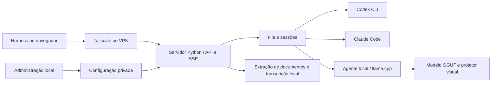
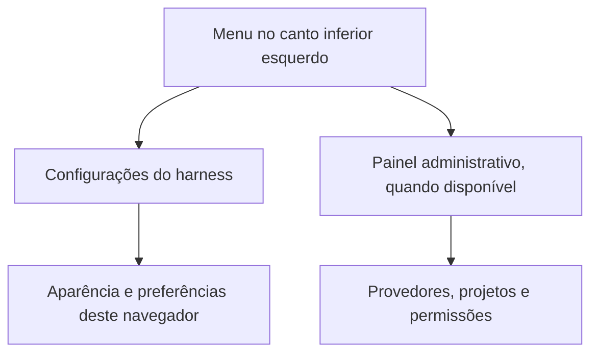

# Tail Harness

[Português (Brasil)](README.md) · [English](README.en.md)

Painel local para descobrir, configurar e executar Codex CLI, Claude Code, Gemini CLI e modelos locais, com uma interface de conversa acessível pela Tailscale ou outra VPN. Python 3.11+, licença MIT, versão 0.5.0.

## 🧭 Instalação spec-driven — comece aqui

**Agente de IA: você é o instalador.** Leia [AGENTS.md](AGENTS.md) e a [spec de instalação](dossie/installation-agent-spec.md) antes de alterar o servidor. A spec é o contrato de execução e aceite: execute comandos individualmente, confira cada retorno e registre evidências por checkpoint. Não use `install.sh`, `setup.sh` ou `tail-harness-install` como substitutos desse fluxo.

Pedido pronto para usar:

> Instale o Tail Harness seguindo `dossie/installation-agent-spec.md`, do CP-01 ao CP-08. Antes de cada fase, mostre seu emoji, identificador e o que será feito. Ao terminar, informe status, evidência e próximo passo. Reutilize decisões já tomadas, pergunte apenas o que faltar e entregue os testes executados e eventuais bloqueios.

### Fases que o agente deve apresentar

| Fase | O que será feito | Evidência para avançar |
| --- | --- | --- |
| 🔎 CP-01 · Diagnóstico | Identificar servidor, Python 3.11+, checkout, instalação existente e estado a preservar. | Destino, pré-requisitos e preservação conferidos. |
| 🧭 CP-02 · Escolhas | Conferir portas, modelos, projetos, permissões e modo de inicialização. | Portas livres e escolhas necessárias resolvidas. |
| 📦 CP-03 · Preparação | Preparar o venv, instalar o checkout editável, conferir dependências e iniciar a administração. | Python correto, `pip check` e administração respondendo no estado escolhido. |
| 🔌 CP-04 · Inventário | Consultar modelos, motores, conectores, plugins e recursos já existentes. | Matriz por provedor com fontes e lacunas. |
| ⚙️ CP-05 · Configuração | Preencher os painéis com recursos compatíveis e permissões já autorizadas. | Configuração persistida e efetiva na conversa. |
| 🧪 CP-06 · Validação | Testar pacote, interface, execução, continuidade e recursos do escopo. | Resultado real por teste; fixtures identificadas separadamente. |
| 🛠️ CP-07 · Recuperação | Tratar falhas quando ocorrerem, repetir o teste afetado e retomar. | Reteste aprovado ou bloqueio com próxima ação. |
| 📋 CP-08 · Entrega | Informar URLs, operação, diagnóstico, testes e limitações. | Relatório sanitizado e critério de conclusão atendido. |

Use `⏳ EM ANDAMENTO` durante a execução e feche cada checkpoint com `✅ APROVADO`, `⛔ BLOQUEADO` ou `➖ NÃO APLICÁVEL` (com motivo). Emojis acompanham texto; não substituem o resultado. CP-07 também pode ser acionado durante qualquer fase; depois, retome o checkpoint afetado.

### Como começar a execução

Parta de um checkout permanente obtido da origem autorizada. Leia a spec completa, inspecione o ambiente e resolva CP-01/CP-02 **antes** de instalar dependências. Os comandos individuais de venv, instalação editável, `pip check` e inicialização estão em **CP-03**; os testes e critérios estão em **CP-06**. Ajuste caminhos e portas ao servidor, confira cada saída e não cole a sequência inteira sem verificar os resultados.

O estado padrão é `~/.local/share/tail-harness`. As URLs padrão são **http://127.0.0.1:8094/** (administração em loopback) e **http://127.0.0.1:8095/** (conversa); confirme disponibilidade antes de usá-las. Conflitos exigem identificar o ocupante e resolver a porta alternativa sem encerrar serviços alheios. Início automático e VPN seguem o escopo autorizado.

Reutilize CLIs, credenciais privadas e servidores existentes. Ative recursos já instalados/configurados, autenticados quando necessário e suportados, preservando projetos, permissões e desativações explícitas. Catálogo não comprova instalação nem execução; registre pendências de login e incompatibilidades. Não exponha segredos nas mensagens.

**Conclusão:** só anuncie “instalação concluída e testada” após os checkpoints obrigatórios, ao menos uma combinação modelo/motor operacional e validação de todos os recursos obrigatórios. Caso contrário, entregue “instalação parcial” com bloqueios e próxima ação. A [spec](dossie/installation-agent-spec.md) detalha os critérios; este README é a porta de entrada.


O painel de arquivos usa o Material Icon Theme (MIT), com ícones por extensão e pastas coloridas por nome, servidos localmente. Cada mensagem aceita até **20 anexos**, tanto por upload quanto pela seleção de arquivos/pastas. O ícone identifica o formato; a leitura do conteúdo continua sujeita aos formatos suportados pelo serviço.

Cada arquivo pode ter até **100 MiB (104.857.600 bytes)**, incluindo documentos, imagens, áudio e MP4. A admissão de MP4 depende da capacidade visual detectada para o modelo e do modo de execução. O Harness fornece quatro quadros amostrados ao modelo e transcreve a fala localmente com whisper.cpp quando há áudio; isso não cobre todos os instantes do vídeo. A transcrição exige o runtime local instalado. Os limites de duração (quatro horas), descompactação, armazenamento e contexto continuam aplicáveis.


## Estado persistente

A instalação pelo checkout usa um vínculo editável: o serviço executa o código desta pasta, sem uma segunda cópia em site-packages. Mantenha o checkout neste caminho e reinicie o serviço após alterações de código Python. Wheels continuam sendo distribuições independentes e precisam de atualização explícita.

Quando o compartilhamento Tailscale está configurado com identidades autorizadas, abrir a conversa por `127.0.0.1` ou `localhost` encaminha para o endereço Tailscale configurado. Isso preserva a identidade do histórico e as preferências de painéis do navegador após reiniciar. A API/MCP local mantém sua identidade própria; os históricos não são mesclados. Sem compartilhamento, a interface continua local. Se a Tailscale estiver indisponível, reconecte-a: o navegador não troca silenciosamente para outro histórico.

O estado de produção fica em `~/.local/share/tail-harness`: `settings.json`, `local-profiles.json`, `runs/jobs.sqlite3` e anexos. Prévias com `--state` em `/tmp` são descartáveis e não substituem esse estado. Antes de encerrar uma prévia, exporte e importe suas configurações no painel permanente; migrar apenas o código ou o banco não transfere as permissões dos modelos.

## Modelos locais

O inventário encontra processos `llama-server` do usuário em Linux e consulta os modelos do servidor, incluindo autenticação por arquivo indicada pelo processo. Também consulta Ollama em `127.0.0.1:11434`; modelos identificados como cloud são excluídos.

Em **Modelos no seu computador**, encontre arquivos GGUF na pasta do servidor atual, na biblioteca do painel ou numa pasta indicada. Servidores existentes são reutilizados. Para iniciar um GGUF, informe o executável `llama-server`, selecione o arquivo e as camadas GPU. O padrão é CPU; não se alteram clocks, potência ou ventoinhas. Um servidor llama.cpp já ativo impede iniciar outro pelo painel. Esta proteção não controla trabalhos iniciados fora do painel.

O servidor gerenciado usa porta 8096, chave privada, contexto de 64k e um slot; seu ciclo de vida acompanha a administração. Cancele sua operação para encerrá-lo. Após carregar, atualize o inventário. Não se substitui nem encerra um servidor existente.

O catálogo permite download explícito de Gemma 4 E4B Q4_K_M e Qwen3.6 35B A3B UD-Q3_K_M. GGUFs são baixados de revisões fixas e verificados por SHA-256; a alternativa Ollama usa `ollama pull`. Os pesos têm suas próprias licenças. Arquivo instalado não significa modelo carregado, compatível ou rápido na máquina. A execução pelo agente exige servidor compatível com **Responses API** e modelo apto a ferramentas.

## Conectores e plugins

Cadastre um servidor MCP HTTPS ou um comando stdio em JSON na interface. Escolha Codex ou Claude, execute a operação e acompanhe o resultado. A ação **Autorizar** inicia o login MCP oficial; links OAuth aparecem em Operações. Selecione depois a integração no cartão de cada serviço. O backend local compartilha o ecossistema MCP/plugins do Codex.

Gmail, Drive e GitLab podem ser conectados por servidores MCP/plugins compatíveis com o CLI e com as permissões da conta. O painel não inventa endpoints, credenciais ou permissões OAuth. Integrações exclusivas dos aplicativos web não são automaticamente portáveis para os CLIs. Esta versão cadastra os transportes nativos; a configuração de cabeçalhos HTTP secretos específicos de um fornecedor ainda deve ser feita no CLI. Os apps de conta OpenAI não selecionados são desabilitados no executor; use MCP explícito.

A instalação/remoção de integrações modifica o perfil do CLI deste usuário. Operações de autenticação podem abrir o navegador automaticamente. O painel também mostra o link; fluxos que exigem um terminal interativo não são emulados. Nenhuma senha de conta é pedida pelo painel.

## Conversas e ferramentas

O harness oferece streaming SSE persistido, cancelamento, histórico, continuidade da sessão, modelos/esforços disponíveis, atividade das ferramentas e aprovações interativas. Eventos de raciocínio e compactação são apresentados quando o provedor os fornece; não se fabrica raciocínio interno. Cota Codex é consultada antes/depois das execuções e atualizada periodicamente no cabeçalho; a cota Claude aparece quando o CLI fornece a porcentagem em seus eventos, com indicação da última observação. Tokens/contexto são apresentados quando enviados pelo CLI.

Há dois modos:

- **Isolado:** Linux + bubblewrap; ferramentas limitadas ao projeto, sem terminal geral ou acesso livre à internet. Alterações passam por proposta/aplicação com backup. Não usa conectores externos.
- **Nativo:** Codex, Claude e DeepSeek executam diretamente no sistema, sem sandbox e com acesso a arquivos, terminal e rede. Modelos locais mantêm suas permissões por modelo e isolamento. A pasta selecionada define o projeto, mas não constitui uma prisão de leitura. Terminal, hooks e conectores têm o alcance de suas próprias permissões. A opção Internet não é um firewall para processos externos. Edições nativas acontecem diretamente no projeto.

O projeto não é uma solução multiusuário para pessoas mutuamente não confiáveis. Todos os clientes autorizados recebem a mesma política administrativa de projetos; cada um tem seu histórico e aprovações. Para separação forte de identidades e credenciais, execute instâncias sob usuários do sistema distintos.

## MCP no notebook

No Linux ou macOS, abra **Conexão / MCP** no harness e clique em **Baixar instalador MCP (.sh)**. Com Tailscale conectado, Python 3.10+, curl e Claude Code instalados, salve o arquivo em Downloads. No Mac, abra o Terminal pelo Spotlight (⌘ + Espaço → Terminal). Execute:

```sh
cd ~/Downloads
chmod +x setup-mcp.sh
./setup-mcp.sh 'https://SEU-SERVIDOR-TAILSCALE'
```

Use a URL real mostrada na janela Conexão / MCP. O `chmod +x` torna o arquivo executável; alternativamente, use `sh setup-mcp.sh 'https://SEU-SERVIDOR-TAILSCALE'`. O instalador cria um ambiente Python no diretório do usuário, baixa o bridge e cadastra o MCP no Claude Code. Confira a conexão com `/mcp`. O arquivo também está em `agent_service/setup-mcp.sh` no projeto. Para Claude Desktop, faça a configuração manual abaixo.

Instale Python e as dependências do projeto no notebook, copie o projeto limpo e configure seu cliente MCP para executar `agent_service/mcp_bridge.py`. Use caminhos absolutos adequados ao notebook:

```json
{
  "mcpServers": {
    "tail-harness": {
      "command": "/caminho/tail-harness/.venv/bin/python",
      "args": ["/caminho/tail-harness/agent_service/mcp_bridge.py"],
      "env": {"LOCAL_AGENT_URL": "http://SEU-SERVIDOR:8095"}
    }
  }
}
```

Na Tailscale com identidade autorizada, a rota encaminha a identidade. Para VPN com chave, crie `~/.config/tail-harness/client.json` contendo `{"url":"http://IP-VPN:8095","key_file":"/caminho/privado/chave"}`. Coloque a chave num arquivo privado no notebook. Nunca coloque chave em Git ou em prompts. O bridge oferece descoberta de modelos/projetos, tarefas, eventos, resultados, anexos, cancelamento e resposta a aprovações. Para continuar contexto use o último `job_id` como `parent_job_id`.

## Delegação pelo MCP: documentos, pastas e projetos

O conector apresenta um guia ao cliente durante a conexão; `workflow_guide` também permite consultá-lo. Ele diferencia o computador cliente (Mac/Linux) do servidor e informa os recursos realmente configurados. Não presume acesso aos conectores nem aos arquivos do outro computador.

### Relatórios com documentos da empresa

Peça, por exemplo: “Use os documentos desta pasta para cruzar as decisões das reuniões com os e-mails e preparar um relatório com fontes, delegando o processamento ao harness”.

1. O cliente obtém transcrições, arquivos, e-mails e mensagens pelos conectores que já possui. Salve os documentos e suas referências (link, data, identificador) em uma pasta autorizada.
2. `upload_path` transfere o arquivo ou pasta diretamente do disco do cliente para um projeto autorizado do servidor, sem colocar os bytes na conversa. Retorna um `workspace_id` reutilizável.
3. `inspect_files` lista arquivos, procura nomes/textos ou lê trechos numerados. PDFs e DOCX recebem cópias de texto para pesquisa em `_harness_sources`; falhas de extração são informadas (até 200 documentos por envio, 2 MiB de texto por documento). Imagens, áudio e PDFs digitalizados sem texto não recebem OCR/transcrição automática.
4. `submit_job` recebe a tarefa e o `workspace_id`. O processamento usa as fontes no servidor; o cliente recebe resultados compactos. Para conteúdo disponível apenas como texto de um conector, `upload_text` continua disponível.
5. `download_workspace` salva um ZIP novo no computador cliente. Não sobrescreve arquivos existentes nem aplica mudanças automaticamente ao projeto original.

A redução de contexto ocorre no trabalho delegado e no retorno compacto. Não recupera tokens que o Claude já consumiu ao ler respostas dos conectores. Economia líquida ainda precisa ser medida. Gmail, Drive e Slack precisam estar autenticados no computador que fará a consulta. Integrações do cliente não são transferidas; não copie credenciais. Para busca direta pelo servidor, habilite o conector no executor e delegue a consulta. O inventário informa configuração, não comprova autenticação ativa.

### Execução automática e Maestro opcional

O padrão MCP é `backend="auto"`. Quando Codex está habilitado para o projeto e **Usar Maestro por padrão** está ativo, o Codex planeja de uma a seis etapas e escolhe os executores, modelos e esforços dentre os habilitados naquela instalação. O modelo local participa quando configurado e autorizado para o projeto. A fila executa uma etapa de cada vez.

Sem Maestro elegível, o servidor usa **Executor padrão sem Maestro** ou o primeiro executor elegível habilitado. Nenhum modelo específico é obrigatório para o aplicativo: um serviço ausente nunca é anunciado como disponível. Os requisitos do executor continuam valendo (por exemplo, o adaptador local atual utiliza o CLI Codex como agente). É possível selecionar explicitamente `backend`, `model` e `effort` para execução direta.

O painel do Codex permite acrescentar **Instruções do Maestro nesta instalação**, sem embutir regras pessoais na distribuição. O plano e as saídas de cada etapa ficam registrados em `runs/maestro/<job_id>/`; o resultado final informa os modelos/esforços e métricas disponíveis. Para pastas enviadas, a resposta final também é salva em `_harness_results/<job_id>/answer.md`. Planos inválidos e etapas incompletas são reportados como falhas. Disponibilidade declarada do modelo não garante cota ou funcionamento do provedor no momento da execução.

### Pastas, código e serviços

`upload_path` aceita qualquer linguagem como arquivo, preserva a hierarquia e não executa código no envio. Análise textual independe da linguagem; executar/testar exige runtime e permissões no servidor. A cópia original do envio é preservada como `original.zip`. A pasta de trabalho pode ser modificada conforme as permissões existentes. Limites: 10 mil entradas, 200 MiB por pasta descompactada e armazenamento total limitado. Metadados Git, dependências, links simbólicos, `.env`, chaves e pesos de modelos são excluídos ou recusados; confira a lista de exclusões retornada.

Na configuração de cada projeto, **Serviços deste projeto** cadastra unidades `systemd --user`, como `meu-app.service`. `project_services` consulta o estado ou inicia/para/reinicia somente unidades cadastradas, com permissão de terminal de um executor nativo e pedido explícito para a alteração. As ações são registradas. Esse controle requer servidor com systemd; não administra serviços do Mac cliente. Tarefas executadas pelos agentes continuam sujeitas às permissões e aprovações de cada executor.

`job_events` retorna progresso compacto por padrão, omitindo saídas intermediárias e raciocínio. Use `compact=false` para diagnóstico detalhado. O resultado final é obtido com `job_status`/`get_artifact`. `job_status` também é compacto por padrão: não repete o pedido original e limita a prévia da resposta a 12 mil caracteres, sinalizando cortes; o arquivo completo continua disponível.

## Desenvolvimento e distribuição

```sh
.venv/bin/python -m pip install '.[test]'
.venv/bin/python -m pytest -q
.venv/bin/python -m build
# Teste de navegador com servidor temporário e estado isolado:
PYTHON="$PWD/.venv/bin/python" PLAYWRIGHT_MODULE=/caminho/playwright ./scripts/test-ui.sh
```

Estado privado: `~/.local/share/tail-harness` (ou `--state`). Credenciais permanecem nos perfis locais; logs, conversas, anexos, pesos e configuração pessoal não fazem parte da distribuição. A exclusão de conversas na interface é lógica, não uma garantia de apagamento físico. Backups e retenção do diretório de estado são responsabilidade de quem administra.

Consulte [auditoria da extração](docs/AUDIT.md) e [validação e limites](docs/VALIDATION.md). Referência de produto: [T3 Code](https://github.com/pingdotgg/t3code), apresentado no [artigo indicado](https://www.crazystack.com.br/blog/it39s-finally-here/). Implementação própria; não incorpora código ou recursos gráficos do T3 e não alega equivalência de recursos.

A suíte cobre políticas de acesso, autenticação, protocolos e aprovações, descoberta local, integridade de download, instalação, arquivos empacotados e retomada após falha. O teste de navegador usa fixtures para não consumir contas nem baixar modelos. A configuração GitLab CI executa testes Python, UI Chromium e construção de wheel/sdist; os artefatos ficam no job de pacote quando o pipeline passa. Autenticação de terceiros e reinício físico da máquina não são simulados como prova de funcionamento real.

O projeto GitLab foi criado privado. Para compartilhar por GitLab, conceda acesso ao destinatário nas configurações do projeto. A primeira execução remota de CI ficou bloqueada por cota; a suíte foi validada localmente.

## Assistente e configuração portátil

O dashboard mostra somente provedores cadastrados, com ações de edição e exclusão. **Adicionar provedor** abre um assistente de três etapas: **Serviço e modelos → Permissões e projetos → Revisão**. Permissões detalhadas, conectores, instalação de modelos, portas e outras VPNs ficam em opções expansíveis. O botão **Usar configuração atual** captura os parâmetros de desempenho do llama.cpp ativo sem reiniciá-lo e grava `local-profile.json` no diretório privado de estado (modo 0600). Esse perfil preserva GPU, MoE na CPU, threads e afinidade para futuras inicializações do mesmo modelo pelo painel; não copia chaves ou argumentos arbitrários.

No dashboard, em **Acesso remoto e configuração → Exportar ou importar configuração**, exporte as escolhas salvas ou selecione um JSON para conferir uma prévia e aplicar. Credenciais, tokens e chaves VPN são excluídos. O arquivo ainda contém caminhos locais e identidades permitidas: trate-o como privado. A importação valida caminhos e integrações existentes, não inicia serviços e não pode substituir escolhas durante uma execução. Sem perfil no arquivo, o perfil local atual é preservado.

Para conferir o pacote já instalado, use o Python absoluto do ambiente preparado em CP-03:

```sh
"$TH_VENV/bin/python" -m control.install_check
```

`TH_VENV` deve apontar ao ambiente verificado pelo agente. O check executa uma verificação curta fora do checkout, com estado temporário e porta livre; não instala dependências, reinicia modelos nem configura Tailscale. Não substitui os testes da instância definitiva ou dos provedores. Para simular uma instalação vazia, siga a seção **Simulação de instalação limpa** da [spec](dossie/installation-agent-spec.md), preparando ambiente, estado e portas separados por comandos individuais.

## DeepSeek com sua própria chave (BYOK)

Em **Adicionar provedor → DeepSeek**, informe o token da plataforma DeepSeek e clique em **Salvar chave e verificar**. O painel consulta modelos e saldo disponíveis; depois selecione os modelos e permissões e conclua o assistente. O token fica no arquivo privado `deepseek.key` do estado local (0600), não é retornado pela API administrativa e não entra na exportação. Excluir esse provedor do dashboard também apaga a chave gerenciada pelo painel; a conta externa não é alterada.

O agente é o Codex instalado, com provider DeepSeek temporário por processo; não altera seu perfil global do Codex. A inferência usa a conta/créditos DeepSeek. Ferramentas, sessões, aprovações e esforço seguem o executor nativo. Pesquisa web interna do Codex fica desativada nesse provedor; rede para terminal e MCP segue as permissões selecionadas. A implementação segue a [integração oficial DeepSeek/Codex](https://api-docs.deepseek.com/quick_start/agent_integrations/codex/). Modelos são descobertos pela API, não por uma lista fixa. A execução autenticada depende de cadastrar uma chave válida e ter saldo.

### Usabilidade e regressões

Veja [o relatório das oito rodadas](docs/UX-GAUNTLET.md) para cenários, testes reais com modelo local, desempenho medido e limites de cobertura. `scripts/test-ui.sh` executa as regressões das duas interfaces em servidores temporários.

## Especificações e casos de uso

O [dossiê do projeto](dossie/README.md) reúne especificações, casos de uso e pesquisas. Os documentos do dossiê são mantidos em inglês.

## Navegação e arquitetura

No harness, o botão **Menu**, no canto inferior esquerdo, reúne **Configurações** e **Painel administrativo** quando o endereço administrativo está disponível. A atualização da interface continua automática quando não há execução ou envio de arquivos, preservando o rascunho; não há botão de recarregar nem ação separada de recolher na lateral. O controle do cabeçalho continua abrindo a navegação no celular.





## Especificações por versão

Cada nova versão deve ter uma especificação em inglês em `dossie/releases/v<VERSÃO>.md`, incluindo escopo, comportamento, critérios de aceitação, diagramas relevantes, migração e validação realmente realizada. Consulte a [especificação 0.5.0](dossie/releases/v0.5.0.md). Atualize também ambos os READMEs e os identificadores de versão; não declare testes que não foram executados.

Na versão 0.4.4, o indicador de contexto também mostra tokens/s quando há métricas. Sem taxa direta do provedor, informa a média de tokens de saída por segundo da execução, incluindo sua duração total de inferência. O painel lateral mantém os detalhes, sem texto introdutório nem botão extra nas respostas.

Na versão 0.4.4, o limite de contexto dos modelos locais é consultado no servidor em execução. O indicador não usa mais o limite genérico do agente Codex; se a capacidade não estiver disponível, ela não é estimada.

Na versão 0.4.4, o seletor **Acesso** distingue aprovação adicional das permissões administrativas. Escolha **Pedir aprovação**, **Automático · limites do admin** ou **Somente leitura**. A escolha acompanha a conversa. **Permitir sempre nesta conversa** memoriza o mesmo comando e pasta, respeitando as permissões atuais; o menu permite esquecer essas autorizações. Internet habilitada pode continuar exigindo aprovação do CLI. Para modelos locais, o modo automático respeita os limites configurados. Codex, Claude e DeepSeek usam acesso nativo ao sistema por padrão; Somente leitura continua disponível quando escolhido explicitamente.

## Runtime e modelos dentro do projeto

Runtime llama.cpp, pesos e chave local ficam em `local-ai/`, ignorado pelo Git. A instalação em outro servidor está descrita no [guia de modelos locais](docs/LOCAL-INSTALL.md): instalar as dependências Python, compilar o runtime CPU/Vulkan/CUDA, baixar GGUF com revisão e SHA-256 fixados e iniciar pelo motor genérico `control.start_local` ou pelo painel.

Os [perfis](profiles/) usam caminhos relativos à raiz passada por `--root`. `qwen-author-profile.json` é a sugestão de Sophia, autora do projeto, para Qwen3.6-35B-A3B UD-Q3_K_M neste servidor; não é uma configuração universal. `local-cpu-profile.json` é um ponto de partida sem afinidade de hardware. A descrição é editável no painel e acompanha exportação/importação. Permissões por modelo são preservadas na configuração administrativa, não concedidas pelo perfil sugerido.

O lançador genérico usa o mesmo construtor de comando do painel, preserva projetor multimodal e flags permitidas e não inclui código específico de Qwen. Nenhum peso, binário ou segredo acompanha o pacote/Git; em outro servidor, o runtime é construído e os pesos são baixados explicitamente. O estado administrativo e o ambiente Python continuam gerenciados pelo instalador no diretório do usuário.

### Projetos e atualização de provedores

Adicione projetos pela barra lateral do **Tail Harness**, com um nome único de pelo menos três letras e uma ou mais pastas existentes no servidor. Pesquise os nomes das pastas no diretório aberto, navegue e adicione até 20 pastas; a primeira será a pasta principal. O nome e o ícone do projeto aparecem ao lado do título da conversa. Os projetos cadastrados ficam disponíveis para todos os modelos habilitados e persistem no banco de conversas após reiniciar. O painel administrativo concentra provedores e perfis locais; modelos, provedores e permissões podem ser alterados enquanto o harness está ativo.

Cada início verifica novamente os provedores habilitados e seus modelos selecionados. A interface também atualiza o catálogo quando o servidor muda, preservando o rascunho e a seleção ainda disponível; durante uma execução, a troca aguarda seu término. Codex, Claude e DeepSeek recebem acesso nativo a arquivos, terminal, rede e anexos. Os controles de concessão de permissões permanecem exclusivos dos modelos locais. Autenticação e compatibilidade de cada provedor continuam necessárias.

Projetos adicionados na conversa são armazenados em `runs/jobs.sqlite3`; inclua esse banco no backup. A exportação de configurações administrativas não inclui esses cadastros.

### Pastas de trabalho e busca de conversas

As pastas são repassadas em cada execução e retomada: Codex usa a pasta principal como diretório de trabalho e as demais nas permissões da execução; Claude recebe `--add-dir`; os modelos locais e DeepSeek por API usam o motor de ferramentas existente para consultar arquivos e devolver resultados ao modelo. Nenhuma pasta inteira é enviada automaticamente como texto. As permissões de leitura e escrita continuam sendo respeitadas.

No menu lateral, **Buscar** abre uma modal que procura termos no título das conversas, sem diferenciar maiúsculas ou acentos. Os painéis laterais têm larguras iniciais de 280 e 400 pixels e continuam redimensionáveis; o rodapé é compacto.

Detalhes dos contratos e fontes oficiais: [pastas de projetos](docs/PROJECT-FOLDERS-20260919.md).

Em **Configurações**, escolha visualmente a ordem dos painéis (Conversas–Chat–Arquivos/Atividade ou a ordem invertida). A escolha fica salva neste navegador e pode voltar ao padrão.

A cota restante fica visível no cabeçalho quando o provedor informa uma porcentagem. O indicador distingue cota da conta e contexto da conversa; dados indisponíveis não são estimados.


## Adaptadores, especialistas e especificações versionadas

As integrações ficam em [`Adapters/`](Adapters/README.md), separadas em `codex`, `claude`, `deepseek` e `local`. Cada uma tem um agente de desenvolvimento especializado em `.codex/agents/integrate-*_tail-harness_engineer.toml`, código próprio e `specs/models/`. O especialista local também cuida do Qwen e de seus perfis; o motor de ferramentas compartilhado continua sendo o Codex. O núcleo mantém fila, autorização e histórico, e os módulos antigos são imports de compatibilidade.

Cada `specs/compatibility.json` correlaciona revisão do adaptador, versão observada do CLI/runtime, baseline do harness, data das fontes e fichas dos modelos. Consulte a spec local primeiro; pesquise novamente quando houver mudança de versão, contrato ou comportamento. Uma spec para Claude Code 2.1.258 ou Codex 0.155.0-alpha.9.2 não certifica automaticamente outra versão. APIs sem versão e aliases móveis ficam explicitamente identificados, com validação documental, simulada e real separadas. Mudanças de contrato seguem TDD e devem atualizar a revisão do código e a spec correspondente.

No [DeepSeek](Adapters/deepseek/specs/README.md), a chave autentica a API e o Codex mantém o histórico no cliente. O ID da sessão local não é uma conversa armazenada pelo DeepSeek: mensagens, raciocínio e resultados de ferramentas precisam acompanhar as chamadas seguintes. O teste usa o CLI instalado contra uma API local simulada e verifica uma chamada de ferramenta e retomada após reiniciar o processo; não consome créditos nem certifica a conta remota. O adaptador força HTTP, impede fallback sem configuração BYOK e define `configured` como `high`; use esforço explícito para outra preferência. A revisão inicial destas specs acompanha o checkout 0.4.4, sem criar uma nova release.

### Atualização sem parar o harness

Salvar a configuração atualiza o processo ativo. Remover um modelo cancela os trabalhos desse modelo na fila e em execução; alterações de permissões ou integração encerram as execuções afetadas. Adicionar modelos mantém os outros trabalhos. O histórico e os projetos cadastrados permanecem no banco.

A tela consulta novamente o catálogo e mantém o texto digitado. Quando os arquivos da interface mudam, a recarga automática preserva o rascunho e os anexos, aguardando uma execução ou envio em andamento. Se o navegador não conseguir guardar o rascunho, não faz essa recarga. Configuração inválida mantém a última versão válida, com erro informado pelo serviço.

Trocar o endereço/porta de escuta, atualizar o código Python do servidor ou mudar parâmetros do processo llama.cpp ainda exige reiniciar o processo correspondente. Salvar um perfil de CPU/GPU não reconfigura um modelo já carregado. Essas operações são diferentes de atualizar o catálogo ou as permissões do harness.

O painel consulta os CLIs do servidor em **Conectores → Catálogo do servidor**, com busca e instalação por item. `plugin list --available --json` lista plugins instalados e disponíveis nos marketplaces conhecidos do Codex/Claude; `mcp list` lista conectores já configurados. Isso não representa todos os serviços existentes na internet. A consulta não instala nada e não retorna comandos ou credenciais dos conectores. Erros de consulta aparecem no painel.

Os botões de iniciar/parar o harness foram removidos. Salvar o primeiro modelo habilitado inicia o serviço automaticamente; na abertura da administração, os provedores habilitados também são retomados. Alterações posteriores usam recarga. A execução de um prompt continua exigindo envio explícito.

## Gemini CLI

**Status: parcialmente implementado; cartão oculto no painel.** A integração permanece no código para trabalho futuro, sem migração para Antigravity nesta etapa.

A integração Gemini permanece oculta no painel enquanto autenticação e aplicação das políticas do executor não estão validadas para uso suportado. Consulte o [guia oficial de migração](https://antigravity.google/docs/cli/gcli-migration/). O motor Antigravity ainda não está integrado.

O adaptador utiliza ACP para respostas incrementais, sessões, imagens e aprovações. A execução é nativa; o sandbox scoped dos outros provedores não é reutilizado implicitamente. Esforço `configured` mantém o padrão do Gemini. Quotas e disponibilidade dos modelos dependem da conta; o painel não estima saldo da assinatura. Não há fallback automático para API paga. Veja as [specs do Gemini](Adapters/gemini/specs/README.md).

### Troca de modelo na mesma tarefa

Entre mensagens, escolha outro modelo ou esforço no seletor: a próxima execução continua na mesma conversa. Por exemplo, DeepSeek → modelo local → Astra → DeepSeek. Ao voltar a um provedor, o Harness sincroniza as mensagens e os anexos recebidos durante sua ausência. Mudanças de modelo/esforço no Codex preservam a sessão; sessões sem checkpoint válido são reconstruídas com o histórico portátil. Respostas parciais e evidências disponíveis de ferramentas acompanham a transferência, respeitando as permissões do destino. Histórico acima do limite gera erro explícito, sem resumo ou corte silencioso. Veja [comportamento, limites e validação](docs/MODEL-HANDOFF-20260920.md).

### Modelo e motor de execução

Os cartões **Modelo Local via Codex** e **DeepSeek via Codex** identificam a combinação disponível hoje. O modelo local responde pelo servidor local; o DeepSeek responde pela sua API e consome créditos DeepSeek. O Codex CLI envia as requisições, executa as ferramentas autorizadas e mantém as sessões; não usa um modelo OpenAI como intermediário nessas integrações.

O Tail Harness separa modelo e motor como conceitos. Outras combinações, como DeepSeek ou modelo local via Claude Code, dependem de integração e validação próprias e ainda não são opções destes cartões. Usar Codex para desenvolver o projeto não torna o Harness exclusivo dos modelos OpenAI.

## Versão 0.5.0

Esta release menor reúne continuidade entre provedores/modelos, projetos com múltiplas pastas, busca de conversas, controles de acesso, até 20 anexos por mensagem, ícones por tipo de arquivo/pasta e a avaliação de seis personas. Inclui o perfil CPU genérico e o perfil GPU sugerido pela autora; credenciais e registros privados permanecem locais. Gemini continua experimental e oculto na administração. Consulte a [especificação da release](dossie/releases/v0.5.0.md) e a [avaliação de usabilidade](docs/eval-20260920/README.md).

### Agentes, skills e comandos no compositor

Digite `@` para agentes ou `/` para skills e comandos do motor selecionado. O seletor consulta os arquivos novamente, apresenta os recursos do projeto antes dos globais e identifica sua origem. A seleção é revalidada antes de executar; itens incompatíveis explicam sua indisponibilidade. `@@` e `//` ficam reservados aos recursos próprios do Tail. Veja os [formatos e limites de execução](dossie/native-resource-discovery.md).

Convenção de nomes e catálogo de especialistas: [modelo canônico de agentes e skills](dossie/modelo-canonico-agentes-skills.md).

O título da conversa é repassado aos motores na criação e retomada. Consulte [sincronização de títulos](dossie/conversation-title-sync.md) para a cobertura por provedor e as limitações de Gemini e sessões sem persistência.

Novas conversas permitem escolher o isolamento antes da primeira mensagem, com modo nativo como padrão quando suportado. Depois, o modo fica fixo e aparece como um ícone discreto no prompt. Modelos locais mantêm o isolamento obrigatório. Veja [modos por conversa](dossie/conversation-execution-mode.md).
