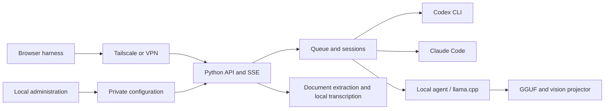
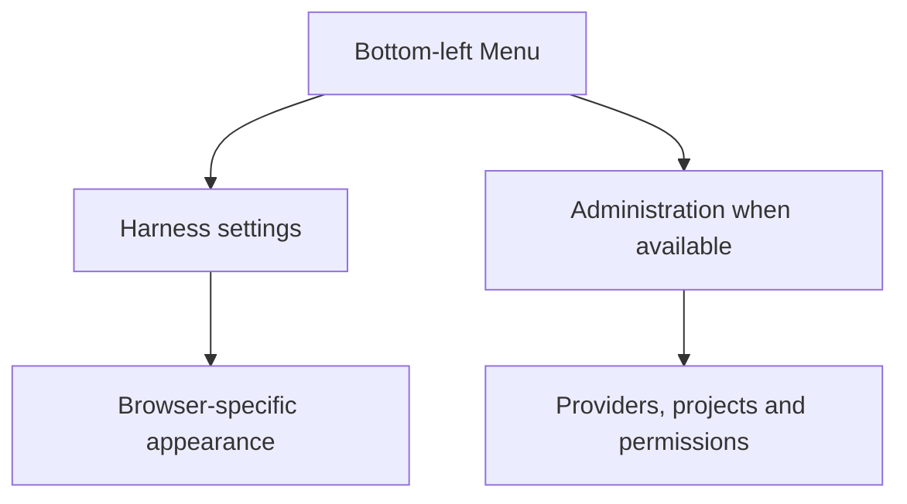
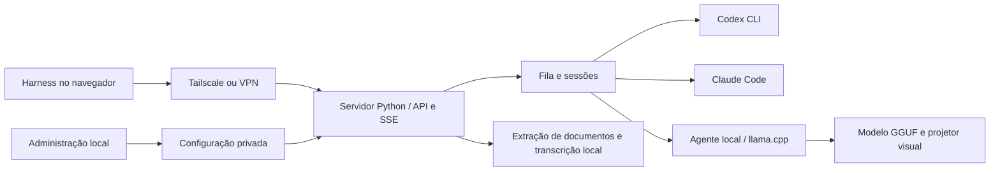
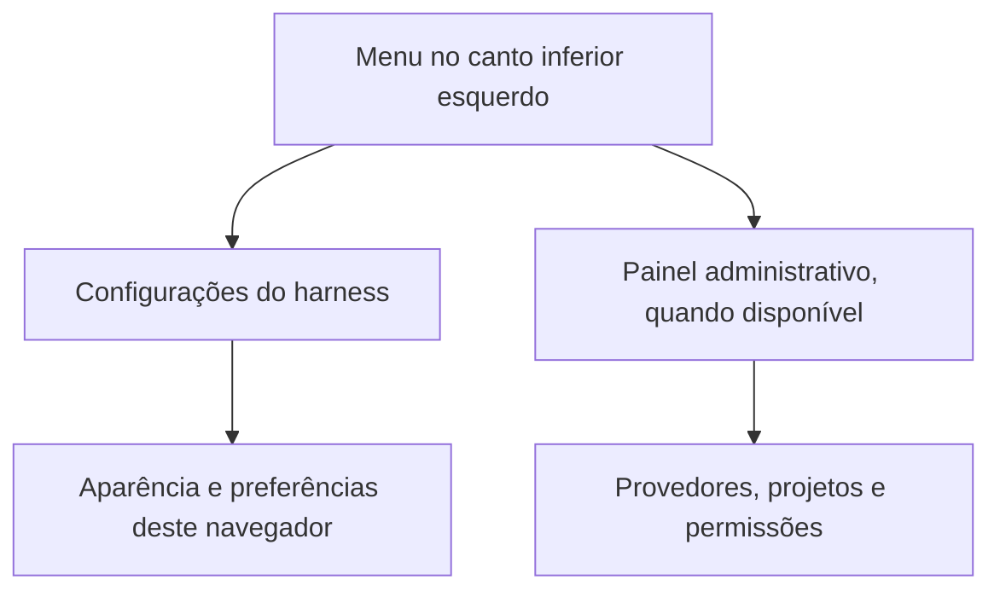

# Tail Harness

[English](#english) · [Português (Brasil)](#português-brasil)

<a id="english"></a>
## English

A local Python control panel for discovering, configuring and running Codex CLI, Claude Code, Gemini CLI and local AI models, with a conversational harness accessible through Tailscale or another VPN. Python 3.11+, MIT license, version **0.5.0**.

### Installation — agent-guided (start here)

Tail Harness is a harness for the AI tools already on your machine: it discovers and drives the Codex CLI, Claude Code, Gemini CLI and local model servers you have installed and signed in to. Because every server has a different mix of CLIs, accounts, models and permissions, installation is **directed by an AI coding agent** (Claude Code, Codex, …) that inspects the machine, reuses what already exists, asks you only for missing decisions and validates each step.

**Requirements:** Linux (systemd for the background service), Python 3.11+, and at least one AI CLI or local model server installed. Clone the repository and give your agent this request:

```sh
git clone https://github.com/sophia-phillipa/tail-harness.git
cd tail-harness
```

> Install Tail Harness following `dossier/installation-agent-spec.md`, from CP-01 through CP-08. Before each phase, say what you will do; afterwards, report status, evidence and next step. Reuse existing CLIs, accounts and models, ask only for missing decisions, and report the tests you ran and any blockers.

The [installation specification](dossier/installation-agent-spec.md) defines eight checkpoints, each closed with evidence before moving on:

| Phase | What happens |
| --- | --- |
| 🔎 CP-01 · Diagnosis | Server, Python 3.11+, checkout, existing installation and state to preserve. |
| 🧭 CP-02 · Decisions | Ports, models, projects, permissions and startup mode. |
| 📦 CP-03 · Preparation | Virtual environment, editable install, dependency check, admin panel started. |
| 🔌 CP-04 · Inventory | Installed models, execution engines, connectors, plugins and resources. |
| ⚙️ CP-05 · Configuration | Panels populated with compatible, authorized resources. |
| 🧪 CP-06 · Validation | Package, interface, execution, continuity and scoped resources tested. |
| 🛠️ CP-07 · Recovery | Failures handled and affected tests rerun. |
| 📋 CP-08 · Handoff | URLs, operating instructions, diagnostics, tests and limitations. |

When it finishes, the admin panel is at **http://127.0.0.1:8094/** and conversations at **http://127.0.0.1:8095/**. State (settings, profiles, conversations, attachments) lives in `~/.local/share/tail-harness`.

#### Manual installation (without an agent)

The scripts install the app but do not inspect or configure your providers; you do that afterwards in the admin panel.

```sh
./install.sh               # Linux/systemd: venv in ~/.local/share/tail-harness/venv, user service and launcher
./install.sh --check-only  # verify the installed package without registering the service
./setup.sh && ./start.sh   # or: .venv in the checkout, admin panel in the foreground
```

Local models also need a llama.cpp runtime or Ollama — see [Local models](docs/LOCAL-INSTALL.md).

The file panel uses Material Icon Theme (MIT), with extension-specific icons and colored folders matched by name, served locally. Each message accepts up to **20 attachments**, through uploads or file/folder selection. Icons identify formats; reading their contents still depends on the formats supported by the service.

### Configure providers

1. Add a provider from the dashboard and inspect discovered services.
2. Complete the CLI's official authorization flow using the link shown in Operations.
3. Choose models and integrations; configure permissions for local models.
4. Save an enabled model; the harness starts automatically.
5. For remote access, authorize Tailscale identities or configure a private VPN address and access key.

Discovery does not grant permissions. DeepSeek supports bringing your own API key; credentials are stored privately and excluded from exports. Codex and Claude inference uses their respective cloud services. The local backend uses Codex as an agent with a local inference endpoint; enabled internet tools and integrations can still make external requests.

### Connectors and plugins

Register an MCP HTTPS server or a stdio command in JSON from the interface. Choose Codex or Claude, run the operation and follow its result. The **Authorize** action starts the official MCP login; OAuth links appear in Operations. Afterward, select the integration on each service's card. The local backend shares Codex's MCP/plugin ecosystem.

Gmail, Drive and GitHub can be connected through MCP servers/plugins compatible with the CLI and the account's permissions. The panel does not invent endpoints, credentials or OAuth permissions. Integrations exclusive to web apps are not automatically portable to the CLIs. This version registers the native transports; configuring a vendor-specific secret HTTP header still has to be done in the CLI. OpenAI account apps that are not selected are disabled in the executor; use explicit MCP instead.

Installing/removing integrations modifies this user's CLI profile. Authentication operations may open the browser automatically. The panel also shows the link; flows that require an interactive terminal are not emulated. No account password is ever requested by the panel.

### Conversations and navigation

The harness supports persisted SSE streaming, conversation history, model/effort selection, cancellation, attachments, approval prompts and tool activity. Reasoning summaries, compaction and token metrics are shown only when provided by the executor. Codex account quota is refreshed before/after execution and periodically in the header; Claude quota appears when its CLI events supply utilization, labeled with the last observation time.

There are two modes:

- **Isolated:** Linux + bubblewrap; tools are limited to the project, with no general terminal or free internet access. Changes go through a propose/apply flow with a backup. It does not use external connectors.
- **Native:** Codex, Claude and DeepSeek run directly on the system, with no sandbox and with access to files, terminal and network. Local models keep their per-model permissions and isolation. The selected folder defines the project but is not a read jail. Terminal, hooks and connectors have the reach of their own permissions. The Internet option is not a firewall for external processes. Native edits happen directly in the project.

The project is not a multi-user solution for mutually untrusted people. Every authorized client receives the same administrative project policy; each has its own history and approvals. For strong isolation of identities and credentials, run instances under separate operating-system users.

The bottom-left **Menu** groups **Settings** and **Administration**. Administration is shown only when its URL is available. Settings retains the independent harness theme preference. The sidebar no longer has separate Reload screen or Collapse buttons; the header navigation toggle remains useful on mobile. Automatic refresh waits until it can preserve the current work.

### Local models and attachments

The inventory discovers local `llama-server` processes for the current user on Linux and queries the server's models, including any authentication indicated by the process. It also queries Ollama at `127.0.0.1:11434`; models identified as cloud are excluded.

Under **Models on this computer**, find GGUF files in the current server's folder, the panel's library, or a given folder. Existing servers are reused. To start a GGUF, provide the `llama-server` executable, select the file and the GPU layers. The default is CPU; clocks, power or fans are not changed. An already-running llama.cpp server prevents starting another one from the panel. This protection does not control jobs started outside the panel.

The managed server uses port 8096, a private key, a 64k context and one slot; its lifecycle follows administration. Cancel its operation to stop it. After loading, refresh the inventory. It does not replace or stop an existing server.

The catalog allows explicit downloads of Gemma 4 E4B Q4_K_M and Qwen3.6 35B A3B UD-Q3_K_M. GGUFs are downloaded from pinned revisions and verified by SHA-256; the Ollama alternative uses `ollama pull`. The weights carry their own licenses. An installed file does not mean a model is loaded, compatible, or fast on the machine. Execution through the agent requires a server compatible with the **Responses API** and a tool-capable model.

Supported attachment paths include text/source files, CSV/TSV, selectable-text PDF, EPUB without DRM, DOCX/PPTX/XLSX and OpenDocument text extraction. Large documents have a labeled excerpt plus a full local text file for bounded tool reads. Image forwarding requires a compatible native executor; local vision is checked against the running server. Optional whisper.cpp performs offline speech transcription. Uploaded folder workspaces use a separate extraction path and do not automatically inherit all single-file transformations.

Each attachment can contain up to **100 MiB (104,857,600 bytes)**, including documents, images, audio and MP4. MP4 admission follows detected model vision capabilities and the execution mode. The harness supplies four sampled frames and locally transcribes speech with whisper.cpp when an audio track exists; sampling does not cover every moment of the video. Speech transcription requires the installed local runtime. Media duration remains limited to four hours; archive expansion, storage and model context limits still apply. Long-media processing has not been load-tested. Scanned PDFs, encrypted/DRM documents, legacy binary Office formats and native audio reasoning are not automatically supported. See the [attachment specification](dossier/UC-004-multimodal-attachments.md).

### Permissions and integrations

Outside a project, local model permissions and folders apply. Inside a project, explicit project grants and folders are added to the model grants. Upload permission does not imply vision or tool compatibility.

Register compatible MCP HTTPS/stdio servers and select integrations for supported CLI executors. OAuth links are surfaced by the panel; accounts must still be authorized with their provider. Client-side connectors do not automatically transfer to the server. Generic Codex/Claude native execution is not a filesystem jail; the local executor has additional Linux sandbox isolation. Internet permission is not a universal firewall for arbitrary external processes.

Authorized clients have separate histories and approvals, but this is not a strong isolation boundary for mutually untrusted users sharing operating-system credentials. Use separate OS users or isolated instances for that scenario.

### MCP on another computer

Open **Connection / MCP** in the harness and download the installer. On Linux/macOS with Python 3.10+, curl and Claude Code installed, save the file under Downloads. On a Mac, open Terminal via Spotlight (⌘ + Space → Terminal). Run:

```sh
cd ~/Downloads
chmod +x setup-mcp.sh
./setup-mcp.sh 'https://YOUR-TAILSCALE-SERVER'
```

Use the URL displayed by your installation's Connection / MCP window. `chmod +x` makes the file executable; alternatively, use `sh setup-mcp.sh 'https://YOUR-TAILSCALE-SERVER'`. The installer creates a Python environment under the user's directory, downloads the bridge and registers the MCP entry in Claude Code. Check the connection with `/mcp`. The file is also available at `agent_service/setup-mcp.sh` in the project. For Claude Desktop, configure it manually as shown below.

Install Python and the project's dependencies on the other computer, copy the clean project, and configure your MCP client to run `agent_service/mcp_bridge.py`. Use paths appropriate for that computer:

```json
{
  "mcpServers": {
    "tail-harness": {
      "command": "/path/tail-harness/.venv/bin/python",
      "args": ["/path/tail-harness/agent_service/mcp_bridge.py"],
      "env": {"TAIL_HARNESS_AGENT_URL": "http://YOUR-SERVER:8095"}
    }
  }
}
```

On Tailscale with an authorized identity, the route forwards the identity. For a VPN with a key, create `~/.config/tail-harness/client.json` containing `{"url":"http://VPN-IP:8095","key_file":"/private/path/to/key"}`. Keep the key in a private file on that computer. Never put a key in Git or in prompts.

The bridge supports model/project discovery, file and workspace transfer, tasks, compact progress, artifacts, cancellation and approvals. Continue a session with the latest `job_id` as `parent_job_id`. Optional Maestro plans bounded sequential tasks among eligible executors; otherwise automatic execution chooses the configured default or an eligible service. Registered project systemd units can be controlled only through the corresponding permissions and explicit requests.

### Delegating through MCP: documents, folders and projects

The connector presents a guide to the client during connection; `workflow_guide` can also be used to query it. It distinguishes the client computer (Mac/Linux) from the server and reports the resources actually configured. It does not assume access to the other computer's connectors or files.

#### Reports built from company documents

Ask, for example: "Use the documents in this folder to cross-reference meeting decisions with the emails and prepare a sourced report, delegating the processing to the harness."

1. The client fetches transcripts, files, emails and messages through the connectors it already has. Save the documents and their references (link, date, identifier) into an authorized folder.
2. `upload_path` transfers the file or folder directly from the client's disk into an authorized project on the server, without putting the bytes into the conversation. It returns a reusable `workspace_id`.
3. `inspect_files` lists files, searches names/text or reads numbered excerpts. PDFs and DOCX receive text copies for search under `_harness_sources`; extraction failures are reported (up to 200 documents per upload, 2MiB of text per document). Images, audio and scanned PDFs with no text do not receive automatic OCR/transcription.
4. `submit_job` receives the task and the `workspace_id`. Processing uses the sources on the server; the client receives compact results. For content available only as a connector's text, `upload_text` remains available.
5. `download_workspace` saves a new ZIP on the client computer. It does not overwrite existing files or automatically apply changes to the original project.

Context reduction happens in the delegated work and the compact return. It does not recover tokens Claude already spent reading the connectors' responses. Net savings still need to be measured. Gmail, Drive and Slack must be authenticated on the computer that will perform the query. Client-side integrations are not transferred; do not copy credentials. For a direct server-side search, enable the connector on the executor and delegate the query. The inventory reports configuration, not proof of active authentication.

#### Automatic execution and optional Maestro

The MCP default is `backend="auto"`. When Codex is enabled for the project and **Use Maestro by default** is on, Codex plans one to six steps and picks the executors, models and efforts among those enabled for that installation. The local model participates when configured and authorized for the project. The queue runs one step at a time.

Without an eligible Maestro, the server uses the **Default executor without Maestro** or the first eligible enabled executor. No specific model is mandatory for the application: a missing service is never announced as available. The executor's own requirements still apply (for example, the current local adapter uses the Codex CLI as its agent). `backend`, `model` and `effort` can be selected explicitly for direct execution.

The Codex panel allows adding **Maestro instructions for this installation**, without embedding personal rules in the distribution. The plan and each step's outputs are recorded under `runs/maestro/<job_id>/`; the final result reports the available models/efforts and metrics. For uploaded folders, the final answer is also saved to `_harness_results/<job_id>/answer.md`. Invalid plans and incomplete steps are reported as failures. A model's declared availability does not guarantee quota or the provider working at execution time.

#### Folders, code and services

`upload_path` accepts any language as a file, preserves the hierarchy and does not execute code on upload. Text analysis is language-independent; running/testing requires a runtime and permissions on the server. The upload's original copy is preserved as `original.zip`. The working folder can be modified according to existing permissions. Limits: 10,000 entries, 200MiB per decompressed folder, and a limited total storage. Git metadata, dependencies, symbolic links, `.env`, keys and model weights are excluded or rejected; check the returned exclusion list.

In each project's configuration, **Services for this project** registers `systemd --user` units, such as `my-app.service`. `project_services` checks the state or starts/stops/restarts only registered units, with terminal permission from a native executor and an explicit request for the change. Actions are logged. This control requires a server with systemd; it does not administer services on the client's Mac. Tasks run by the agents remain subject to each executor's permissions and approvals.

`job_events` returns compact progress by default, omitting intermediate output and reasoning. Use `compact=false` for detailed diagnostics. The final result is obtained with `job_status`/`get_artifact`. `job_status` is also compact by default: it does not repeat the original request and limits the response preview to 12,000 characters, flagging truncation; the complete file remains available.

### Architecture





### Persistence and portable configuration

Installing from the checkout uses an editable link: the service runs this folder's code directly, with no second copy under site-packages. Keep the checkout at this path and restart the service after Python code changes. Wheels remain independent distributions and need an explicit update.

Production state defaults to `~/.local/share/tail-harness`: settings, model profiles, conversations and attachments. Temporary previews using `/tmp` do not replace production state. Export and import settings through the dashboard when moving installations; moving only the code or database does not migrate every permission.

Configuration exports omit credentials but may contain local paths and authorized identities. Treat them as private. Conversation deletion in the UI is logical, not guaranteed physical erasure. Administrators are responsible for backups and retention.

When Tailscale sharing is configured with authorized identities, opening the chat through `127.0.0.1` or `localhost` redirects to the configured Tailscale address. This preserves history identity and browser panel preferences across restarts. Local API/MCP callers retain their own identity; histories are not merged. Without sharing, the UI remains local. If Tailscale is unavailable, reconnect it: the browser does not silently fall back to another history.

### Development and releases

```sh
.venv/bin/python -m pip install '.[test]'
.venv/bin/python -m pytest -q
.venv/bin/python -m build
PYTHON="$PWD/.venv/bin/python" PLAYWRIGHT_MODULE=/path/to/playwright ./scripts/test-ui.sh
```

UI fixtures avoid cloud inference and model downloads. A passing mocked suite does not prove third-party authentication, physical reboot or full-context performance. To check the installed package, use `"$TH_VENV/bin/python" -m control.install_check`, with `TH_VENV` set to the environment used by the installation (`~/.local/share/tail-harness/venv` for `install.sh`, `.venv` for `setup.sh`). This smoke check runs outside the checkout with temporary state and an available port; it does not install dependencies or validate the production instance and providers. For a clean installation simulation, follow the dedicated section of the [spec](dossier/installation-agent-spec.md), preparing separate environment, state and ports through individual commands.

Every new version requires an English specification at `dossier/releases/v<VERSION>.md`, with behavior, acceptance criteria, relevant diagrams, migration notes and actual validation. Update both language sections of this README and the version identifiers together. See [version 0.5.0](dossier/releases/v0.5.0.md) and the [dossier](dossier/README.md). Product reference: [T3 Code](https://github.com/pingdotgg/t3code). This is an independent implementation; it does not incorporate T3's code or graphical assets and does not claim feature parity.

The suite covers access policies, authentication, protocols and approvals, local discovery, download integrity, installation, packaged files and recovery after a failure. The browser test uses fixtures so it does not consume accounts or download models. The GitHub Actions configuration runs Python tests, Chromium UI tests and the wheel/sdist build; artifacts are attached to the packaging job when the pipeline passes. Third-party authentication and a physical machine reboot are not simulated as proof of real operation.

The GitHub repository is private unless its administrator changes its visibility. Grant collaborators access through GitHub's repository settings.

Version 0.4.4 adds throughput beside context usage. When the provider does not report a direct generation rate, output tokens divided by inference duration are labeled as the execution average. Missing metrics show a dash. Response details remain in the activity panel, without introductory copy or a per-response shortcut button.

Version 0.4.4 obtains local context capacity from the running model server instead of the Codex agent's generic model metadata. Missing capacity is not estimated.

Version 0.4.4 separates administrative grants from CLI approvals with Ask, Automatic within admin limits, and Read-only conversation modes. Exact command approvals can be remembered within a conversation and cleared from its menu. Internet permission does not imply that every CLI escalation is already approved. For local models, automatic mode stays within configured limits. Codex, Claude and DeepSeek use unrestricted native host access by default; explicitly selecting Read-only still restricts the turn.

### Setup wizard and portable configuration

The dashboard shows only registered providers, with edit and delete actions. **Add provider** opens a three-step wizard: **Service and models → Permissions and projects → Review**. Detailed permissions, connectors, model installation, ports and other VPNs live in expandable options. The **Use current configuration** button captures the running llama.cpp's performance parameters without restarting it and writes `local-profile.json` into the private state directory (mode 0600). This profile preserves GPU, MoE-on-CPU, threads and affinity for future startups of the same model from the panel; it does not copy keys or arbitrary arguments.

In the dashboard, under **Remote access and configuration → Export or import configuration**, export the saved choices or select a JSON file to preview and apply. Credentials, tokens and VPN keys are excluded. The file still contains local paths and authorized identities: treat it as private. Import validates existing paths and integrations, does not start services, and cannot replace choices during an active execution. Without a profile in the file, the current local profile is preserved.

To check the already-installed package, use the Python from the installation's environment (`~/.local/share/tail-harness/venv` for `install.sh`, `.venv` for `setup.sh`):

```sh
"$TH_VENV/bin/python" -m control.install_check
```

`TH_VENV` must point to that environment. The check runs a short verification outside the checkout, with temporary state and a free port; it does not install dependencies, restart models or configure Tailscale. It does not replace testing the final instance or the providers. To simulate an empty installation, follow the **Clean installation simulation** section of the [spec](dossier/installation-agent-spec.md), preparing a separate environment, state and ports through individual commands.

### DeepSeek with your own key (BYOK)

Under **Add provider → DeepSeek**, enter your DeepSeek platform token and click **Save key and verify**. The panel queries available models and balance; then select the models and permissions and finish the wizard. The token lives in the local state's private `deepseek.key` file (0600), is never returned by the administrative API and is excluded from exports. Removing this provider from the dashboard also deletes the key managed by the panel; the external account is unaffected.

The agent is the installed Codex, with a temporary per-process DeepSeek provider; it does not change your global Codex profile. Inference uses the DeepSeek account/credits. Tools, sessions, approvals and effort follow the native executor. Codex's internal web search is disabled for this provider; network access for the terminal and MCP follows the selected permissions. The implementation follows the [official DeepSeek/Codex integration](https://api-docs.deepseek.com/quick_start/agent_integrations/codex/). Models are discovered through the API, not a fixed list. Authenticated execution depends on registering a valid key with an available balance.

#### Usability and regressions

`scripts/test-ui.sh` runs both interfaces' regressions on temporary servers, covering usability scenarios, real tests with a local model and layout/theme checks.

### Specifications and use cases

The [project dossier](dossier/README.md) gathers specifications, use cases and research notes. Dossier documents are kept in English.

### Project-local runtime and models

llama.cpp, model weights and the local API key live under the Git-ignored `local_ai/` directory (renamed from `local-ai/` automatically on first start). Follow the [local installation guide](docs/LOCAL-INSTALL.md) on a new server: install Python dependencies, build the CPU/Vulkan/CUDA runtime, download GGUF weights pinned by revision and SHA-256, then use `control.start_local` or the administration panel.

The [profiles](profiles/) resolve paths against `--root`. `profiles/qwen-vulkan-profile.json` is the author-suggested configuration for Qwen3.6-35B-A3B UD-Q3_K_M on the author's own server, not a universal default. `local-cpu-profile.json` avoids hardware-specific affinity. Profile descriptions can be edited and survive export/import. Administrative model permissions are preserved separately and are not granted by a suggested profile.

The generic launcher and panel share the same command builder, including optional multimodal projector and allowed flags, without Qwen-specific code. Runtime binaries, weights and secrets are not shipped in Git/packages; provision them explicitly per server. User-level application state and the Python environment remain managed by the installer.

#### Projects and provider refresh

Add projects from the **Tail Harness** conversation sidebar with a unique name containing at least three letters and one or more existing server folders. Search folder names in the current directory, browse and select up to 20 folders; the first is the primary working directory. The project name and icon appear beside the conversation title. Registered projects are available to every enabled model and persist in the conversation database across restarts. The administration panel handles providers and local profiles; models, providers and permissions can be changed while the harness is running.

Every startup rechecks enabled providers and selected models. The conversation interface also refreshes changed model catalogs, preserving drafts and still-valid selections; updates wait for an active execution to finish. Codex, Claude and DeepSeek receive native filesystem, terminal, network and attachment access without sandboxing. Permission controls remain specific to local models. Provider authentication and model/tool compatibility are still required.

Conversation-created projects live in `runs/jobs.sqlite3`; include that database in backups. Administrative settings exports do not include these registrations.

#### Working folders and conversation search

Folders are supplied on each run and resume: Codex uses the primary working directory and execution permissions for additional roots; Claude receives `--add-dir`; local and DeepSeek API models use the existing tool runtime to inspect files and return results to the model. Entire folders are not automatically uploaded as text. Read and write permissions still apply.

**Search** in the sidebar menu opens a title-only, case- and accent-insensitive search dialog. Side panels default to 280 and 400 pixels and remain resizable; the footer is compact.

See [project folder contracts and official sources](docs/PROJECT-FOLDERS-20260919.md).

In **Settings**, choose the illustrated panel order (Conversations–Chat–Files/Activity or its reverse). The choice is saved in this browser and can be restored to the default.

Remaining quota stays visible in the header when the provider supplies a percentage. The indicator distinguishes account quota from conversation context; unavailable values are not estimated.

### Provider adapters, specialists and versioned specifications

[`adapters/`](adapters/README.md) separates `codex`, `claude`, `deepseek` and `local`. Each integration has its own implementation and `specs/models/` records. The local specialist also owns Qwen and its profiles. Codex remains the shared tool transport; the service owns queues, authorization and conversation history.

Each `specs/compatibility.json` correlates the adapter revision, observed CLI/runtime version, harness baseline, source review date and model records. Read the local specification first. Revisit official documentation when a version, contract or behavior changes. A specification for Claude Code 2.1.258 or Codex 0.155.0-alpha.9.2 does not automatically certify another version. Rolling APIs and model aliases are marked explicitly, and documentary, simulated and live validation are distinguished. Contract changes follow TDD and update both the implementation revision and its specification.

For [DeepSeek](adapters/deepseek/specs/README.md), the key authenticates the API while Codex maintains client-side history. A local thread ID is not a conversation stored by DeepSeek: messages, reasoning and tool results must accompany later requests. The regression test runs the installed CLI against a stateless localhost fixture and checks a tool cycle plus resume after process restart. It spends no provider credits and does not certify remote account access. The adapter forces HTTP, refuses missing BYOK configuration instead of falling back, and maps `configured` effort to `high`; select an explicit effort for another preference. These first specification revisions describe the 0.4.4 working tree and do not create a new release.

#### Updating without stopping the harness

Saving configuration updates the running process. Removing a model cancels its queued and running jobs; changed permissions or integration settings cancel affected executions. Adding models preserves unrelated jobs. Conversation history and registered projects remain in SQLite.

The page refreshes the model catalog without losing typed text. Updated interface assets can reload the page while preserving the draft and attachments, after any active execution or upload finishes. Automatic reload is skipped if browser draft persistence fails. Invalid configuration retains the last valid runtime configuration and exposes an error.

Changing the listening address/port, Python server code, or llama.cpp process parameters still requires restarting the corresponding process. Saving a CPU/GPU profile does not reconfigure an already loaded model. These operations are separate from updating the harness catalog or permissions.

The administration panel queries server CLIs under **Connectors → Server catalog**, with search and per-item installation. `plugin list --available --json` lists installed and available plugins from known Codex/Claude marketplaces; `mcp list` lists configured connectors. This is not a universal internet-wide catalog. Listing does not install anything and excludes connector commands and credentials. Query failures are displayed.

Manual harness start/stop buttons have been removed. Saving the first enabled model starts the service automatically; starting administration also resumes enabled providers. Later settings changes use live reload. Prompts still require explicit submission.

### Gemini CLI

**Status: partially implemented; card hidden in the administration panel.** The integration remains in the code for future work; no Antigravity migration is performed at this stage.

Google discontinued Gemini CLI access for individual, Google AI Pro and Ultra accounts. A real authentication attempt on 2026-09-20 returned an unsupported-client error. Retrying login or using the same CLI in a terminal does not resolve it. See the [official migration guide](https://antigravity.google/docs/cli/gcli-migration/). Antigravity is not yet integrated into this panel; installing its CLI does not enable the Gemini card.

The adapter uses ACP for incremental responses, sessions, images and approvals. Execution is native; other providers' scoped sandbox is not implicitly reused. The `configured` effort leaves reasoning to Gemini. Model access and quotas depend on the account; the panel does not estimate subscription balance or fall back automatically to paid API authentication. See the [Gemini specs](adapters/gemini/specs/README.md) and [0.5.0 release specification](dossier/releases/v0.5.0.md).

#### Switching models within one task

Between messages, select another model or effort: the next execution continues the same conversation. For example, DeepSeek → local model → Astra → DeepSeek. When returning to a provider, the Harness synchronizes messages and attachments received during its absence. Codex model/effort changes preserve the session; sessions without a valid checkpoint are rebuilt from portable history. Partial answers and available tool evidence accompany the transfer, subject to destination permissions. History exceeding the limit fails explicitly, without silent summarization or truncation. See [behavior, limits and validation](docs/MODEL-HANDOFF-20260920.md).

#### Model and execution engine

The **Local model via Codex** and **DeepSeek via Codex** cards identify the combinations currently available. The local model answers through the local inference server; DeepSeek answers through its API and consumes DeepSeek credits. Codex CLI sends requests, executes authorized tools and maintains sessions; these integrations do not use an OpenAI model as an intermediary.

Tail Harness distinguishes the model from the execution engine. Other combinations, such as DeepSeek or a local model through Claude Code, require their own integration and validation and are not yet options in these cards. Developing this project with Codex does not make the Harness exclusive to OpenAI models.

### Version 0.5.0

This minor release brings together cross-provider/model continuity, multi-folder projects, conversation search, access controls, up to 20 attachments per message, file/folder type icons and the six-persona evaluation. The generic CPU profile and the author-suggested GPU profile are distributed; credentials and private host records remain local. Gemini remains experimental and hidden in administration. See the [release specification](dossier/releases/v0.5.0.md).

#### Composer agents, skills and commands

Type `@` for agents or `/` for skills and commands belonging to the selected engine. The selector reads fresh metadata, shows project resources before global resources and identifies their origin. Selections are revalidated before execution; unavailable items explain their limitations. `@@` and `//` are reserved for Tail-owned resources. See [formats and execution limits](dossier/native-resource-discovery.md).

Naming convention and specialist catalog: [canonical agent and skill model](dossier/canonical-agents-skills-model.md).

Conversation titles are passed to execution engines on creation and resume. See [title synchronization](dossier/conversation-title-sync.md) for provider coverage and limitations for Gemini and nonpersistent sessions.

New conversations offer isolation before the first message, defaulting to native execution where supported. The mode is then fixed and shown as a discreet prompt icon. Local models retain mandatory isolation. See [conversation execution modes](dossier/conversation-execution-mode.md).

### License

MIT — see [LICENSE](LICENSE).

---

<a id="português-brasil"></a>
## Português (Brasil)

Painel local para descobrir, configurar e executar Codex CLI, Claude Code, Gemini CLI e modelos locais, com uma interface de conversa acessível pela Tailscale ou outra VPN. Python 3.11+, licença MIT, versão 0.5.0.

### Instalação — guiada por agente (comece aqui)

O Tail Harness é um harness para as ferramentas de IA que já estão na sua máquina: ele descobre e opera o Codex CLI, o Claude Code, o Gemini CLI e os servidores de modelos locais que você instalou e autenticou. Como cada servidor tem uma combinação diferente de CLIs, contas, modelos e permissões, a instalação é **conduzida por um agente de IA** (Claude Code, Codex, …) que inspeciona a máquina, reaproveita o que já existe, pergunta só as decisões que faltam e valida cada etapa.

**Requisitos:** Linux (systemd para o serviço em segundo plano), Python 3.11+ e ao menos um CLI de IA ou servidor de modelo local instalado. Clone o repositório e faça este pedido ao seu agente:

```sh
git clone https://github.com/sophia-phillipa/tail-harness.git
cd tail-harness
```

> Instale o Tail Harness seguindo `dossier/installation-agent-spec.md`, do CP-01 ao CP-08. Antes de cada fase, diga o que vai fazer; ao terminar, informe status, evidência e próximo passo. Reaproveite CLIs, contas e modelos existentes, pergunte só as decisões que faltarem e informe os testes executados e eventuais bloqueios.

A [especificação de instalação](dossier/installation-agent-spec.md) define oito checkpoints, cada um fechado com evidência antes de avançar:

| Fase | O que acontece |
| --- | --- |
| 🔎 CP-01 · Diagnóstico | Servidor, Python 3.11+, checkout, instalação existente e estado a preservar. |
| 🧭 CP-02 · Decisões | Portas, modelos, projetos, permissões e modo de inicialização. |
| 📦 CP-03 · Preparação | Ambiente virtual, instalação editável, checagem de dependências e painel administrativo iniciado. |
| 🔌 CP-04 · Inventário | Modelos, motores de execução, conectores, plugins e recursos instalados. |
| ⚙️ CP-05 · Configuração | Painéis preenchidos com recursos compatíveis e autorizados. |
| 🧪 CP-06 · Validação | Pacote, interface, execução, continuidade e recursos testados. |
| 🛠️ CP-07 · Recuperação | Falhas tratadas e testes afetados repetidos. |
| 📋 CP-08 · Entrega | URLs, instruções de operação, diagnósticos, testes e limitações. |

Ao final, o painel administrativo fica em **http://127.0.0.1:8094/** e as conversas em **http://127.0.0.1:8095/**. O estado (configurações, perfis, conversas e anexos) fica em `~/.local/share/tail-harness`.

#### Instalação manual (sem agente)

Os scripts instalam o app, mas não inspecionam nem configuram seus provedores; isso é feito depois no painel administrativo.

```sh
./install.sh               # Linux/systemd: venv em ~/.local/share/tail-harness/venv, serviço do usuário e atalho
./install.sh --check-only  # verifica o pacote instalado sem registrar o serviço
./setup.sh && ./start.sh   # ou: .venv no checkout e painel administrativo em primeiro plano
```

Modelos locais também precisam de um runtime llama.cpp ou do Ollama — veja [Modelos locais](docs/LOCAL-INSTALL.md).

### Estado persistente

A instalação pelo checkout usa um vínculo editável: o serviço executa o código desta pasta, sem uma segunda cópia em site-packages. Mantenha o checkout neste caminho e reinicie o serviço após alterações de código Python. Wheels continuam sendo distribuições independentes e precisam de atualização explícita.

Quando o compartilhamento Tailscale está configurado com identidades autorizadas, abrir a conversa por `127.0.0.1` ou `localhost` encaminha para o endereço Tailscale configurado. Isso preserva a identidade do histórico e as preferências de painéis do navegador após reiniciar. A API/MCP local mantém sua identidade própria; os históricos não são mesclados. Sem compartilhamento, a interface continua local. Se a Tailscale estiver indisponível, reconecte-a: o navegador não troca silenciosamente para outro histórico.

O estado de produção fica em `~/.local/share/tail-harness`: `settings.json`, `local-profiles.json`, `runs/jobs.sqlite3` e anexos. Prévias com `--state` em `/tmp` são descartáveis e não substituem esse estado. Antes de encerrar uma prévia, exporte e importe suas configurações no painel permanente; migrar apenas o código ou o banco não transfere as permissões dos modelos.

### Modelos locais

O inventário encontra processos `llama-server` do usuário em Linux e consulta os modelos do servidor, incluindo autenticação por arquivo indicada pelo processo. Também consulta Ollama em `127.0.0.1:11434`; modelos identificados como cloud são excluídos.

Em **Modelos no seu computador**, encontre arquivos GGUF na pasta do servidor atual, na biblioteca do painel ou numa pasta indicada. Servidores existentes são reutilizados. Para iniciar um GGUF, informe o executável `llama-server`, selecione o arquivo e as camadas GPU. O padrão é CPU; não se alteram clocks, potência ou ventoinhas. Um servidor llama.cpp já ativo impede iniciar outro pelo painel. Esta proteção não controla trabalhos iniciados fora do painel.

O servidor gerenciado usa porta 8096, chave privada, contexto de 64k e um slot; seu ciclo de vida acompanha a administração. Cancele sua operação para encerrá-lo. Após carregar, atualize o inventário. Não se substitui nem encerra um servidor existente.

O catálogo permite download explícito de Gemma 4 E4B Q4_K_M e Qwen3.6 35B A3B UD-Q3_K_M. GGUFs são baixados de revisões fixas e verificados por SHA-256; a alternativa Ollama usa `ollama pull`. Os pesos têm suas próprias licenças. Arquivo instalado não significa modelo carregado, compatível ou rápido na máquina. A execução pelo agente exige servidor compatível com **Responses API** e modelo apto a ferramentas.

### Conectores e plugins

Cadastre um servidor MCP HTTPS ou um comando stdio em JSON na interface. Escolha Codex ou Claude, execute a operação e acompanhe o resultado. A ação **Autorizar** inicia o login MCP oficial; links OAuth aparecem em Operações. Selecione depois a integração no cartão de cada serviço. O backend local compartilha o ecossistema MCP/plugins do Codex.

Gmail, Drive e GitHub podem ser conectados por servidores MCP/plugins compatíveis com o CLI e com as permissões da conta. O painel não inventa endpoints, credenciais ou permissões OAuth. Integrações exclusivas dos aplicativos web não são automaticamente portáveis para os CLIs. Esta versão cadastra os transportes nativos; a configuração de cabeçalhos HTTP secretos específicos de um fornecedor ainda deve ser feita no CLI. Os apps de conta OpenAI não selecionados são desabilitados no executor; use MCP explícito.

A instalação/remoção de integrações modifica o perfil do CLI deste usuário. Operações de autenticação podem abrir o navegador automaticamente. O painel também mostra o link; fluxos que exigem um terminal interativo não são emulados. Nenhuma senha de conta é pedida pelo painel.

### Conversas e ferramentas

O harness oferece streaming SSE persistido, cancelamento, histórico, continuidade da sessão, modelos/esforços disponíveis, atividade das ferramentas e aprovações interativas. Eventos de raciocínio e compactação são apresentados quando o provedor os fornece; não se fabrica raciocínio interno. Cota Codex é consultada antes/depois das execuções e atualizada periodicamente no cabeçalho; a cota Claude aparece quando o CLI fornece a porcentagem em seus eventos, com indicação da última observação. Tokens/contexto são apresentados quando enviados pelo CLI.

Há dois modos:

- **Isolado:** Linux + bubblewrap; ferramentas limitadas ao projeto, sem terminal geral ou acesso livre à internet. Alterações passam por proposta/aplicação com backup. Não usa conectores externos.
- **Nativo:** Codex, Claude e DeepSeek executam diretamente no sistema, sem sandbox e com acesso a arquivos, terminal e rede. Modelos locais mantêm suas permissões por modelo e isolamento. A pasta selecionada define o projeto, mas não constitui uma prisão de leitura. Terminal, hooks e conectores têm o alcance de suas próprias permissões. A opção Internet não é um firewall para processos externos. Edições nativas acontecem diretamente no projeto.

O projeto não é uma solução multiusuário para pessoas mutuamente não confiáveis. Todos os clientes autorizados recebem a mesma política administrativa de projetos; cada um tem seu histórico e aprovações. Para separação forte de identidades e credenciais, execute instâncias sob usuários do sistema distintos.

### MCP no notebook

No Linux ou macOS, abra **Conexão / MCP** no harness e clique em **Baixar instalador MCP (.sh)**. Com Tailscale conectado, Python 3.10+, curl e Claude Code instalados, salve o arquivo em Downloads. No Mac, abra o Terminal pelo Spotlight (⌘ + Espaço → Terminal). Execute:

```sh
cd ~/Downloads
chmod +x setup-mcp.sh
./setup-mcp.sh 'https://SEU-SERVIDOR-TAILSCALE'
```

Use a URL real mostrada na janela Conexão / MCP. O `chmod +x` torna o arquivo executável; alternativamente, use `sh setup-mcp.sh 'https://SEU-SERVIDOR-TAILSCALE'`. O instalador cria um ambiente Python no diretório do usuário, baixa o bridge e cadastra o MCP no Claude Code. Confira a conexão com `/mcp`. O arquivo também está em `agent_service/setup-mcp.sh` no projeto. Para Claude Desktop, faça a configuração manual abaixo.

Instale Python e as dependências do projeto no notebook, copie o projeto limpo e configure seu cliente MCP para executar `agent_service/mcp_bridge.py`. Use caminhos absolutos adequados ao notebook:

```json
{
  "mcpServers": {
    "tail-harness": {
      "command": "/caminho/tail-harness/.venv/bin/python",
      "args": ["/caminho/tail-harness/agent_service/mcp_bridge.py"],
      "env": {"TAIL_HARNESS_AGENT_URL": "http://SEU-SERVIDOR:8095"}
    }
  }
}
```

Na Tailscale com identidade autorizada, a rota encaminha a identidade. Para VPN com chave, crie `~/.config/tail-harness/client.json` contendo `{"url":"http://IP-VPN:8095","key_file":"/caminho/privado/chave"}`. Coloque a chave num arquivo privado no notebook. Nunca coloque chave em Git ou em prompts. O bridge oferece descoberta de modelos/projetos, tarefas, eventos, resultados, anexos, cancelamento e resposta a aprovações. Para continuar contexto use o último `job_id` como `parent_job_id`.

### Delegação pelo MCP: documentos, pastas e projetos

O conector apresenta um guia ao cliente durante a conexão; `workflow_guide` também permite consultá-lo. Ele diferencia o computador cliente (Mac/Linux) do servidor e informa os recursos realmente configurados. Não presume acesso aos conectores nem aos arquivos do outro computador.

#### Relatórios com documentos da empresa

Peça, por exemplo: "Use os documentos desta pasta para cruzar as decisões das reuniões com os e-mails e preparar um relatório com fontes, delegando o processamento ao harness".

1. O cliente obtém transcrições, arquivos, e-mails e mensagens pelos conectores que já possui. Salve os documentos e suas referências (link, data, identificador) em uma pasta autorizada.
2. `upload_path` transfere o arquivo ou pasta diretamente do disco do cliente para um projeto autorizado do servidor, sem colocar os bytes na conversa. Retorna um `workspace_id` reutilizável.
3. `inspect_files` lista arquivos, procura nomes/textos ou lê trechos numerados. PDFs e DOCX recebem cópias de texto para pesquisa em `_harness_sources`; falhas de extração são informadas (até 200 documentos por envio, 2 MiB de texto por documento). Imagens, áudio e PDFs digitalizados sem texto não recebem OCR/transcrição automática.
4. `submit_job` recebe a tarefa e o `workspace_id`. O processamento usa as fontes no servidor; o cliente recebe resultados compactos. Para conteúdo disponível apenas como texto de um conector, `upload_text` continua disponível.
5. `download_workspace` salva um ZIP novo no computador cliente. Não sobrescreve arquivos existentes nem aplica mudanças automaticamente ao projeto original.

A redução de contexto ocorre no trabalho delegado e no retorno compacto. Não recupera tokens que o Claude já consumiu ao ler respostas dos conectores. Economia líquida ainda precisa ser medida. Gmail, Drive e Slack precisam estar autenticados no computador que fará a consulta. Integrações do cliente não são transferidas; não copie credenciais. Para busca direta pelo servidor, habilite o conector no executor e delegue a consulta. O inventário informa configuração, não comprova autenticação ativa.

#### Execução automática e Maestro opcional

O padrão MCP é `backend="auto"`. Quando Codex está habilitado para o projeto e **Usar Maestro por padrão** está ativo, o Codex planeja de uma a seis etapas e escolhe os executores, modelos e esforços dentre os habilitados naquela instalação. O modelo local participa quando configurado e autorizado para o projeto. A fila executa uma etapa de cada vez.

Sem Maestro elegível, o servidor usa **Executor padrão sem Maestro** ou o primeiro executor elegível habilitado. Nenhum modelo específico é obrigatório para o aplicativo: um serviço ausente nunca é anunciado como disponível. Os requisitos do executor continuam valendo (por exemplo, o adaptador local atual utiliza o CLI Codex como agente). É possível selecionar explicitamente `backend`, `model` e `effort` para execução direta.

O painel do Codex permite acrescentar **Instruções do Maestro nesta instalação**, sem embutir regras pessoais na distribuição. O plano e as saídas de cada etapa ficam registrados em `runs/maestro/<job_id>/`; o resultado final informa os modelos/esforços e métricas disponíveis. Para pastas enviadas, a resposta final também é salva em `_harness_results/<job_id>/answer.md`. Planos inválidos e etapas incompletas são reportados como falhas. Disponibilidade declarada do modelo não garante cota ou funcionamento do provedor no momento da execução.

#### Pastas, código e serviços

`upload_path` aceita qualquer linguagem como arquivo, preserva a hierarquia e não executa código no envio. Análise textual independe da linguagem; executar/testar exige runtime e permissões no servidor. A cópia original do envio é preservada como `original.zip`. A pasta de trabalho pode ser modificada conforme as permissões existentes. Limites: 10 mil entradas, 200 MiB por pasta descompactada e armazenamento total limitado. Metadados Git, dependências, links simbólicos, `.env`, chaves e pesos de modelos são excluídos ou recusados; confira a lista de exclusões retornada.

Na configuração de cada projeto, **Serviços deste projeto** cadastra unidades `systemd --user`, como `meu-app.service`. `project_services` consulta o estado ou inicia/para/reinicia somente unidades cadastradas, com permissão de terminal de um executor nativo e pedido explícito para a alteração. As ações são registradas. Esse controle requer servidor com systemd; não administra serviços do Mac cliente. Tarefas executadas pelos agentes continuam sujeitas às permissões e aprovações de cada executor.

`job_events` retorna progresso compacto por padrão, omitindo saídas intermediárias e raciocínio. Use `compact=false` para diagnóstico detalhado. O resultado final é obtido com `job_status`/`get_artifact`. `job_status` também é compacto por padrão: não repete o pedido original e limita a prévia da resposta a 12 mil caracteres, sinalizando cortes; o arquivo completo continua disponível.

### Desenvolvimento e distribuição

```sh
.venv/bin/python -m pip install '.[test]'
.venv/bin/python -m pytest -q
.venv/bin/python -m build
# Teste de navegador com servidor temporário e estado isolado:
PYTHON="$PWD/.venv/bin/python" PLAYWRIGHT_MODULE=/caminho/playwright ./scripts/test-ui.sh
```

Estado privado: `~/.local/share/tail-harness` (ou `--state`). Credenciais permanecem nos perfis locais; logs, conversas, anexos, pesos e configuração pessoal não fazem parte da distribuição. A exclusão de conversas na interface é lógica, não uma garantia de apagamento físico. Backups e retenção do diretório de estado são responsabilidade de quem administra.

Referência de produto: [T3 Code](https://github.com/pingdotgg/t3code), apresentado no [artigo indicado](https://www.crazystack.com.br/blog/it39s-finally-here/). Implementação própria; não incorpora código ou recursos gráficos do T3 e não alega equivalência de recursos.

A suíte cobre políticas de acesso, autenticação, protocolos e aprovações, descoberta local, integridade de download, instalação, arquivos empacotados e retomada após falha. O teste de navegador usa fixtures para não consumir contas nem baixar modelos. A configuração de GitHub Actions executa testes Python, UI Chromium e construção de wheel/sdist; os artefatos ficam no job de pacote quando o pipeline passa. Autenticação de terceiros e reinício físico da máquina não são simulados como prova de funcionamento real.

O repositório GitHub foi criado privado. Para compartilhar, conceda acesso ao destinatário nas configurações de colaboradores do repositório.

### Assistente e configuração portátil

O dashboard mostra somente provedores cadastrados, com ações de edição e exclusão. **Adicionar provedor** abre um assistente de três etapas: **Serviço e modelos → Permissões e projetos → Revisão**. Permissões detalhadas, conectores, instalação de modelos, portas e outras VPNs ficam em opções expansíveis. O botão **Usar configuração atual** captura os parâmetros de desempenho do llama.cpp ativo sem reiniciá-lo e grava `local-profile.json` no diretório privado de estado (modo 0600). Esse perfil preserva GPU, MoE na CPU, threads e afinidade para futuras inicializações do mesmo modelo pelo painel; não copia chaves ou argumentos arbitrários.

No dashboard, em **Acesso remoto e configuração → Exportar ou importar configuração**, exporte as escolhas salvas ou selecione um JSON para conferir uma prévia e aplicar. Credenciais, tokens e chaves VPN são excluídos. O arquivo ainda contém caminhos locais e identidades permitidas: trate-o como privado. A importação valida caminhos e integrações existentes, não inicia serviços e não pode substituir escolhas durante uma execução. Sem perfil no arquivo, o perfil local atual é preservado.

Para conferir o pacote já instalado, use o Python do ambiente da instalação (`~/.local/share/tail-harness/venv` com `install.sh`, `.venv` com `setup.sh`):

```sh
"$TH_VENV/bin/python" -m control.install_check
```

`TH_VENV` deve apontar para esse ambiente. O check executa uma verificação curta fora do checkout, com estado temporário e porta livre; não instala dependências, reinicia modelos nem configura Tailscale. Não substitui os testes da instância definitiva ou dos provedores. Para simular uma instalação vazia, siga a seção **Simulação de instalação limpa** da [spec](dossier/installation-agent-spec.md), preparando ambiente, estado e portas separados por comandos individuais.

### DeepSeek com sua própria chave (BYOK)

Em **Adicionar provedor → DeepSeek**, informe o token da plataforma DeepSeek e clique em **Salvar chave e verificar**. O painel consulta modelos e saldo disponíveis; depois selecione os modelos e permissões e conclua o assistente. O token fica no arquivo privado `deepseek.key` do estado local (0600), não é retornado pela API administrativa e não entra na exportação. Excluir esse provedor do dashboard também apaga a chave gerenciada pelo painel; a conta externa não é alterada.

O agente é o Codex instalado, com provider DeepSeek temporário por processo; não altera seu perfil global do Codex. A inferência usa a conta/créditos DeepSeek. Ferramentas, sessões, aprovações e esforço seguem o executor nativo. Pesquisa web interna do Codex fica desativada nesse provedor; rede para terminal e MCP segue as permissões selecionadas. A implementação segue a [integração oficial DeepSeek/Codex](https://api-docs.deepseek.com/quick_start/agent_integrations/codex/). Modelos são descobertos pela API, não por uma lista fixa. A execução autenticada depende de cadastrar uma chave válida e ter saldo.

#### Usabilidade e regressões

`scripts/test-ui.sh` executa as regressões das duas interfaces em servidores temporários, cobrindo cenários de usabilidade, testes reais com modelo local e checagens de layout/tema.

### Especificações e casos de uso

O [dossiê do projeto](dossier/README.md) reúne especificações, casos de uso e pesquisas. Os documentos do dossiê são mantidos em inglês.

### Navegação e arquitetura

No harness, o botão **Menu**, no canto inferior esquerdo, reúne **Configurações** e **Painel administrativo** quando o endereço administrativo está disponível. A atualização da interface continua automática quando não há execução ou envio de arquivos, preservando o rascunho; não há botão de recarregar nem ação separada de recolher na lateral. O controle do cabeçalho continua abrindo a navegação no celular.





### Especificações por versão

Cada nova versão deve ter uma especificação em inglês em `dossier/releases/v<VERSÃO>.md`, incluindo escopo, comportamento, critérios de aceitação, diagramas relevantes, migração e validação realmente realizada. Consulte a [especificação 0.5.0](dossier/releases/v0.5.0.md). Atualize também as duas seções de idioma deste README e os identificadores de versão; não declare testes que não foram executados.

Na versão 0.4.4, o indicador de contexto também mostra tokens/s quando há métricas. Sem taxa direta do provedor, informa a média de tokens de saída por segundo da execução, incluindo sua duração total de inferência. O painel lateral mantém os detalhes, sem texto introdutório nem botão extra nas respostas.

Na versão 0.4.4, o limite de contexto dos modelos locais é consultado no servidor em execução. O indicador não usa mais o limite genérico do agente Codex; se a capacidade não estiver disponível, ela não é estimada.

Na versão 0.4.4, o seletor **Acesso** distingue aprovação adicional das permissões administrativas. Escolha **Pedir aprovação**, **Automático · limites do admin** ou **Somente leitura**. A escolha acompanha a conversa. **Permitir sempre nesta conversa** memoriza o mesmo comando e pasta, respeitando as permissões atuais; o menu permite esquecer essas autorizações. Internet habilitada pode continuar exigindo aprovação do CLI. Para modelos locais, o modo automático respeita os limites configurados. Codex, Claude e DeepSeek usam acesso nativo ao sistema por padrão; Somente leitura continua disponível quando escolhido explicitamente.

### Runtime e modelos dentro do projeto

Runtime llama.cpp, pesos e chave local ficam em `local_ai/` (renomeado de `local-ai/` automaticamente na primeira execução), ignorado pelo Git. A instalação em outro servidor está descrita no [guia de modelos locais](docs/LOCAL-INSTALL.md): instalar as dependências Python, compilar o runtime CPU/Vulkan/CUDA, baixar GGUF com revisão e SHA-256 fixados e iniciar pelo motor genérico `control.start_local` ou pelo painel.

Os [perfis](profiles/) usam caminhos relativos à raiz passada por `--root`. `profiles/qwen-vulkan-profile.json` é a sugestão da autora do projeto para Qwen3.6-35B-A3B UD-Q3_K_M em seu próprio servidor; não é uma configuração universal. `local-cpu-profile.json` é um ponto de partida sem afinidade de hardware. A descrição é editável no painel e acompanha exportação/importação. Permissões por modelo são preservadas na configuração administrativa, não concedidas pelo perfil sugerido.

O lançador genérico usa o mesmo construtor de comando do painel, preserva projetor multimodal e flags permitidas e não inclui código específico de Qwen. Nenhum peso, binário ou segredo acompanha o pacote/Git; em outro servidor, o runtime é construído e os pesos são baixados explicitamente. O estado administrativo e o ambiente Python continuam gerenciados pelo instalador no diretório do usuário.

#### Projetos e atualização de provedores

Adicione projetos pela barra lateral do **Tail Harness**, com um nome único de pelo menos três letras e uma ou mais pastas existentes no servidor. Pesquise os nomes das pastas no diretório aberto, navegue e adicione até 20 pastas; a primeira será a pasta principal. O nome e o ícone do projeto aparecem ao lado do título da conversa. Os projetos cadastrados ficam disponíveis para todos os modelos habilitados e persistem no banco de conversas após reiniciar. O painel administrativo concentra provedores e perfis locais; modelos, provedores e permissões podem ser alterados enquanto o harness está ativo.

Cada início verifica novamente os provedores habilitados e seus modelos selecionados. A interface também atualiza o catálogo quando o servidor muda, preservando o rascunho e a seleção ainda disponível; durante uma execução, a troca aguarda seu término. Codex, Claude e DeepSeek recebem acesso nativo a arquivos, terminal, rede e anexos. Os controles de concessão de permissões permanecem exclusivos dos modelos locais. Autenticação e compatibilidade de cada provedor continuam necessárias.

Projetos adicionados na conversa são armazenados em `runs/jobs.sqlite3`; inclua esse banco no backup. A exportação de configurações administrativas não inclui esses cadastros.

#### Pastas de trabalho e busca de conversas

As pastas são repassadas em cada execução e retomada: Codex usa a pasta principal como diretório de trabalho e as demais nas permissões da execução; Claude recebe `--add-dir`; os modelos locais e DeepSeek por API usam o motor de ferramentas existente para consultar arquivos e devolver resultados ao modelo. Nenhuma pasta inteira é enviada automaticamente como texto. As permissões de leitura e escrita continuam sendo respeitadas.

No menu lateral, **Buscar** abre uma modal que procura termos no título das conversas, sem diferenciar maiúsculas ou acentos. Os painéis laterais têm larguras iniciais de 280 e 400 pixels e continuam redimensionáveis; o rodapé é compacto.

Detalhes dos contratos e fontes oficiais: [pastas de projetos](docs/PROJECT-FOLDERS-20260919.md).

Em **Configurações**, escolha visualmente a ordem dos painéis (Conversas–Chat–Arquivos/Atividade ou a ordem invertida). A escolha fica salva neste navegador e pode voltar ao padrão.

A cota restante fica visível no cabeçalho quando o provedor informa uma porcentagem. O indicador distingue cota da conta e contexto da conversa; dados indisponíveis não são estimados.

### Adaptadores, especialistas e especificações versionadas

As integrações ficam em [`adapters/`](adapters/README.md), separadas em `codex`, `claude`, `deepseek` e `local`. Cada uma tem código próprio e registros em `specs/models/`. O especialista local também cuida do Qwen e de seus perfis; o motor de ferramentas compartilhado continua sendo o Codex. O núcleo mantém fila, autorização e histórico.

Cada `specs/compatibility.json` correlaciona revisão do adaptador, versão observada do CLI/runtime, baseline do harness, data das fontes e fichas dos modelos. Consulte a spec local primeiro; pesquise novamente quando houver mudança de versão, contrato ou comportamento. Uma spec para Claude Code 2.1.258 ou Codex 0.155.0-alpha.9.2 não certifica automaticamente outra versão. APIs sem versão e aliases móveis ficam explicitamente identificados, com validação documental, simulada e real separadas. Mudanças de contrato seguem TDD e devem atualizar a revisão do código e a spec correspondente.

No [DeepSeek](adapters/deepseek/specs/README.md), a chave autentica a API e o Codex mantém o histórico no cliente. O ID da sessão local não é uma conversa armazenada pelo DeepSeek: mensagens, raciocínio e resultados de ferramentas precisam acompanhar as chamadas seguintes. O teste usa o CLI instalado contra uma API local simulada e verifica uma chamada de ferramenta e retomada após reiniciar o processo; não consome créditos nem certifica a conta remota. O adaptador força HTTP, impede fallback sem configuração BYOK e define `configured` como `high`; use esforço explícito para outra preferência. A revisão inicial destas specs acompanha o checkout 0.4.4, sem criar uma nova release.

#### Atualização sem parar o harness

Salvar a configuração atualiza o processo ativo. Remover um modelo cancela os trabalhos desse modelo na fila e em execução; alterações de permissões ou integração encerram as execuções afetadas. Adicionar modelos mantém os outros trabalhos. O histórico e os projetos cadastrados permanecem no banco.

A tela consulta novamente o catálogo e mantém o texto digitado. Quando os arquivos da interface mudam, a recarga automática preserva o rascunho e os anexos, aguardando uma execução ou envio em andamento. Se o navegador não conseguir guardar o rascunho, não faz essa recarga. Configuração inválida mantém a última versão válida, com erro informado pelo serviço.

Trocar o endereço/porta de escuta, atualizar o código Python do servidor ou mudar parâmetros do processo llama.cpp ainda exige reiniciar o processo correspondente. Salvar um perfil de CPU/GPU não reconfigura um modelo já carregado. Essas operações são diferentes de atualizar o catálogo ou as permissões do harness.

O painel consulta os CLIs do servidor em **Conectores → Catálogo do servidor**, com busca e instalação por item. `plugin list --available --json` lista plugins instalados e disponíveis nos marketplaces conhecidos do Codex/Claude; `mcp list` lista conectores já configurados. Isso não representa todos os serviços existentes na internet. A consulta não instala nada e não retorna comandos ou credenciais dos conectores. Erros de consulta aparecem no painel.

Os botões de iniciar/parar o harness foram removidos. Salvar o primeiro modelo habilitado inicia o serviço automaticamente; na abertura da administração, os provedores habilitados também são retomados. Alterações posteriores usam recarga. A execução de um prompt continua exigindo envio explícito.

### Gemini CLI

**Status: parcialmente implementado; cartão oculto no painel.** A integração permanece no código para trabalho futuro, sem migração para Antigravity nesta etapa.

O Google descontinuou o acesso ao Gemini CLI para contas individuais, Google AI Pro e Ultra. Uma tentativa real de autenticação em 20/09/2026 retornou um erro de cliente não suportado. Repetir o login ou usar o mesmo CLI num terminal não resolve. Veja o [guia oficial de migração](https://antigravity.google/docs/cli/gcli-migration/). O Antigravity ainda não está integrado a este painel; instalar seu CLI não habilita o cartão do Gemini.

O adaptador utiliza ACP para respostas incrementais, sessões, imagens e aprovações. A execução é nativa; o sandbox scoped dos outros provedores não é reutilizado implicitamente. Esforço `configured` mantém o padrão do Gemini. Quotas e disponibilidade dos modelos dependem da conta; o painel não estima saldo da assinatura, nem recorre automaticamente à autenticação paga por API. Veja as [specs do Gemini](adapters/gemini/specs/README.md) e a [especificação da release 0.5.0](dossier/releases/v0.5.0.md).

#### Troca de modelo na mesma tarefa

Entre mensagens, escolha outro modelo ou esforço no seletor: a próxima execução continua na mesma conversa. Por exemplo, DeepSeek → modelo local → Astra → DeepSeek. Ao voltar a um provedor, o Harness sincroniza as mensagens e os anexos recebidos durante sua ausência. Mudanças de modelo/esforço no Codex preservam a sessão; sessões sem checkpoint válido são reconstruídas com o histórico portátil. Respostas parciais e evidências disponíveis de ferramentas acompanham a transferência, respeitando as permissões do destino. Histórico acima do limite gera erro explícito, sem resumo ou corte silencioso. Veja [comportamento, limites e validação](docs/MODEL-HANDOFF-20260920.md).

#### Modelo e motor de execução

Os cartões **Modelo Local via Codex** e **DeepSeek via Codex** identificam a combinação disponível hoje. O modelo local responde pelo servidor local; o DeepSeek responde pela sua API e consome créditos DeepSeek. O Codex CLI envia as requisições, executa as ferramentas autorizadas e mantém as sessões; não usa um modelo OpenAI como intermediário nessas integrações.

O Tail Harness separa modelo e motor como conceitos. Outras combinações, como DeepSeek ou modelo local via Claude Code, dependem de integração e validação próprias e ainda não são opções destes cartões. Usar Codex para desenvolver o projeto não torna o Harness exclusivo dos modelos OpenAI.

### Versão 0.5.0

Esta release menor reúne continuidade entre provedores/modelos, projetos com múltiplas pastas, busca de conversas, controles de acesso, até 20 anexos por mensagem, ícones por tipo de arquivo/pasta e a avaliação de seis personas. Inclui o perfil CPU genérico e o perfil GPU sugerido pela autora; credenciais e registros privados permanecem locais. Gemini continua experimental e oculto na administração. Consulte a [especificação da release](dossier/releases/v0.5.0.md).

#### Agentes, skills e comandos no compositor

Digite `@` para agentes ou `/` para skills e comandos do motor selecionado. O seletor consulta os arquivos novamente, apresenta os recursos do projeto antes dos globais e identifica sua origem. A seleção é revalidada antes de executar; itens incompatíveis explicam sua indisponibilidade. `@@` e `//` ficam reservados aos recursos próprios do Tail. Veja os [formatos e limites de execução](dossier/native-resource-discovery.md).

Convenção de nomes e catálogo de especialistas: [modelo canônico de agentes e skills](dossier/canonical-agents-skills-model.md).

O título da conversa é repassado aos motores na criação e retomada. Consulte [sincronização de títulos](dossier/conversation-title-sync.md) para a cobertura por provedor e as limitações de Gemini e sessões sem persistência.

Novas conversas permitem escolher o isolamento antes da primeira mensagem, com modo nativo como padrão quando suportado. Depois, o modo fica fixo e aparece como um ícone discreto no prompt. Modelos locais mantêm o isolamento obrigatório. Veja [modos por conversa](dossier/conversation-execution-mode.md).

### Licença

MIT — veja [LICENSE](LICENSE).
