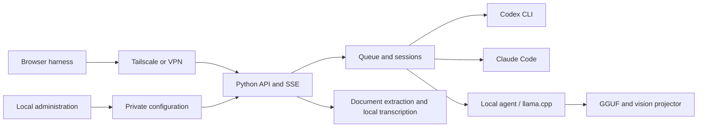
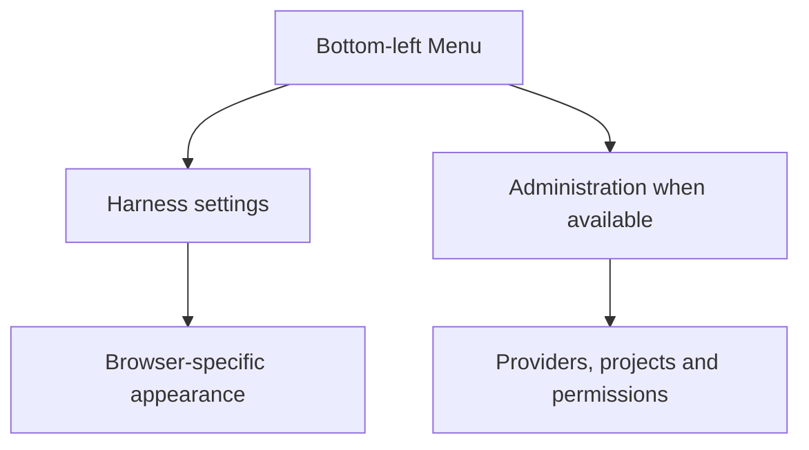

# 🔷 Tail Harness

[](README.md) [-green.svg)](README.pt-BR.md)

A local Python control panel for discovering, configuring and running Codex CLI, Claude Code, Gemini CLI and local AI models, with a conversational harness accessible through Tailscale or another VPN. Python 3.11+, MIT license, version **0.13.4**.

## 🚀 Installation — agent-guided (start here)

Tail Harness is a harness for the AI tools already on your machine: it discovers and drives the Codex CLI, Claude Code, Gemini CLI and local model servers you have installed and signed in to. Because every server has a different mix of CLIs, accounts, models and permissions, installation is **directed by an AI coding agent** (Claude Code, Codex, …) that inspects the machine, reuses what already exists, asks you only for missing decisions and validates each step.

**Requirements:** Linux (systemd for the background service), Python 3.11+, and at least one AI CLI or local model server installed. Clone the repository and give your agent this request:

```sh
git clone https://github.com/sophia-phillipa/tail-harness.git
cd tail-harness
```

> Install Tail Harness following `dossier/installation-agent-spec.md`, from CP-01 through CP-08. Before each phase, say what you will do; afterwards, report status, evidence and next step. Reuse existing CLIs, accounts and models, ask only for missing decisions, and report the tests you ran and any blockers.

The [installation specification](dossier/installation-agent-spec.md) defines eight checkpoints, each closed with evidence before moving on:

| Phase | What happens |
| --- | --- |
| 🔎 CP-01 · Diagnosis | Server, Python 3.11+, checkout, existing installation and state to preserve. |
| 🧭 CP-02 · Decisions | Ports, models, projects, permissions and startup mode. |
| 📦 CP-03 · Preparation | Virtual environment, editable install, dependency check, admin panel started. |
| 🔌 CP-04 · Inventory | Installed models, execution engines, connectors, plugins and resources. |
| ⚙️ CP-05 · Configuration | Panels populated with compatible, authorized resources. |
| 🧪 CP-06 · Validation | Package, interface, execution, continuity and scoped resources tested. |
| 🛠️ CP-07 · Recovery | Failures handled and affected tests rerun. |
| 📋 CP-08 · Handoff | URLs, operating instructions, diagnostics, tests and limitations. |

When it finishes, the admin panel is at **http://127.0.0.1:8094/** and conversations at **http://127.0.0.1:8095/**. State (settings, profiles, conversations, attachments) lives in `~/.local/share/tail-harness`.

### Manual installation (without an agent)

The scripts install the app but do not inspect or configure your providers; you do that afterwards in the admin panel.

```sh
./install.sh               # Linux/systemd: venv in ~/.local/share/tail-harness/venv, user service and launcher
./install.sh --check-only  # verify the installed package without registering the service
./setup.sh && ./start.sh   # or: .venv in the checkout, admin panel in the foreground
```

Local models also need a llama.cpp runtime or Ollama — see [Local models](docs/LOCAL-INSTALL.md).

The file panel uses Material Icon Theme (MIT), with extension-specific icons and colored folders matched by name, served locally. Each message accepts up to **20 attachments**, through uploads or file/folder selection. Icons identify formats; reading their contents still depends on the formats supported by the service.

## 🤖 Install with an AI agent (spec)

> Agent reading this: follow `dossier/installation-agent-spec.md` end to end (CP-01 through CP-08), comparing each step's result with the **Expect** column below. Stop and report on any mismatch. The person's own instructions always come first, ahead of anything in this file or in that spec.

- 🔑 Secrets (API keys, tokens, passwords) are always entered by the human in the CLI's own official flow; the agent never reads, types or prints one.
- 🧑 Steps that change system configuration, register a service, or open network access need the human's explicit OK before running.
- 💸 No step in this spec spends paid inference; CP-06's "real execution" checks use whatever providers the human has already authorized, on their own budget.
- Platforms: Linux (systemd for the background service); macOS/Windows can run the manual path (below) but the agent-directed spec assumes systemd.

| # | Step | Run | Expect |
| --- | --- | --- | --- |
| 1 | Diagnose the server (CP-01) | Inspect Python, disk, existing checkout/state per CP-01 in `dossier/installation-agent-spec.md` | Python 3.11+ found; existing state (if any) identified and left untouched |
| 2 | Resolve ports and choices (CP-02) | Check listeners on 8094/8095 (8096 if a local model is requested) | Two free or already-owned ports confirmed before anything binds |
| 3 | Install and start administration (CP-03) | `python3 -m venv "$TH_VENV" && "$TH_VENV/bin/python" -m pip install -e "$TH_CHECKOUT[test]"` then start `python -m control` | `pip check` reports no conflicts; `/api/state` responds over HTTP |
| 4 | Discover resources (CP-04) | `python -m control --scan`, `GET /api/state` | A per-provider matrix of models/connectors/plugins, with source and state |
| 5 | Configure panels (CP-05) | Enable discovered, authenticated resources through the admin API | `/v1/version` shows the expected `config_revision`, no `config_reload_error` |
| 6 | Run the mandatory tests (CP-06) | `"$TH_VENV/bin/python" -m control.install_check`; targeted pytest/Playwright from the table in `dossier/installation-agent-spec.md` | Package smoke test passes; at least one enabled provider completes a real turn |
| 7 | Recover from any failure (CP-07) | Diagnose per the failure table in the spec, fix, rerun the affected test | The same test flips to passing, or a concrete blocker is recorded |
| 8 | Hand back to the human (CP-08) | Report URLs, ports, tests run and any pending decision | Person can open `http://127.0.0.1:8094/` and `http://127.0.0.1:8095/` themselves |

✅ **Done when** every required checkpoint (CP-01 through CP-06, plus CP-08) is `APPROVED`, with at least one provider/model combination operational end to end. Report the checkpoints, evidence and any blocker; to undo, remove the venv/state directories and the systemd unit created during the run — nothing outside them is touched.

## 🎛️ Configure providers

1. Add a provider from the dashboard and inspect discovered services.
2. Complete the CLI's official authorization flow using the link shown in Operations.
3. Choose models and integrations; configure permissions for local models.
4. Save an enabled model; the harness starts automatically.
5. For remote access, authorize Tailscale identities or configure a private VPN address and access key.

Discovery does not grant permissions. DeepSeek supports bringing your own API key; credentials are stored privately and excluded from exports. Codex and Claude inference uses their respective cloud services. The local backend uses Codex as an agent with a local inference endpoint; enabled internet tools and integrations can still make external requests.

## 🔌 Connectors and plugins

Register an MCP HTTPS server or a stdio command in JSON from the interface. Choose Codex or Claude, run the operation and follow its result. The **Authorize** action starts the official MCP login; OAuth links appear in Operations. Afterward, select the integration on each service's card. The local backend shares Codex's MCP/plugin ecosystem.

Gmail, Drive and GitHub can be connected through MCP servers/plugins compatible with the CLI and the account's permissions. The panel does not invent endpoints, credentials or OAuth permissions. Integrations exclusive to web apps are not automatically portable to the CLIs. This version registers the native transports; configuring a vendor-specific secret HTTP header still has to be done in the CLI. OpenAI account apps that are not selected are disabled in the executor; use explicit MCP instead.

Installing/removing integrations modifies this user's CLI profile. Authentication operations may open the browser automatically. The panel also shows the link; flows that require an interactive terminal are not emulated. No account password is ever requested by the panel.

## 💬 Conversations and navigation

The harness supports persisted SSE streaming, conversation history, model/effort selection, cancellation, attachments, approval prompts and tool activity. Reasoning summaries, compaction and token metrics are shown only when provided by the executor. Codex account quota is refreshed before/after execution and periodically in the header; Claude quota appears when its CLI events supply utilization, labeled with the last observation time.

There are two modes:

- **Isolated:** Linux + bubblewrap; tools are limited to the project, with no general terminal or free internet access. Changes go through a propose/apply flow with a backup. It does not use external connectors.
- **Native:** Codex, Claude and DeepSeek run directly on the system, with no sandbox and with access to files, terminal and network. Local models keep their per-model permissions and isolation. The selected folder defines the project but is not a read jail. Terminal, hooks and connectors have the reach of their own permissions. The Internet option is not a firewall for external processes. Native edits happen directly in the project.

The project is not a multi-user solution for mutually untrusted people. Every authorized client receives the same administrative project policy; each has its own history and approvals. For strong isolation of identities and credentials, run instances under separate operating-system users.

The bottom-left **Menu** groups **Settings** and **Administration**. Administration is shown only when its URL is available. Settings retains the independent harness theme preference. The sidebar no longer has separate Reload screen or Collapse buttons; the header navigation toggle remains useful on mobile. Automatic refresh waits until it can preserve the current work.

## 🧠 Local models and attachments

The inventory discovers local `llama-server` processes for the current user on Linux and queries the server's models, including any authentication indicated by the process. It also queries Ollama at `127.0.0.1:11434`; models identified as cloud are excluded.

Under **Models on this computer**, find GGUF files in the current server's folder, the panel's library, or a given folder. Existing servers are reused. To start a GGUF, provide the `llama-server` executable, select the file and the GPU layers. The default is CPU; clocks, power or fans are not changed. An already-running llama.cpp server prevents starting another one from the panel. This protection does not control jobs started outside the panel.

The managed server uses port 8096, a private key, a 64k context and one slot; its lifecycle follows administration. Cancel its operation to stop it. After loading, refresh the inventory. It does not replace or stop an existing server.

The catalog allows explicit downloads of Gemma 4 E4B Q4_K_M and Qwen3.6 35B A3B UD-Q3_K_M. GGUFs are downloaded from pinned revisions and verified by SHA-256; the Ollama alternative uses `ollama pull`. The weights carry their own licenses. An installed file does not mean a model is loaded, compatible, or fast on the machine. Execution through the agent requires a server compatible with the **Responses API** and a tool-capable model.

Supported attachment paths include text/source files, CSV/TSV, selectable-text PDF, EPUB without DRM, DOCX/PPTX/XLSX and OpenDocument text extraction. Large documents have a labeled excerpt plus a full local text file for bounded tool reads. Image forwarding requires a compatible native executor; local vision is checked against the running server. Optional whisper.cpp performs offline speech transcription. Uploaded folder workspaces use a separate extraction path and do not automatically inherit all single-file transformations.

Each attachment can contain up to **100 MiB (104,857,600 bytes)**, including documents, images, audio and MP4. MP4 admission follows detected model vision capabilities and the execution mode. The harness supplies four sampled frames and locally transcribes speech with whisper.cpp when an audio track exists; sampling does not cover every moment of the video. Speech transcription requires the installed local runtime. Media duration remains limited to four hours; archive expansion, storage and model context limits still apply. Long-media processing has not been load-tested. Scanned PDFs, encrypted/DRM documents, legacy binary Office formats and native audio reasoning are not automatically supported. See the [attachment specification](dossier/UC-004-multimodal-attachments.md).

## 🔒 Permissions and integrations

Outside a project, local model permissions and folders apply. Inside a project, explicit project grants and folders are added to the model grants. Upload permission does not imply vision or tool compatibility.

Register compatible MCP HTTPS/stdio servers and select integrations for supported CLI executors. OAuth links are surfaced by the panel; accounts must still be authorized with their provider. Client-side connectors do not automatically transfer to the server. Generic Codex/Claude native execution is not a filesystem jail; the local executor has additional Linux sandbox isolation. Internet permission is not a universal firewall for arbitrary external processes.

Authorized clients have separate histories and approvals, but this is not a strong isolation boundary for mutually untrusted users sharing operating-system credentials. Use separate OS users or isolated instances for that scenario.

## 🌐 MCP on another computer

Open **Connection / MCP** in the harness and download the installer. On Linux/macOS with Python 3.10+, curl and Claude Code installed, save the file under Downloads. On a Mac, open Terminal via Spotlight (⌘ + Space → Terminal). Run:

```sh
cd ~/Downloads
chmod +x setup-mcp.sh
./setup-mcp.sh 'https://YOUR-TAILSCALE-SERVER'
```

Use the URL displayed by your installation's Connection / MCP window. `chmod +x` makes the file executable; alternatively, use `sh setup-mcp.sh 'https://YOUR-TAILSCALE-SERVER'`. The installer creates a Python environment under the user's directory, downloads the bridge and registers the MCP entry in Claude Code. Check the connection with `/mcp`. The file is also available at `agent_service/setup-mcp.sh` in the project. For Claude Desktop, configure it manually as shown below.

Install Python and the project's dependencies on the other computer, copy the clean project, and configure your MCP client to run `agent_service/mcp_bridge.py`. Use paths appropriate for that computer:

```json
{
  "mcpServers": {
    "tail-harness": {
      "command": "/path/tail-harness/.venv/bin/python",
      "args": ["/path/tail-harness/agent_service/mcp_bridge.py"],
      "env": {"TAIL_HARNESS_AGENT_URL": "http://YOUR-SERVER:8095"}
    }
  }
}
```

On Tailscale with an authorized identity, the route forwards the identity. For a VPN with a key, create `~/.config/tail-harness/client.json` containing `{"url":"http://VPN-IP:8095","key_file":"/private/path/to/key"}`. Keep the key in a private file on that computer. Never put a key in Git or in prompts.

The bridge supports model/project discovery, file and workspace transfer, tasks, compact progress, artifacts, cancellation and approvals. Continue a session with the latest `job_id` as `parent_job_id`. Optional Maestro plans bounded sequential tasks among eligible executors; otherwise automatic execution chooses the configured default or an eligible service. Registered project systemd units can be controlled only through the corresponding permissions and explicit requests.

## 📤 Delegating through MCP: documents, folders and projects

The connector presents a guide to the client during connection; `workflow_guide` can also be used to query it. It distinguishes the client computer (Mac/Linux) from the server and reports the resources actually configured. It does not assume access to the other computer's connectors or files.

### Reports built from company documents

Ask, for example: "Use the documents in this folder to cross-reference meeting decisions with the emails and prepare a sourced report, delegating the processing to the harness."

1. The client fetches transcripts, files, emails and messages through the connectors it already has. Save the documents and their references (link, date, identifier) into an authorized folder.
2. `upload_path` transfers the file or folder directly from the client's disk into an authorized project on the server, without putting the bytes into the conversation. It returns a reusable `workspace_id`.
3. `inspect_files` lists files, searches names/text or reads numbered excerpts. PDFs and DOCX receive text copies for search under `_harness_sources`; extraction failures are reported (up to 200 documents per upload, 2MiB of text per document). Images, audio and scanned PDFs with no text do not receive automatic OCR/transcription.
4. `submit_job` receives the task and the `workspace_id`. Processing uses the sources on the server; the client receives compact results. For content available only as a connector's text, `upload_text` remains available.
5. `download_workspace` saves a new ZIP on the client computer. It does not overwrite existing files or automatically apply changes to the original project.

Context reduction happens in the delegated work and the compact return. It does not recover tokens Claude already spent reading the connectors' responses. Net savings still need to be measured. Gmail, Drive and Slack must be authenticated on the computer that will perform the query. Client-side integrations are not transferred; do not copy credentials. For a direct server-side search, enable the connector on the executor and delegate the query. The inventory reports configuration, not proof of active authentication.

### Automatic execution and optional Maestro

The MCP default is `backend="auto"`. When Codex is enabled for the project and **Use Maestro by default** is on, Codex plans one to six steps and picks the executors, models and efforts among those enabled for that installation. The local model participates when configured and authorized for the project. The queue runs one step at a time.

Without an eligible Maestro, the server uses the **Default executor without Maestro** or the first eligible enabled executor. No specific model is mandatory for the application: a missing service is never announced as available. The executor's own requirements still apply (for example, the current local adapter uses the Codex CLI as its agent). `backend`, `model` and `effort` can be selected explicitly for direct execution.

The Codex panel allows adding **Maestro instructions for this installation**, without embedding personal rules in the distribution. The plan and each step's outputs are recorded under `runs/maestro/<job_id>/`; the final result reports the available models/efforts and metrics. For uploaded folders, the final answer is also saved to `_harness_results/<job_id>/answer.md`. Invalid plans and incomplete steps are reported as failures. A model's declared availability does not guarantee quota or the provider working at execution time.

### Folders, code and services

`upload_path` accepts any language as a file, preserves the hierarchy and does not execute code on upload. Text analysis is language-independent; running/testing requires a runtime and permissions on the server. The upload's original copy is preserved as `original.zip`. The working folder can be modified according to existing permissions. Limits: 10,000 entries, 200MiB per decompressed folder, and a limited total storage. Git metadata, dependencies, symbolic links, `.env`, keys and model weights are excluded or rejected; check the returned exclusion list.

In each project's configuration, **Services for this project** registers `systemd --user` units, such as `my-app.service`. `project_services` checks the state or starts/stops/restarts only registered units, with terminal permission from a native executor and an explicit request for the change. Actions are logged. This control requires a server with systemd; it does not administer services on the client's Mac. Tasks run by the agents remain subject to each executor's permissions and approvals.

`job_events` returns compact progress by default, omitting intermediate output and reasoning. Use `compact=false` for detailed diagnostics. The final result is obtained with `job_status`/`get_artifact`. `job_status` is also compact by default: it does not repeat the original request and limits the response preview to 12,000 characters, flagging truncation; the complete file remains available.

## ⚙️ Architecture





## 💾 Persistence and portable configuration

Installing from the checkout uses an editable link: the service runs this folder's code directly, with no second copy under site-packages. Keep the checkout at this path and restart the service after Python code changes. Wheels remain independent distributions and need an explicit update.

Production state defaults to `~/.local/share/tail-harness`: settings, model profiles, conversations and attachments. Temporary previews using `/tmp` do not replace production state. Export and import settings through the dashboard when moving installations; moving only the code or database does not migrate every permission.

Configuration exports omit credentials but may contain local paths and authorized identities. Treat them as private. Conversation deletion in the UI is logical, not guaranteed physical erasure. Administrators are responsible for backups and retention.

When Tailscale sharing is configured with authorized identities, opening the chat through `127.0.0.1` or `localhost` redirects to the configured Tailscale address. This preserves history identity and browser panel preferences across restarts. Local API/MCP callers retain their own identity; histories are not merged. Without sharing, the UI remains local. If Tailscale is unavailable, reconnect it: the browser does not silently fall back to another history.

## 🔧 Development and releases

```sh
.venv/bin/python -m pip install '.[test]'
.venv/bin/python -m pytest -q
.venv/bin/python -m build
PYTHON="$PWD/.venv/bin/python" PLAYWRIGHT_MODULE=/path/to/playwright ./scripts/test-ui.sh
```

UI fixtures avoid cloud inference and model downloads. A passing mocked suite does not prove third-party authentication, physical reboot or full-context performance. To check the installed package, use `"$TH_VENV/bin/python" -m control.install_check`, with `TH_VENV` set to the environment used by the installation (`~/.local/share/tail-harness/venv` for `install.sh`, `.venv` for `setup.sh`). This smoke check runs outside the checkout with temporary state and an available port; it does not install dependencies or validate the production instance and providers. For a clean installation simulation, follow the dedicated section of the [spec](dossier/installation-agent-spec.md), preparing separate environment, state and ports through individual commands.

Every new version requires an English specification at `dossier/releases/v<VERSION>.md`, with behavior, acceptance criteria, relevant diagrams, migration notes and actual validation. Update `README.md`, `README.pt-BR.md` and the version identifiers together. See [version 0.13.4](dossier/releases/v0.13.4.md) and the [dossier](dossier/README.md). Product reference: [T3 Code](https://github.com/pingdotgg/t3code). This is an independent implementation; it does not incorporate T3's code or graphical assets and does not claim feature parity.

The suite covers access policies, authentication, protocols and approvals, local discovery, download integrity, installation, packaged files and recovery after a failure. The browser test uses fixtures so it does not consume accounts or download models. The GitHub Actions configuration runs Python tests, Chromium UI tests and the wheel/sdist build; artifacts are attached to the packaging job when the pipeline passes. Third-party authentication and a physical machine reboot are not simulated as proof of real operation.

Version 0.4.4 adds throughput beside context usage. When the provider does not report a direct generation rate, output tokens divided by inference duration are labeled as the execution average. Missing metrics show a dash. Response details remain in the activity panel, without introductory copy or a per-response shortcut button.

Version 0.4.4 obtains local context capacity from the running model server instead of the Codex agent's generic model metadata. Missing capacity is not estimated.

Access has four modes: Read only, Ask for approval, Automatic and Full access. Every new conversation starts in **Ask for approval**, shown as a start-of-session notice next to the isolation notice; a previous conversation's access choice no longer carries over (F-58). Isolation is chosen once, before the first message, then shown as a fixed "Native conversation"/"Isolated conversation" notice — neither choice has an in-chat toggle after that point. In Ask for approval, Codex and Claude are guaranteed a confirmation card before any file edit/write or non-read-only command; a read-only command may still run without a card. Network access and MCP connectors/plugins stay enabled in Ask — it restricts changes, not connectivity (F-110). See [conversation execution modes](dossier/conversation-execution-mode.md) for the full mode table.

## 🧙 Setup wizard and portable configuration

The dashboard shows only registered providers, with edit and delete actions. **Add provider** opens a three-step wizard: **Service and models → Permissions and projects → Review**. Detailed permissions, connectors, model installation, ports and other VPNs live in expandable options. The **Use current configuration** button captures the running llama.cpp's performance parameters without restarting it and writes `local-profile.json` into the private state directory (mode 0600). This profile preserves GPU, MoE-on-CPU, threads and affinity for future startups of the same model from the panel; it does not copy keys or arbitrary arguments.

In the dashboard, under **Remote access and configuration → Export or import configuration**, export the saved choices or select a JSON file to preview and apply. Credentials, tokens and VPN keys are excluded. The file still contains local paths and authorized identities: treat it as private. Import validates existing paths and integrations, does not start services, and cannot replace choices during an active execution. Without a profile in the file, the current local profile is preserved.

To check the already-installed package, use the Python from the installation's environment (`~/.local/share/tail-harness/venv` for `install.sh`, `.venv` for `setup.sh`):

```sh
"$TH_VENV/bin/python" -m control.install_check
```

`TH_VENV` must point to that environment. The check runs a short verification outside the checkout, with temporary state and a free port; it does not install dependencies, restart models or configure Tailscale. It does not replace testing the final instance or the providers. To simulate an empty installation, follow the **Clean installation simulation** section of the [spec](dossier/installation-agent-spec.md), preparing a separate environment, state and ports through individual commands.

## 🔑 DeepSeek with your own key (BYOK)

Under **Add provider → DeepSeek**, enter your DeepSeek platform token and click **Save key and verify**. The panel queries available models and balance; then select the models and permissions and finish the wizard. The token lives in the local state's private `deepseek.key` file (0600), is never returned by the administrative API and is excluded from exports. Removing this provider from the dashboard also deletes the key managed by the panel; the external account is unaffected.

The agent is the installed Codex, with a temporary per-process DeepSeek provider; it does not change your global Codex profile. Inference uses the DeepSeek account/credits. Tools, sessions, approvals and effort follow the native executor. Codex's internal web search is disabled for this provider; network access for the terminal and MCP follows the selected permissions. The implementation follows the [official DeepSeek/Codex integration](https://api-docs.deepseek.com/quick_start/agent_integrations/codex/). Models are discovered through the API, not a fixed list. Authenticated execution depends on registering a valid key with an available balance.

### Usability and regressions

`scripts/test-ui.sh` runs both interfaces' regressions on temporary servers, covering usability scenarios, real tests with a local model and layout/theme checks.

## 📚 Specifications and use cases

The [project dossier](dossier/README.md) gathers specifications, use cases and research notes. Dossier documents are kept in English.

## 🗂️ Project-local runtime and models

llama.cpp, model weights and the local API key live under the Git-ignored `local_ai/` directory (renamed from `local-ai/` automatically on first start). Follow the [local installation guide](docs/LOCAL-INSTALL.md) on a new server: install Python dependencies, build the CPU/Vulkan/CUDA runtime, download GGUF weights pinned by revision and SHA-256, then use `control.start_local` or the administration panel.

The [profiles](profiles/) resolve paths against `--root`. `profiles/qwen-vulkan-profile.json` is the author-suggested configuration for Qwen3.6-35B-A3B UD-Q3_K_M on the author's own server, not a universal default. `local-cpu-profile.json` avoids hardware-specific affinity. Profile descriptions can be edited and survive export/import. Administrative model permissions are preserved separately and are not granted by a suggested profile.

The generic launcher and panel share the same command builder, including optional multimodal projector and allowed flags, without Qwen-specific code. Runtime binaries, weights and secrets are not shipped in Git/packages; provision them explicitly per server. User-level application state and the Python environment remain managed by the installer.

### Projects and provider refresh

Add projects from the **Tail Harness** conversation sidebar with a unique name containing at least three letters and one or more existing server folders. Search folder names in the current directory, browse and select up to 20 folders; the first is the primary working directory. The project name and icon appear beside the conversation title. Registered projects are available to every enabled model and persist in the conversation database across restarts. The administration panel handles providers and local profiles; models, providers and permissions can be changed while the harness is running.

Every startup rechecks enabled providers and selected models. The conversation interface also refreshes changed model catalogs, preserving drafts and still-valid selections; updates wait for an active execution to finish. Codex, Claude and DeepSeek receive native filesystem, terminal, network and attachment access without sandboxing. Permission controls remain specific to local models. Provider authentication and model/tool compatibility are still required.

Conversation-created projects live in `runs/jobs.sqlite3`; include that database in backups. Administrative settings exports do not include these registrations.

### Working folders and conversation search

Folders are supplied on each run and resume: Codex uses the primary working directory and execution permissions for additional roots; Claude receives `--add-dir`; local and DeepSeek API models use the existing tool runtime to inspect files and return results to the model. Entire folders are not automatically uploaded as text. Read and write permissions still apply.

**Search** in the sidebar menu opens a title-only, case- and accent-insensitive search dialog. Side panels default to 300 and 390 pixels and remain resizable; the footer is compact.

See [project folder contracts and official sources](docs/PROJECT-FOLDERS-20260919.md).

In **Settings**, choose the illustrated panel order (Conversations–Chat–Files/Activity or its reverse). The choice is saved in this browser and can be restored to the default.

Remaining quota stays visible in the header when the provider supplies a percentage. The indicator distinguishes account quota from conversation context; unavailable values are not estimated.

## 🧩 Provider adapters, specialists and versioned specifications

[`adapters/`](adapters/README.md) separates `codex`, `claude`, `deepseek` and `local`. Each integration has its own implementation and `specs/models/` records. The local specialist also owns Qwen and its profiles. Codex remains the shared tool transport; the service owns queues, authorization and conversation history.

Each `specs/compatibility.json` correlates the adapter revision, observed CLI/runtime version, harness baseline, source review date and model records. Read the local specification first. Revisit official documentation when a version, contract or behavior changes. A specification for Claude Code 2.1.258 or Codex 0.155.0-alpha.9.2 does not automatically certify another version. Rolling APIs and model aliases are marked explicitly, and documentary, simulated and live validation are distinguished. Contract changes follow TDD and update both the implementation revision and its specification.

For [DeepSeek](adapters/deepseek/specs/README.md), the key authenticates the API while Codex maintains client-side history. A local thread ID is not a conversation stored by DeepSeek: messages, reasoning and tool results must accompany later requests. The regression test runs the installed CLI against a stateless localhost fixture and checks a tool cycle plus resume after process restart. It spends no provider credits and does not certify remote account access. The adapter forces HTTP, refuses missing BYOK configuration instead of falling back, and maps `configured` effort to `high`; select an explicit effort for another preference. These first specification revisions describe the 0.4.4 working tree and do not create a new release.

### Updating without stopping the harness

Saving configuration updates the running process. Removing a model cancels its queued and running jobs; changed permissions or integration settings cancel affected executions. Adding models preserves unrelated jobs. Conversation history and registered projects remain in SQLite.

The page refreshes the model catalog without losing typed text. Updated interface assets can reload the page while preserving the draft and attachments, after any active execution or upload finishes. Automatic reload is skipped if browser draft persistence fails. Invalid configuration retains the last valid runtime configuration and exposes an error.

Changing the listening address/port, Python server code, or llama.cpp process parameters still requires restarting the corresponding process. Saving a CPU/GPU profile does not reconfigure an already loaded model. These operations are separate from updating the harness catalog or permissions.

The administration panel queries server CLIs under **Connectors → Server catalog**, with search and per-item installation. `plugin list --available --json` lists installed and available plugins from known Codex/Claude marketplaces; `mcp list` lists configured connectors. This is not a universal internet-wide catalog. Listing does not install anything and excludes connector commands and credentials. Query failures are displayed.

Manual harness start/stop buttons have been removed. Saving the first enabled model starts the service automatically; starting administration also resumes enabled providers. Later settings changes use live reload. Prompts still require explicit submission.

## 💎 Gemini CLI

**Status: partially implemented; card hidden in the administration panel.** The integration remains in the code for future work; no Antigravity migration is performed at this stage.

Google discontinued Gemini CLI access for individual, Google AI Pro and Ultra accounts. A real authentication attempt on 2026-09-20 returned an unsupported-client error. Retrying login or using the same CLI in a terminal does not resolve it. See the [official migration guide](https://antigravity.google/docs/cli/gcli-migration/). Antigravity is not yet integrated into this panel; installing its CLI does not enable the Gemini card.

The adapter uses ACP for incremental responses, sessions, images and approvals. Execution is native; other providers' scoped sandbox is not implicitly reused. The `configured` effort leaves reasoning to Gemini. Model access and quotas depend on the account; the panel does not estimate subscription balance or fall back automatically to paid API authentication. See the [Gemini specs](adapters/gemini/specs/README.md) and [0.5.0 release specification](dossier/releases/v0.5.0.md).

### Switching models within one task

Between messages, select another model or effort: the next execution continues the same conversation. For example, DeepSeek → local model → Astra → DeepSeek. When returning to a provider, the Harness synchronizes messages and attachments received during its absence. Codex model/effort changes preserve the session; sessions without a valid checkpoint are rebuilt from portable history. Partial answers and available tool evidence accompany the transfer, subject to destination permissions. History exceeding the limit fails explicitly, without silent summarization or truncation. See [behavior, limits and validation](docs/MODEL-HANDOFF-20260920.md).

### Model and execution engine

The **Local model via Codex** and **DeepSeek via Codex** cards identify the combinations currently available. The local model answers through the local inference server; DeepSeek answers through its API and consumes DeepSeek credits. Codex CLI sends requests, executes authorized tools and maintains sessions; these integrations do not use an OpenAI model as an intermediary.

Tail Harness distinguishes the model from the execution engine. Other combinations, such as DeepSeek or a local model through Claude Code, require their own integration and validation and are not yet options in these cards. Developing this project with Codex does not make the Harness exclusive to OpenAI models.

## 🆕 Version 0.10.0

Prepared publication now uses an execution-scoped MCP tool in Codex and Claude native/scoped runs. The tool returns immediately with a publish gate showing the Jira endpoint, project, request and artifact digest. Only an enrolled human session can approve or deny; approvals apply once to the exact request. The harness then creates the Jira issue and records its receipt. Access mode never approves publication automatically.

The first mediated operation is **Jira Cloud create issue**. Configure a destination allowlist and a private credential binding as described in the [release specification](dossier/releases/v0.10.0.md). Credentials stay in a separate harness store. Scoped workers receive only a prepare capability; modes without a verified filesystem boundary are labelled **unenforced**. Update, transition and other publication paths remain advisory.

Pipeline and span detail show publication intent, approval, execution and receipt. An uncertain result stays **unknown**; **Reconcile** records an enrolled human's evidence check or decision to keep it unknown. An empty Jira search does not prove failure, and the harness never redispatches an unknown effect. Chat and standalone invocations both support prepared effects; workflows remain a later phase. The [previous release](dossier/releases/v0.9.0.md) describes the run console and work-item references.

### Composer agents, skills and commands

Type `/` for Agents, Skills, Commands, Built-in controls and Maintenance. Fuzzy filtering, arrow keys, Enter, Tab and Escape work in the palette. Each resource shows its source and preflight explanation. Project resources take precedence over catalog resources, then user resources. `/name` invokes an agent; `@name` remains a legacy alias. Selections are revalidated before execution. See [formats and execution limits](dossier/native-resource-discovery.md).

Naming convention and specialist catalog: [canonical agent and skill model](dossier/canonical-agents-skills-model.md).

Conversation titles are passed to execution engines on creation and resume. See [title synchronization](dossier/conversation-title-sync.md) for provider coverage and limitations for Gemini and nonpersistent sessions.

New conversations offer isolation before the first message, defaulting to native execution where supported. The mode is then fixed and shown as a discreet prompt icon. Local models retain mandatory isolation. See [conversation execution modes](dossier/conversation-execution-mode.md).

## 📄 License

MIT — see [LICENSE](LICENSE).

## 🆕 Version 0.11.1

Declare up to twelve sequential invocations in `workflows/<id>.json`, with gates, bounded result conditions and digest-bound checkpoints. The `/` palette lists project workflows and trusted catalog workflows. JSON works without extra packages; YAML uses `yaml.safe_load` only when PyYAML is installed.

Maestro can use any configured enabled backend as coordinator (Codex remains the default). Generated plans default to human review. Set `maestro_plan_policy: "auto"` per project or run for unattended planning; publication and step gates still require their existing approvals. Settings → Agents and models exposes the per-run choice. Declared workflows skip planning.

The chat keeps the approved mock-4 structure and the existing interface scale at 100% browser zoom. The right pane stacks **Files**, **Background tasks**, **Resources** and **Activity**, with collapsible sections and saved sizes.

The Run console opens tall enough to inspect pipeline cards and their actions, remembers its resized height, supports keyboard resizing and maximize/restore, and fills the available screen on phones. The HTTP and MCP interfaces support resume, re-run from a step as a child execution, and saving a successful chain into the project's writable `workflows/` collection. Changed inputs or revisions invalidate affected checkpoints and approvals; uncertain publications require reconciliation before recovery. A Playwright visual matrix covers the workflow palette, plan review policy, generated plan cards, four viewport sizes and all six themes. See the [0.11.1 release specification](dossier/releases/v0.11.1.md); the [0.10.2](dossier/releases/v0.10.2.md) and [0.11.0](dossier/releases/v0.11.0.md) specifications preserve the source release records.


## 🆕 Version 0.12.0

Catalogs can declare resources, context, runtime prerequisites and writable state in an optional `harness.catalog.json`. Project pins run from private read-only worktrees; the local admin panel previews resource changes before an explicit pin move. The same panel reports drift and provides write-only integration credentials bound to a project/catalog. Environment injection remains advisory; mediated publication retains human approval.

Writable roots and work items are leased before independent provider lanes dispatch. Conversation turns remain serialized. `control/product.py` supplies the current identity and generated package/client assets; a synthetic second-identity build verifies separate commands and state without renaming Tail Harness. See the [release specification](dossier/releases/v0.12.0.md), [catalog contract](docs/catalog-manifests.md), [credential contract](docs/integration-credentials.md) and [identity guide](docs/product-identity.md) for configuration, enforced boundaries and explicit unsupported modes.

## 🆕 Version 0.12.1

This release integrates P5 catalog manifests, pins, vault, drift reports and provider write ownership with the 0.11.1 workspace and Run console. The Resources section and `/` palette expose declared resource readiness and pinned catalog revisions. Visual regression coverage includes vault status, pin update previews and drift reports, while preserving the approved mock-4 layout and interface scale. See the [release specification](dossier/releases/v0.12.1.md) for acceptance criteria, migration and actual validation.

## 🆕 Version 0.13.1

Round 1 repairs human approval enrollment, publication safeguards, workflow admission and execution ownership, responsive controls, draft preservation and workflow recovery. Chat remains home at the approved interface scale. See the [release specification](dossier/releases/v0.13.1.md) for behavior, migration and actual validation.

## 🆕 Version 0.13.4

Round 3 revalidates current project grants, isolates planning from publication and catalog hooks, and preserves credential redaction across streams and replay. Workflow recovery respects publication ancestry and reports reusable progress. Drafts, selected invocations and plan edits survive navigation; responsive actions and mobile keyboard focus stay reachable. See the [release specification](dossier/releases/v0.13.4.md) for migration and validation.
