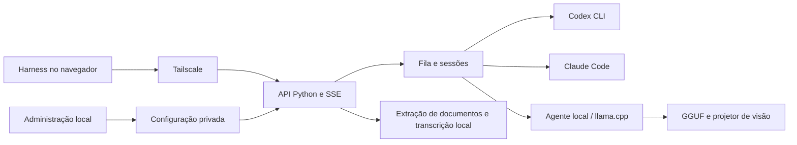
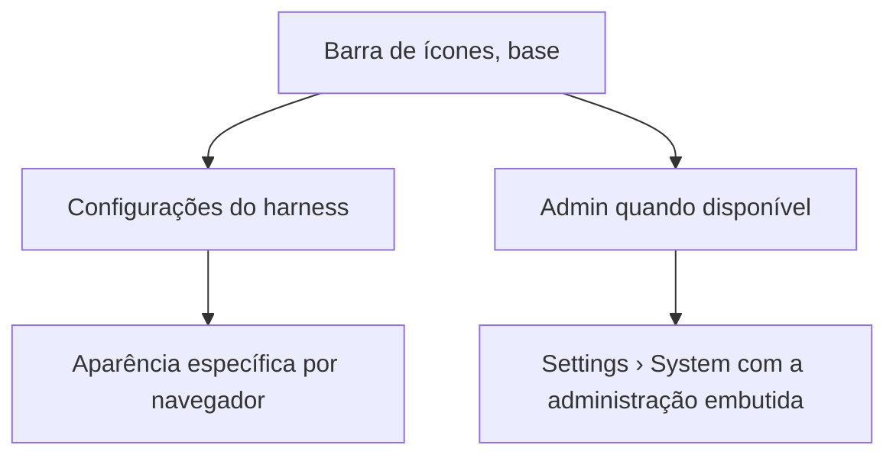

# 🔷 KeepHarness

[](README.md) [-green.svg)](README.pt-BR.md)

Painel local em Python para descobrir, configurar e executar o Codex CLI, o Claude Code, o Gemini CLI e modelos de IA locais, com uma interface de conversa acessível pela Tailscale. Python 3.11+, licença MIT, versão **0.16.0**.

## 🚀 Installation — agent-guided (start here)

O KeepHarness é um harness para as ferramentas de IA que já estão na sua máquina: ele descobre e opera o Codex CLI, o Claude Code, o Gemini CLI e os servidores de modelos locais que você já instalou e autenticou. Como cada servidor tem uma combinação diferente de CLIs, contas, modelos e permissões, a instalação é **conduzida por um agente de IA** (Claude Code, Codex, …) que inspeciona a máquina, reaproveita o que já existe, pergunta só as decisões que faltam e valida cada etapa.

**Requisitos:** Linux (systemd para o serviço em segundo plano), Python 3.11+ e ao menos um CLI de IA ou servidor de modelo local instalado. Clone o repositório e faça este pedido ao seu agente:

```sh
git clone https://github.com/sophia-phillipa/keepharness.git
cd keepharness
```

> Instale o KeepHarness seguindo `dossier/installation-agent-spec.md`, do CP-01 ao CP-08. Antes de cada fase, diga o que vai fazer; ao terminar, informe status, evidência e próximo passo. Reaproveite CLIs, contas e modelos existentes, pergunte só as decisões que faltarem e informe os testes executados e eventuais bloqueios.

A [especificação de instalação](dossier/installation-agent-spec.md) define oito checkpoints, cada um fechado com evidência antes de avançar:

| Fase | O que acontece |
| --- | --- |
| 🔎 CP-01 · Diagnóstico | Servidor, Python 3.11+, checkout, instalação existente e estado a preservar. |
| 🧭 CP-02 · Decisões | Portas, modelos, projetos, permissões e modo de inicialização. |
| 📦 CP-03 · Preparação | Ambiente virtual, instalação editável, checagem de dependências e painel administrativo iniciado. |
| 🔌 CP-04 · Inventário | Modelos, motores de execução, conectores, plugins e recursos instalados. |
| ⚙️ CP-05 · Configuração | Painéis preenchidos com recursos compatíveis e autorizados. |
| 🧪 CP-06 · Validação | Pacote, interface, execução, continuidade e recursos testados. |
| 🛠️ CP-07 · Recuperação | Falhas tratadas e testes afetados repetidos. |
| 📋 CP-08 · Entrega | URLs, instruções de operação, diagnósticos, testes e limitações. |

Ao final, o painel administrativo fica em **http://127.0.0.1:8094/** e as conversas em **http://127.0.0.1:8095/**. Antes, conecte o navegador com `keepharness open`, que imprime e abre um link de uso único (o aplicativo desktop conecta a própria janela). O estado (configurações, perfis, conversas e anexos) fica em `~/.local/share/keepharness`.

### Manual installation (without an agent)

Os scripts instalam o app, mas não inspecionam nem configuram seus provedores; isso é feito depois no painel administrativo.

```sh
./install.sh                # Linux/systemd: gera um wheel, instala em ~/.local/share/keepharness/venv, serviço do usuário e atalho
./install.sh --check-only   # as mesmas verificações e uma instalação de teste em pasta temporária; não altera mais nada
./install.sh --dev          # instalação editável: o serviço executa o código deste checkout
./setup.sh && ./start.sh    # ou: .venv no checkout e painel administrativo em primeiro plano
```

O `install.sh` primeiro verifica se está no host, se nenhum outro programa ocupa a porta do painel (padrão 8094) e se o estado do Tail Harness pode ser movido (um Tail Harness rodando no próprio `tail-harness.service` não bloqueia: o `install.sh` para esse serviço sozinho; um iniciado de outra forma, num terminal ou no cliente desktop, precisa ser parado antes); depois instala o pacote num ambiente temporário e faz um teste rápido. Só então para o Tail Harness, move o estado uma única vez e registra o serviço; ele só informa sucesso quando o próprio processo do serviço responde na porta. Se um passo posterior falhar, ele diz como tentar de novo ou voltar.

- **Hosts Fedora Atomic (Bazzite, Silverblue) com distrobox ou toolbox:** rode `./install.sh` num terminal do host. Dentro de um contêiner ele recusa, porque o systemd do host não consegue executar um ambiente criado com o Python do contêiner; de dentro do contêiner, `distrobox-host-exec ./install.sh` o executa no host. O serviço recebe o PATH do shell que rodou o instalador, então encontra as mesmas CLIs (por exemplo em `~/.local/bin` ou no Homebrew).
- **Atualizando do Tail Harness 0.14:** só o `install.sh` move `~/.local/share/tail-harness` para `~/.local/share/keepharness`; iniciar o KeepHarness nunca o move. Se uma pré-versão anterior deixou dados nas duas pastas, `./install.sh --merge-legacy` mostra um plano de fusão e `./install.sh --merge-legacy --apply` faz backup das duas pastas e as funde em `~/.local/share/tail-harness`, recusando quando uma conversa tem arquivos nas duas.
- **Voltando ao Tail Harness 0.14:** `./install.sh --rollback-to-0.14` remove o serviço, o atalho e a entrada de menu do KeepHarness, devolve o estado, põe de lado os marcadores de thread dos provedores como `*.before-rollback` (assim o 0.14 reexecuta o histórico de cada conversa em vez de retomar uma thread que não tem os turnos do 0.15) e registra a reversão em `~/.local/share/tail-harness.rolled-back`; nada volta a ser movido para o KeepHarness até você apagar esse arquivo e rodar `./install.sh`.

Modelos locais também precisam de um runtime llama.cpp ou do Ollama — veja [Modelos locais](docs/LOCAL-INSTALL.md).

O painel de arquivos usa o Material Icon Theme (MIT), com ícones específicos por extensão e pastas coloridas por nome, servidos localmente. Cada mensagem aceita até **20 anexos**, por upload ou seleção de arquivo/pasta. Os ícones identificam formatos; a leitura do conteúdo ainda depende dos formatos suportados pelo serviço.

## Updating

Espere os trabalhos em execução e na fila terminarem, atualize este checkout para a release desejada e rode `./install.sh` novamente no host. Use `./install.sh --dev` para manter uma instalação editável. O instalador verifica novamente depois da compilação de teste, antes de parar serviços, mover estado ou substituir o ambiente em uso. Uma recusa durante o registro do serviço informa que o pacote já está instalado e o serviço mantém o código antigo até reiniciar. O instalador recusa enquanto o painel administrativo informa trabalhos na fila ou em execução e explica que esses trabalhos precisam terminar primeiro. `./install.sh --force` ignora essa recusa quando você aceita explicitamente interromper trabalhos. Se um painel administrativo antigo não oferecer a consulta de trabalho sem alterações de estado, o instalador também recusa: espere os trabalhos terminarem antes de usar `--force` nessa atualização.

`/v1/version` informa o processo em execução como `build` e os arquivos atuais em disco como `disk_build`. `source_build` e `disk_source_build` identificam apenas os arquivos Python/fonte (incluindo `harness_ui/__init__.py` e o arquivo de versão) na inicialização e em disco; uma diferença entre eles mostra **Restart to finish the update** sem recarregar a página. Alterações apenas na interface não mostram esse aviso. Mudanças nos arquivos de interface podem recarregá-la depois que trabalhos ativos e uploads terminarem, preservando o rascunho e os anexos. Em uma instalação editável, espere os trabalhos terminarem antes de executar `systemctl --user restart keepharness.service` para carregar o código Python alterado.

O encerramento permite até 60 segundos para drenar os trabalhos, seguidos pelo prazo de 15 segundos para parar o harness. Rode `./install.sh` novamente para gerar a unit do usuário com `TimeoutStopSec=90`; apenas reiniciar não atualiza a unit.

## 🤖 Install with an AI agent (spec)

> Agente lendo isto: siga `dossier/installation-agent-spec.md` do início ao fim (CP-01 ao CP-08), comparando o resultado de cada etapa com a coluna **Expect** abaixo. Pare e informe qualquer divergência. As instruções da própria pessoa sempre vêm primeiro, antes de qualquer coisa neste arquivo ou naquela spec.

- 🔑 Segredos (chaves de API, tokens, senhas) são sempre digitados pela pessoa humana no fluxo oficial do próprio CLI; o agente nunca lê, digita ou imprime um segredo.
- 🧑 Etapas que alteram configuração do sistema, cadastram um serviço ou abrem acesso à rede precisam do OK explícito da pessoa antes de executar.
- 💸 Nenhuma etapa desta spec gasta inferência paga; as checagens de "execução real" do CP-06 usam os provedores que a pessoa já autorizou, no orçamento dela.
- Plataformas: Linux (systemd para o serviço em segundo plano); macOS/Windows conseguem seguir o caminho manual (abaixo), mas a spec guiada por agente pressupõe systemd.

| # | Etapa | Executar | Esperado |
| --- | --- | --- | --- |
| 1 | Diagnosticar o servidor (CP-01) | Inspecionar Python, disco e checkout/estado existentes conforme o CP-01 em `dossier/installation-agent-spec.md` | Python 3.11+ encontrado; estado existente (se houver) identificado e preservado |
| 2 | Resolver portas e decisões (CP-02) | Verificar os listeners em 8094/8095 (8096 se um modelo local for solicitado) | Duas portas livres, ou já pertencentes a esta instalação, confirmadas antes de qualquer bind |
| 3 | Instalar e iniciar a administração (CP-03) | `python3 -m venv "$TH_VENV" && "$TH_VENV/bin/python" -m pip install -e "$TH_CHECKOUT[test]"` e então iniciar `python -m control` | `pip check` sem conflitos; `/api/state` responde por HTTP |
| 4 | Descobrir recursos (CP-04) | `python -m control --scan`, `GET /api/state` | Uma matriz por provedor de modelos/conectores/plugins, com origem e estado |
| 5 | Configurar os painéis (CP-05) | Habilitar recursos descobertos e autenticados pela API administrativa | `/v1/version` mostra o `config_revision` esperado, sem `config_reload_error` |
| 6 | Executar os testes obrigatórios (CP-06) | `"$TH_VENV/bin/python" -m control.install_check`; pytest/Playwright direcionados da tabela em `dossier/installation-agent-spec.md` | O smoke test do pacote passa; ao menos um provedor habilitado completa uma execução real |
| 7 | Recuperar-se de qualquer falha (CP-07) | Diagnosticar conforme a tabela de falhas da spec, corrigir, repetir o teste afetado | O mesmo teste passa a aprovar, ou um bloqueio concreto é registrado |
| 8 | Entregar à pessoa humana (CP-08) | Informar URLs, portas, testes executados e qualquer decisão pendente | A pessoa executa `keepharness open` e então consegue abrir `http://127.0.0.1:8094/` e `http://127.0.0.1:8095/` por conta própria |

✅ **Concluído quando** todo checkpoint obrigatório (CP-01 ao CP-06, mais o CP-08) estiver `APPROVED`, com ao menos uma combinação de provedor/modelo operacional de ponta a ponta. Informe os checkpoints, a evidência e qualquer bloqueio; para desfazer, remova os diretórios de venv/estado e a unidade systemd criados durante a execução — nada fora deles é tocado.

## 🎛️ Configure providers

1. Adicione um provedor pelo dashboard e inspecione os serviços descobertos.
2. Complete o fluxo oficial de autorização do CLI usando o link mostrado em Operações.
3. Escolha modelos; configure permissões para modelos locais.
4. Salve um modelo habilitado; o harness inicia automaticamente.
5. Para acesso remoto, autorize a identidade Tailscale do dono.

A descoberta não concede permissões. O DeepSeek permite usar sua própria chave de API; as credenciais ficam privadas e são excluídas das exportações. A inferência do Codex e do Claude usa os respectivos serviços em nuvem. O backend local usa o Codex como agente com um endpoint de inferência local; ferramentas e integrações com internet habilitada ainda podem fazer requisições externas.

## 🔌 Connectors and plugins

Cadastre um servidor MCP HTTPS ou um comando stdio em JSON pela interface. Escolha Codex ou Claude, execute a operação e acompanhe o resultado. A ação **Autorizar** inicia o login MCP oficial; links OAuth aparecem em Operações. A configuração do próprio CLI decide o que ele carrega; o KeepHarness não mantém uma lista de permissões separada por provedor. O backend local compartilha o ecossistema MCP/plugins do Codex.

Gmail, Drive e GitHub podem ser conectados por servidores MCP/plugins compatíveis com o CLI e com as permissões da conta. O painel não inventa endpoints, credenciais ou permissões OAuth. Integrações exclusivas dos aplicativos web não são automaticamente portáveis para os CLIs. Esta versão cadastra os transportes nativos; configurar um cabeçalho HTTP secreto específico de um fornecedor ainda deve ser feito no CLI. As execuções nativas do Codex e do Claude carregam a configuração de CLI da proprietária, incluindo apps, servidores MCP e plugins habilitados. As opções de acesso selecionam os modos de permissão do CLI; Somente leitura não desativa integrações.

Instalar/remover integrações modifica o perfil de CLI deste usuário. Operações de autenticação podem abrir o navegador automaticamente. O painel também mostra o link; fluxos que exigem um terminal interativo não são emulados. Nenhuma senha de conta é pedida pelo painel.

## 💬 Conversations and navigation

O harness oferece streaming SSE persistido, histórico de conversas, seleção de modelo/esforço, cancelamento, anexos, pedidos de aprovação e atividade das ferramentas. Resumos de raciocínio, compactação e métricas de tokens só aparecem quando o executor os fornece. A cota da conta Codex é atualizada antes/depois da execução e periodicamente nos medidores de cota da barra de ícones; a cota do Claude aparece quando os eventos do CLI fornecem utilização, com a hora da última observação.

O modo de execução segue o provedor:

- **Local:** o isolamento obrigatório do sistema de arquivos continua habilitado, com as permissões existentes por modelo.
- **Nativo:** Codex, Claude, DeepSeek e Gemini usam suas rotas de execução nativas e as políticas de permissão aplicáveis. Codex e Claude não oferecem mais um modo isolado separado. A pasta selecionada define o projeto, mas não é uma prisão de leitura. Terminal, hooks e conectores têm o alcance de suas próprias permissões. A opção Internet não é um firewall para processos externos. Edições nativas acontecem diretamente no projeto.

O projeto não é uma solução multiusuário para pessoas mutuamente não confiáveis. Outras contas do mesmo computador não são confiáveis: alcançar 127.0.0.1 não basta para agir como dono. O dono é quem tem o segredo da instalação em `~/.local/share/keepharness/local.key` (modo 0600). O segredo nunca sai desse arquivo: o aplicativo desktop e `keepharness open` o usam para assinar um link de uso único que dá ao navegador uma sessão própria, válida por 30 dias; `keepharness open --revoke` desconecta todos os navegadores. Só esse dono registra, reaponta ou apaga pastas de projeto; pastas registradas no harness não são compartilhadas com outros clientes, e outros clientes não veem personas de agentes nem caminhos da pasta pessoal. Cada cliente autorizado tem seu próprio histórico e aprovações. Para isolamento forte de identidades e credenciais, execute instâncias sob usuários de sistema operacional distintos.

A barra de ícones à esquerda reúne, de cima para baixo, o botão da barra lateral, a **Busca** (Ctrl/⌘ K), o sino de atenção, arquivos e atividade, **Runs and pipeline** e **Agents and skills**; na base, nesta ordem, os medidores de cota dos provedores, **Admin**, **Theme**, **About** e **Settings**. O **Admin** só aparece quando seu endereço está disponível e, neste computador, abre **Settings › System**, que embute a administração (Providers, Operations, Runs, Catalogs and vault). Configurações mantém a preferência de tema do harness independente por navegador. A barra lateral não tem mais botões separados de recarregar tela ou recolher; o botão da barra lateral, no topo da barra de ícones (que vira barra superior nos celulares), continua útil em telas pequenas. A atualização automática espera até poder preservar o trabalho em andamento.

## 🧠 Local models and attachments

O inventário descobre processos `llama-server` do usuário atual no Linux e consulta os modelos do servidor, incluindo qualquer autenticação indicada pelo processo. Também consulta o Ollama em `127.0.0.1:11434`; modelos identificados como cloud são excluídos.

Em **Modelos neste computador**, encontre arquivos GGUF na pasta do servidor atual, na biblioteca do painel ou em uma pasta indicada. Servidores existentes são reutilizados. Para iniciar um GGUF, informe o executável `llama-server`, selecione o arquivo e as camadas de GPU. O padrão é CPU; clocks, potência ou ventoinhas não são alterados. Um servidor llama.cpp já em execução impede iniciar outro pelo painel. Essa proteção não controla trabalhos iniciados fora do painel.

O servidor gerenciado usa a porta 8096, uma chave privada, contexto de 64k e um slot; seu ciclo de vida acompanha a administração. Cancele sua operação para encerrá-lo. Depois de carregar, atualize o inventário. Ele não substitui nem encerra um servidor existente.

O catálogo permite download explícito de Gemma 4 E4B Q4_K_M e Qwen3.6 35B A3B UD-Q3_K_M. Os GGUFs são baixados de revisões fixas e verificados por SHA-256; a alternativa Ollama usa `ollama pull`. Os pesos têm suas próprias licenças. Um arquivo instalado não significa que o modelo está carregado, é compatível ou é rápido na máquina. A execução pelo agente exige um servidor compatível com a **Responses API** e um modelo apto a ferramentas.

Os caminhos de anexo suportados incluem arquivos de texto/código, CSV/TSV, PDF com texto selecionável, EPUB sem DRM, DOCX/PPTX/XLSX e extração de texto OpenDocument. Documentos grandes recebem um trecho identificado mais um arquivo de texto local completo para leituras limitadas por ferramenta. O envio de imagem exige um executor nativo compatível; a visão local é verificada contra o servidor em execução. O whisper.cpp opcional faz transcrição de fala offline. Workspaces de pastas enviadas usam um caminho de extração separado e não herdam automaticamente todas as transformações de arquivo único.

Cada anexo pode ter até **100 MiB (104.857.600 bytes)**, incluindo documentos, imagens, áudio e MP4. A admissão de MP4 segue as capacidades de visão detectadas do modelo e o modo de execução. O harness fornece quatro quadros amostrados e transcreve a fala localmente com whisper.cpp quando há uma trilha de áudio; a amostragem não cobre todos os momentos do vídeo. A transcrição de fala exige o runtime local instalado. A duração de mídia permanece limitada a quatro horas; expansão de arquivo, armazenamento e limites de contexto do modelo continuam valendo. O processamento de mídia longa não foi testado sob carga. PDFs digitalizados, documentos criptografados/DRM, formatos binários antigos do Office e raciocínio nativo sobre áudio não são suportados automaticamente. Veja a [especificação de anexos](dossier/UC-004-multimodal-attachments.md).

## 🔒 Permissions and integrations

Fora de um projeto, valem as permissões e pastas do modelo local. Dentro de um projeto, concessões e pastas explícitas do projeto são somadas às concessões do modelo. A permissão de upload não implica compatibilidade de visão ou ferramentas.

Cadastre servidores MCP HTTPS/stdio compatíveis para os CLIs suportados; cada CLI decide quais deles carrega. Links OAuth são exibidos pelo painel; as contas ainda precisam ser autorizadas com o próprio provedor. Conectores do lado do cliente não são transferidos automaticamente para o servidor. A execução nativa genérica do Codex/Claude não é uma prisão de sistema de arquivos; o executor local tem isolamento adicional por sandbox do Linux. A permissão de Internet não é um firewall universal para processos externos arbitrários.

Clientes autorizados têm históricos e aprovações separados, mas isso não é uma fronteira de isolamento forte para usuários mutuamente não confiáveis que compartilham credenciais do sistema operacional. Use usuários de sistema operacional separados ou instâncias isoladas para esse cenário.

## 🌐 MCP on another computer

Abra **Conexão / MCP** no harness e baixe o instalador. No Linux ou macOS nativo em Apple Silicon com Python 3.10+, curl e Claude Code instalados, salve o arquivo em Downloads. O instalador do bridge não suporta macOS Intel (incluindo um terminal ou Python x86_64 sob Rosetta): cryptography 49 removeu as wheels Intel, e a última versão Intel, 48.0.1, tem um [alerta conhecido no OSV](https://osv.dev/vulnerability/GHSA-g6cj-pr64-35w5). O bridge mantém cryptography 50.0.2 em vez de fazer downgrade. Em um Mac suportado, abra o Terminal pelo Spotlight (⌘ + Espaço → Terminal). Execute:

```sh
cd ~/Downloads
chmod +x setup-mcp.sh
./setup-mcp.sh 'https://SEU-SERVIDOR-TAILSCALE'
```

Use a URL mostrada na janela Conexão / MCP da sua instalação. O `chmod +x` torna o arquivo executável; alternativamente, use `sh setup-mcp.sh 'https://SEU-SERVIDOR-TAILSCALE'`. O instalador cria um ambiente Python no diretório do usuário, baixa o bridge e cadastra a entrada MCP no Claude Code. Confira a conexão com `/mcp`. O arquivo também está disponível em `agent_service/setup-mcp.sh` no projeto. Para o Claude Desktop, configure manualmente como mostrado abaixo.

Instale Python e as dependências do projeto no outro computador, copie o projeto limpo e configure seu cliente MCP para executar `agent_service/mcp_bridge.py`. Use caminhos adequados a esse computador:

```json
{
  "mcpServers": {
    "keepharness": {
      "command": "/caminho/keepharness/.venv/bin/python",
      "args": ["/caminho/keepharness/agent_service/mcp_bridge.py"],
      "env": {"KEEPHARNESS_AGENT_URL": "https://SEU-SERVIDOR-TAILSCALE"}
    }
  }
}
```

O acesso remoto é somente do dono, pela Tailscale Serve, que encaminha a identidade do dono. Não existe chave compartilhada: um token bearer ou cookie só vale em uma conexão local direta, então um cliente MCP em outro computador não consegue se autenticar com um. O bridge só funciona a partir de outro computador pela Tailscale Serve (a URL `https://SEU-SERVIDOR-TAILSCALE` acima), com o login Tailscale desse computador na lista de permitidos; o `client.json` dele não precisa de `key_file`.

O bridge oferece descoberta de modelos/projetos, transferência de arquivos e workspaces, tarefas, progresso compacto, artefatos, cancelamento e aprovações. Continue uma sessão usando o último `job_id` como `parent_job_id`. A execução automática escolhe o executor padrão configurado ou o primeiro serviço elegível habilitado. Unidades systemd de projetos cadastrados só podem ser controladas pelas permissões correspondentes e por pedidos explícitos.

## 📤 Delegating through MCP: documents, folders and projects

O conector apresenta um guia ao cliente durante a conexão; `workflow_guide` também pode ser usado para consultá-lo. Ele diferencia o computador cliente (Mac/Linux) do servidor e informa os recursos realmente configurados. Não presume acesso aos conectores nem aos arquivos do outro computador.

### Reports built from company documents

Peça, por exemplo: "Use os documentos desta pasta para cruzar as decisões das reuniões com os e-mails e preparar um relatório com fontes, delegando o processamento ao harness."

1. O cliente obtém transcrições, arquivos, e-mails e mensagens pelos conectores que já possui. Salve os documentos e suas referências (link, data, identificador) em uma pasta autorizada.
2. `upload_path` transfere o arquivo ou pasta diretamente do disco do cliente para um projeto autorizado no servidor, sem colocar os bytes na conversa. Retorna um `workspace_id` reutilizável.
3. `inspect_files` lista arquivos, procura nomes/textos ou lê trechos numerados. PDFs e DOCX recebem cópias de texto para busca em `_harness_sources`; falhas de extração são informadas (até 200 documentos por envio, 2 MiB de texto por documento). Imagens, áudio e PDFs digitalizados sem texto não recebem OCR/transcrição automática.
4. `submit_job` recebe a tarefa e o `workspace_id`. O processamento usa as fontes no servidor; o cliente recebe resultados compactos. Para conteúdo disponível apenas como texto de um conector, `upload_text` continua disponível.
5. `download_workspace` salva um ZIP novo no computador cliente. Não sobrescreve arquivos existentes nem aplica mudanças automaticamente ao projeto original.

A redução de contexto ocorre no trabalho delegado e no retorno compacto. Ela não recupera tokens que o Claude já gastou lendo as respostas dos conectores. A economia líquida ainda precisa ser medida. Gmail, Drive e Slack precisam estar autenticados no computador que fará a consulta. Integrações do lado do cliente não são transferidas; não copie credenciais. Para busca direta pelo servidor, habilite o conector no executor e delegue a consulta. O inventário informa configuração, não prova de autenticação ativa.

### Automatic execution

O padrão do MCP é `backend="auto"`: o servidor usa o **Preferred provider** (provedor preferido) ou o primeiro executor elegível habilitado. Não há planejador nem modo de plano em várias etapas; cada execução enviada vai para um único executor. O modelo local participa quando configurado e autorizado para o projeto. Nenhum modelo específico é obrigatório para a aplicação: um serviço ausente nunca é anunciado como disponível. Os requisitos do próprio executor continuam valendo (por exemplo, o adaptador local atual usa o CLI Codex como agente). `backend`, `model` e `effort` podem ser selecionados explicitamente para execução direta. O backend `maestro`, aposentado, é recusado com `backend_unavailable` (HTTP 422).

Workflows declarados e cadeias `/` com várias invocações continuam rodando etapa por etapa no motor de etapas, e a fila executa uma etapa por vez. Suas saídas ficam em `runs/maestro/<job_id>/` (o nome da pasta é um identificador persistido e foi mantido). Para pastas enviadas, a resposta final também é salva em `_harness_results/<job_id>/answer.md`. Etapas incompletas são reportadas como falhas. A disponibilidade declarada de um modelo não garante cota ou o provedor funcionando no momento da execução.

### Folders, code and services

`upload_path` aceita qualquer linguagem como arquivo, preserva a hierarquia e não executa código no envio. A análise textual independe da linguagem; executar/testar exige runtime e permissões no servidor. A cópia original do envio é preservada como `original.zip`. A pasta de trabalho pode ser modificada conforme as permissões existentes. Limites: 10.000 entradas, 200 MiB por pasta descompactada e armazenamento total limitado. Metadados Git, dependências, links simbólicos, `.env`, chaves e pesos de modelo são excluídos ou recusados; confira a lista de exclusões retornada.

Na configuração de cada projeto, **Serviços deste projeto** cadastra unidades `systemd --user`, como `meu-app.service`. `project_services` consulta o estado ou inicia/para/reinicia somente unidades cadastradas, com permissão de terminal de um executor nativo e um pedido explícito para a alteração. As ações são registradas. Esse controle exige um servidor com systemd; não administra serviços do Mac cliente. Tarefas executadas pelos agentes continuam sujeitas às permissões e aprovações de cada executor.

`job_events` retorna progresso compacto por padrão, omitindo saída intermediária e raciocínio. Use `compact=false` para diagnóstico detalhado. O resultado final é obtido com `job_status`/`get_artifact`. `job_status` também é compacto por padrão: não repete o pedido original e limita a prévia da resposta a 12.000 caracteres, sinalizando corte; o arquivo completo continua disponível.

## ⚙️ Architecture





## 💾 Persistence and portable configuration

O `install.sh` instala um wheel gerado a partir dos arquivos versionados do checkout, então o serviço continua funcionando quando o checkout é movido ou troca de branch; rode `./install.sh` de novo para atualizá-lo. Com `--dev` ele instala um vínculo editável (registrado no arquivo da unit): o serviço passa a executar o código desta pasta diretamente, então mantenha o checkout neste caminho e reinicie o serviço após alterações de código Python.

O estado de produção usa por padrão `~/.local/share/keepharness`: configurações, perfis de modelo, conversas e anexos. Prévias temporárias usando `/tmp` não substituem o estado de produção. Exporte e importe configurações pelo dashboard ao mudar de instalação; migrar apenas o código ou o banco não migra todas as permissões.

As exportações de configuração omitem credenciais, mas podem conter caminhos locais e identidades autorizadas. Trate-as como privadas. A exclusão de conversas na interface é lógica, não uma garantia de apagamento físico. Administradores são responsáveis por backups e retenção.

Quando o compartilhamento Tailscale está configurado com identidades autorizadas, abrir a conversa por `127.0.0.1` ou `localhost` redireciona para o endereço Tailscale configurado. Isso preserva a identidade do histórico e as preferências de painel do navegador entre reinícios. Chamadores locais de API/MCP mantêm sua própria identidade; os históricos não são mesclados. Sem compartilhamento, a interface permanece local. Se a Tailscale estiver indisponível, reconecte-a: o navegador não troca silenciosamente para outro histórico.

## 🔧 Development and releases

```sh
.venv/bin/python -m pip install '.[test]'
.venv/bin/python -m pytest -q
.venv/bin/python -m build
PYTHON="$PWD/.venv/bin/python" PLAYWRIGHT_MODULE=/caminho/playwright ./scripts/test-ui.sh
```

As fixtures de UI evitam inferência em nuvem e download de modelos. Uma suíte mocada passando não prova autenticação de terceiros, reinício físico ou desempenho em contexto completo. Para verificar o pacote instalado, use `"$TH_VENV/bin/python" -m control.install_check`, com `TH_VENV` apontando para o ambiente usado na instalação (`~/.local/share/keepharness/venv` para `install.sh`, `.venv` para `setup.sh`). Esse smoke check roda fora do checkout, com estado temporário e uma porta disponível; ele não instala dependências nem valida a instância de produção e os provedores. Para simular uma instalação limpa, siga a seção dedicada da [spec](dossier/installation-agent-spec.md), preparando ambiente, estado e portas separados por comandos individuais.

Toda nova versão exige uma especificação em inglês em `dossier/releases/v<VERSÃO>.md`, com comportamento, critérios de aceitação, diagramas relevantes, notas de migração e validação realmente executada. Atualize `README.md`, `README.pt-BR.md` e os identificadores de versão juntos. Veja a [versão 0.13.14](dossier/releases/v0.13.14.md) e o [dossiê](dossier/README.md). Referência de produto: [T3 Code](https://github.com/pingdotgg/t3code). Esta é uma implementação independente; não incorpora código ou recursos gráficos do T3 e não alega equivalência de recursos.

A suíte cobre políticas de acesso, autenticação, protocolos e aprovações, descoberta local, integridade de download, instalação, arquivos empacotados e recuperação após falha. O teste de navegador usa fixtures, então não consome contas nem baixa modelos. A configuração do GitHub Actions executa os testes Python, os testes de UI no Chromium e a construção de wheel/sdist; os artefatos ficam anexados ao job de empacotamento quando o pipeline passa. Autenticação de terceiros e reinício físico da máquina não são simulados como prova de operação real.

A versão 0.4.4 acrescenta throughput ao lado do uso de contexto. Quando o provedor não informa uma taxa de geração direta, os tokens de saída divididos pela duração da inferência são identificados como a média da execução. Métricas ausentes mostram um traço. Os detalhes da resposta continuam no painel de atividade, sem texto introdutório nem botão extra por resposta.

A versão 0.4.4 obtém a capacidade de contexto local a partir do servidor de modelo em execução, em vez da metadata genérica de modelo do agente Codex. A capacidade ausente não é estimada.

O acesso tem quatro modos: Somente leitura, Pedir aprovação, Automático e Acesso total. Toda nova conversa começa em **Pedir aprovação**, mostrado como um aviso de início de sessão ao lado do aviso de modo de execução; a escolha de acesso de uma conversa anterior não é mais herdada (F-58). O modo de execução segue o provedor e permanece fixo na conversa. Os perfis de permissão nativos continuam separados do isolamento obrigatório do Local. Em Pedir aprovação, o Codex e o Claude têm garantido um cartão de confirmação antes de qualquer edição/escrita de arquivo ou comando que não seja somente leitura; um comando somente leitura ainda pode ser executado sem cartão. O acesso à rede e os conectores/plugins MCP permanecem habilitados em Pedir aprovação — o modo restringe alterações, não conectividade (F-110). Veja os [modos de execução de conversa](dossier/conversation-execution-mode.md) para a tabela completa de modos.

## 🧙 Setup wizard and portable configuration

O dashboard mostra somente os provedores cadastrados, com ações de edição e exclusão. **Adicionar provedor** abre um assistente de três etapas: **Serviço e modelos → Permissões e projetos → Revisão**. Permissões detalhadas, conectores, instalação de modelos, portas e a Tailscale Serve ficam em opções expansíveis. O botão **Usar configuração atual** captura os parâmetros de desempenho do llama.cpp em execução sem reiniciá-lo e grava `local-profile.json` no diretório privado de estado (modo 0600). Esse perfil preserva GPU, MoE na CPU, threads e afinidade para futuras inicializações do mesmo modelo pelo painel; não copia chaves nem argumentos arbitrários.

No dashboard, em **Acesso remoto e configuração → Exportar ou importar configuração**, exporte as escolhas salvas ou selecione um arquivo JSON para pré-visualizar e aplicar. Credenciais e tokens são excluídos. O arquivo ainda contém caminhos locais e identidades autorizadas: trate-o como privado. A importação valida caminhos e integrações existentes, não inicia serviços e não pode substituir escolhas durante uma execução ativa. Sem um perfil no arquivo, o perfil local atual é preservado.

Para verificar o pacote já instalado, use o Python do ambiente da instalação (`~/.local/share/keepharness/venv` para `install.sh`, `.venv` para `setup.sh`):

```sh
"$TH_VENV/bin/python" -m control.install_check
```

`TH_VENV` deve apontar para esse ambiente. O check executa uma verificação curta fora do checkout, com estado temporário e uma porta livre; não instala dependências, reinicia modelos nem configura a Tailscale. Não substitui o teste da instância final nem dos provedores. Para simular uma instalação vazia, siga a seção **Simulação de instalação limpa** da [spec](dossier/installation-agent-spec.md), preparando ambiente, estado e portas separados por comandos individuais.

## 🔑 DeepSeek with your own key (BYOK)

Em **Adicionar provedor → DeepSeek**, informe o token da plataforma DeepSeek e clique em **Salvar chave e verificar**. O painel consulta os modelos e o saldo disponíveis; depois selecione os modelos e permissões e conclua o assistente. O token fica no arquivo privado `deepseek.key` do estado local (0600), nunca é retornado pela API administrativa e é excluído das exportações. Remover esse provedor do dashboard também apaga a chave gerenciada pelo painel; a conta externa não é afetada.

O agente é o Codex instalado, com um provedor DeepSeek temporário por processo; isso não altera o seu perfil global do Codex. A inferência usa a conta/créditos do DeepSeek. Ferramentas, sessões, aprovações e esforço seguem o executor nativo. A pesquisa web interna do Codex fica desabilitada para esse provedor; o acesso à rede do terminal e do MCP segue as permissões selecionadas. A implementação segue a [integração oficial DeepSeek/Codex](https://api-docs.deepseek.com/quick_start/agent_integrations/codex/). Os modelos são descobertos pela API, não por uma lista fixa. A execução autenticada depende de cadastrar uma chave válida com saldo disponível.

### Usability and regressions

`scripts/test-ui.sh` executa as regressões das duas interfaces em servidores temporários, cobrindo cenários de usabilidade, testes reais com um modelo local e checagens de layout/tema.

## 📚 Specifications and use cases

O [dossiê do projeto](dossier/README.md) reúne especificações, casos de uso e notas de pesquisa. Os documentos do dossiê são mantidos em inglês.

## 🗂️ Project-local runtime and models

O llama.cpp, os pesos de modelo e a chave de API local ficam no diretório `local_ai/`, ignorado pelo Git (renomeado de `local-ai/` automaticamente na primeira execução). Siga o [guia de instalação local](docs/LOCAL-INSTALL.md) em um servidor novo: instale as dependências Python, compile o runtime CPU/Vulkan/CUDA, baixe os pesos GGUF fixados por revisão e SHA-256 e então use `control.start_local` ou o painel administrativo.

Os [perfis](profiles/) resolvem caminhos em relação à raiz passada por `--root`. `profiles/qwen-vulkan-profile.json` é a configuração sugerida pela autora para o Qwen3.6-35B-A3B UD-Q3_K_M no próprio servidor dela, não um padrão universal. `local-cpu-profile.json` evita afinidade específica de hardware. As descrições de perfil podem ser editadas e sobrevivem à exportação/importação. As permissões administrativas por modelo são preservadas separadamente e não são concedidas por um perfil sugerido.

O lançador genérico e o painel compartilham o mesmo construtor de comando, incluindo o projetor multimodal opcional e as flags permitidas, sem código específico do Qwen. Binários de runtime, pesos e segredos não são distribuídos no Git/pacotes; provisione-os explicitamente em cada servidor. O estado da aplicação em nível de usuário e o ambiente Python continuam gerenciados pelo instalador.

### Projects and provider refresh

Adicione projetos pela barra lateral de conversas do **KeepHarness**, com um nome único de pelo menos três letras e uma ou mais pastas existentes no servidor. Pesquise nomes de pasta no diretório atual, navegue e selecione até 20 pastas; a primeira é o diretório de trabalho principal. O nome e o ícone do projeto aparecem ao lado do título da conversa. Os projetos cadastrados ficam disponíveis para todo modelo habilitado e persistem no banco de conversas entre reinícios. O painel administrativo concentra provedores e perfis locais; modelos, provedores e permissões podem ser alterados enquanto o harness está em execução.

Cada inicialização reverifica os provedores habilitados e os modelos selecionados. A interface de conversa também atualiza catálogos de modelo alterados, preservando rascunhos e seleções ainda válidas; as atualizações esperam o fim de uma execução ativa. Codex, Claude e DeepSeek recebem acesso nativo a arquivos, terminal, rede e anexos sem sandbox. Os controles de permissão permanecem específicos aos modelos locais. Autenticação do provedor e compatibilidade de modelo/ferramenta continuam necessárias.

Projetos criados na conversa ficam em `runs/jobs.sqlite3`; inclua esse banco nos backups. As exportações de configuração administrativa não incluem esses cadastros.

### Working folders and conversation search

As pastas são fornecidas em cada execução e retomada: o Codex usa o diretório de trabalho principal e as permissões de execução para raízes adicionais; o Claude recebe `--add-dir`; os modelos locais e o DeepSeek via API usam o runtime de ferramentas existente para inspecionar arquivos e devolver resultados ao modelo. Pastas inteiras não são enviadas automaticamente como texto. As permissões de leitura e escrita continuam valendo.

A **Busca**, botão da barra de ícones (Ctrl/⌘ K), abre uma caixa de diálogo de busca só por título, sem diferenciar maiúsculas ou acentos. Os painéis laterais têm 300 e 390 pixels por padrão e continuam redimensionáveis; o rodapé é compacto.

Veja [contratos de pastas de projeto e fontes oficiais](docs/PROJECT-FOLDERS-20260919.md).

Em **Configurações**, escolha a ordem ilustrada dos painéis (Conversas–Chat–Arquivos/Atividade ou o inverso). A escolha fica salva neste navegador e pode ser restaurada ao padrão.

A cota restante fica visível nos medidores da barra de ícones quando o provedor informa uma porcentagem. O indicador distingue a cota da conta do contexto da conversa; valores indisponíveis não são estimados.

## 🧩 Provider adapters, specialists and versioned specifications

[`adapters/`](adapters/README.md) separa `codex`, `claude`, `deepseek` e `local`. Cada integração tem sua própria implementação e registros em `specs/models/`. O especialista local também é responsável pelo Qwen e seus perfis. O Codex continua sendo o transporte de ferramentas compartilhado; o serviço é responsável por fila, autorização e histórico de conversas.

Cada `specs/compatibility.json` correlaciona a revisão do adaptador, a versão observada do CLI/runtime, a baseline do harness, a data de revisão das fontes e os registros de modelo. Leia a especificação local primeiro. Revisite a documentação oficial quando houver mudança de versão, contrato ou comportamento. Uma especificação para o Claude Code 2.1.258 ou o Codex 0.155.0-alpha.9.2 não certifica automaticamente outra versão. APIs sem versão fixa e aliases móveis de modelo são marcados explicitamente, e a validação documental, simulada e real são distinguidas. Mudanças de contrato seguem TDD e atualizam tanto a revisão da implementação quanto sua especificação.

No [DeepSeek](adapters/deepseek/specs/README.md), a chave autentica a API enquanto o Codex mantém o histórico do lado do cliente. Um ID de sessão local não é uma conversa armazenada pelo DeepSeek: mensagens, raciocínio e resultados de ferramentas precisam acompanhar as requisições seguintes. O teste de regressão executa o CLI instalado contra uma fixture localhost sem estado e verifica um ciclo de ferramenta mais retomada após reiniciar o processo. Não gasta créditos do provedor nem certifica acesso à conta remota. O adaptador força HTTP, recusa a ausência de configuração BYOK em vez de usar um fallback e mapeia o esforço `configured` para `high`; selecione um esforço explícito para outra preferência. Estas primeiras revisões de especificação descrevem a árvore de trabalho da versão 0.4.4 e não criam uma nova release.

### Updating without stopping the harness

Salvar a configuração atualiza o processo em execução. Remover um modelo cancela seus trabalhos na fila e em execução; alterações de permissão ou de integração cancelam as execuções afetadas. Adicionar modelos preserva os demais trabalhos. O histórico de conversas e os projetos cadastrados permanecem no SQLite.

A página atualiza o catálogo de modelos sem perder o texto digitado. Novos ativos de interface podem recarregar a página preservando o rascunho e os anexos, depois que qualquer execução ou envio ativo terminar. A recarga automática é pulada se a persistência do rascunho no navegador falhar. Configuração inválida mantém a última configuração de runtime válida e expõe um erro.

Mudar o endereço/porta de escuta, o código Python do servidor ou os parâmetros do processo llama.cpp ainda exige reiniciar o processo correspondente. Salvar um perfil de CPU/GPU não reconfigura um modelo já carregado. Essas operações são separadas de atualizar o catálogo ou as permissões do harness.

O painel administrativo consulta os CLIs do servidor em **Conectores → Catálogo do servidor**, com busca e instalação por item. `plugin list --available --json` lista plugins instalados e disponíveis nos marketplaces conhecidos do Codex/Claude; `mcp list` lista os conectores já configurados. Isso não é um catálogo universal de toda a internet. A listagem não instala nada e exclui comandos e credenciais de conector. Falhas de consulta são exibidas.

Os botões manuais de iniciar/parar o harness foram removidos. Salvar o primeiro modelo habilitado inicia o serviço automaticamente; abrir a administração também retoma os provedores habilitados. Alterações posteriores de configuração usam recarga em tempo real. Os prompts continuam exigindo envio explícito.

## 💎 Gemini CLI

**Status: parcialmente implementado; cartão oculto no painel administrativo.** A integração permanece no código para trabalho futuro; nenhuma migração para o Antigravity é feita nesta etapa.

O Google descontinuou o acesso ao Gemini CLI para contas individuais, Google AI Pro e Ultra. Uma tentativa real de autenticação em 20/09/2026 retornou um erro de cliente não suportado. Repetir o login ou usar o mesmo CLI em um terminal não resolve. Veja o [guia oficial de migração](https://antigravity.google/docs/cli/gcli-migration/). O Antigravity ainda não está integrado a este painel; instalar o CLI dele não habilita o cartão do Gemini.

O adaptador usa ACP para respostas incrementais, sessões, imagens e aprovações. A execução é nativa; o sandbox isolado dos outros provedores não é reutilizado implicitamente. O esforço `configured` deixa o raciocínio a cargo do Gemini. O acesso a modelos e as cotas dependem da conta; o painel não estima o saldo da assinatura nem recorre automaticamente à autenticação paga por API. Veja as [specs do Gemini](adapters/gemini/specs/README.md) e a [especificação da release 0.5.0](dossier/releases/v0.5.0.md).

### Switching models within one task

Entre mensagens, selecione outro modelo ou esforço: a próxima execução continua na mesma conversa. Por exemplo, DeepSeek → modelo local → Astra → DeepSeek. Ao voltar a um provedor, o Harness sincroniza as mensagens e os anexos recebidos durante sua ausência. Mudanças de modelo/esforço no Codex preservam a sessão; sessões sem checkpoint válido são reconstruídas a partir do histórico portátil. Respostas parciais e evidências de ferramenta disponíveis acompanham a transferência, sujeitas às permissões do destino. Histórico acima do limite falha explicitamente, sem resumo ou corte silencioso. Veja [comportamento, limites e validação](docs/MODEL-HANDOFF-20260920.md).

### Model and execution engine

Os cartões **Modelo local via Codex** e **DeepSeek via Codex** identificam as combinações disponíveis atualmente. O modelo local responde pelo servidor de inferência local; o DeepSeek responde pela sua API e consome créditos DeepSeek. O Codex CLI envia as requisições, executa as ferramentas autorizadas e mantém as sessões; essas integrações não usam um modelo OpenAI como intermediário.

O KeepHarness distingue o modelo do motor de execução. Outras combinações, como DeepSeek ou um modelo local via Claude Code, exigem integração e validação próprias e ainda não são opções nesses cartões. Desenvolver este projeto com o Codex não torna o Harness exclusivo dos modelos OpenAI.

## 🆕 Version 0.10.0

A publicação preparada usa uma ferramenta MCP por execução no modo nativo do Codex e Claude. A execução cloud-scoped foi retirada na versão 0.16.0. A ferramenta retorna imediatamente com um gate que mostra o endpoint do Jira, projeto, pedido e digest do artefato. Somente uma sessão humana cadastrada pode aprovar ou negar; cada aprovação vale uma vez para o pedido exato. O harness então cria a issue no Jira e registra o comprovante. O modo de acesso nunca aprova a publicação automaticamente.

A primeira operação mediada é **criar issue no Jira Cloud**. Configure destinos permitidos e um vínculo privado de credenciais conforme a [especificação da release](dossier/releases/v0.10.0.md). As credenciais ficam em um armazenamento separado do harness. Os modos sem uma fronteira de sistema de arquivos verificada são identificados como **unenforced**. Atualizações, transições e outros caminhos de publicação continuam consultivos.

Pipeline e detalhes dos spans mostram intenção, aprovação, execução e comprovante. Um resultado incerto permanece **unknown**; **Reconcile** registra a consulta de evidências ou a decisão de uma pessoa cadastrada de manter o resultado desconhecido. Uma busca vazia no Jira não prova falha, e o harness nunca reenvia um efeito desconhecido. Chat e invocações avulsas aceitam efeitos preparados; workflows ficam para uma fase posterior. A [release anterior](dossier/releases/v0.9.0.md) descreve o console de execução e as referências de itens de trabalho.

### Composer agents, skills and commands

Digite `/` para Agents, Skills, Commands, controles Built-in e Maintenance. A paleta oferece filtro aproximado, setas, Enter, Tab e Escape. Cada recurso mostra sua origem e explicação de disponibilidade. Recursos do projeto têm precedência sobre os do catálogo, seguidos pelos do usuário. `/nome` invoca um agente; `@nome` permanece como alias legado. As seleções são revalidadas antes da execução. Veja os [formatos e limites de execução](dossier/native-resource-discovery.md).

Convenção de nomes e catálogo de especialistas: [modelo canônico de agentes e skills](dossier/canonical-agents-skills-model.md).

Os títulos de conversa são passados aos motores de execução na criação e na retomada. Veja [sincronização de título](dossier/conversation-title-sync.md) para a cobertura por provedor e as limitações do Gemini e de sessões sem persistência.

Conversas do Codex e Claude usam execução nativa, sem opção de isolamento. Rascunhos isolados descontinuados continuam visíveis com Enviar desabilitado. O histórico continua legível e exportável: use **Nova conversa** para iniciar explicitamente a execução nativa sem importar a sessão antiga do provedor nem enviar conteúdo automaticamente. A ausência de capacidades do modelo bloqueia o envio até a atualização. Modelos locais mantêm isolamento obrigatório, e os arquivos antigos em `<state>/providers/home` permanecem intocados. Veja os [modos de execução de conversa](dossier/conversation-execution-mode.md).

## 📄 License

MIT — veja [LICENSE](LICENSE).

## 🆕 Version 0.11.1

Declare até doze invocações sequenciais em `workflows/<id>.json`, com portões de aprovação, condições sobre resultados limitados e checkpoints vinculados a digests. A paleta `/` lista workflows do projeto e de catálogos confiáveis. JSON funciona sem pacotes extras; YAML usa `yaml.safe_load` somente quando PyYAML está instalado.

O planejador Maestro foi removido em uma versão posterior (veja "Maestro removed" em Version 0.16.0); workflows declarados não mudam.

A conversa mantém a estrutura do mock-4 aprovado e a escala existente da interface com zoom do navegador em 100%. O painel direito empilha **Files**, **Background tasks**, **Resources** e **Activity**, com seções recolhíveis e tamanhos salvos.

O Run console abre com altura útil para inspecionar os cartões do pipeline e suas ações, lembra a altura ajustada, permite redimensionamento por teclado e maximizar/restaurar, e ocupa a tela disponível no celular. As interfaces HTTP e MCP permitem retomar, executar novamente a partir de uma etapa como execução filha e salvar uma cadeia bem-sucedida na coleção gravável `workflows/` do projeto. Mudanças em entradas ou revisões invalidam os checkpoints e aprovações afetados; publicações incertas exigem reconciliação antes da retomada. Uma matriz visual Playwright cobre a paleta de workflows, quatro resoluções e os seis temas. Veja a [especificação da release 0.11.1](dossier/releases/v0.11.1.md); as especificações [0.10.2](dossier/releases/v0.10.2.md) e [0.11.0](dossier/releases/v0.11.0.md) preservam os registros das releases de origem.


## 🆕 Version 0.12.0

Catálogos podem declarar recursos, contexto, pré-requisitos de runtime e estado gravável no arquivo opcional `harness.catalog.json`. Pins de projeto executam a partir de worktrees privadas somente para leitura; o painel administrativo local mostra as alterações de recursos antes da troca explícita do pin. O mesmo painel mostra divergências e permite gravar credenciais de integração, sem relê-las, vinculadas ao projeto/catálogo. A injeção por ambiente continua consultiva; a publicação mediada mantém a aprovação humana.

Raízes graváveis e itens de trabalho recebem exclusividade antes do despacho por filas independentes de provedor. Turnos da mesma conversa continuam serializados. `control/product.py` concentra a identidade atual e gera os arquivos de pacote/cliente; um build de segunda identidade sintética verifica comandos e estado separados sem renomear KeepHarness. Veja a [especificação da release](dossier/releases/v0.12.0.md), o [contrato de catálogo](docs/catalog-manifests.md), o [contrato de credenciais](docs/integration-credentials.md) e o [guia de identidade](docs/product-identity.md) para configuração, limites de isolamento e modos explicitamente não suportados.

## 🆕 Version 0.12.1

Esta versão integra manifestos de catálogo, pins, cofre, relatórios de divergência e exclusividade de escrita por provedor do P5 com o espaço de trabalho e o Run console da 0.11.1. A seção Resources e a paleta `/` mostram os pré-requisitos dos recursos declarados e as revisões fixadas dos catálogos. A cobertura visual inclui o estado do cofre, prévias de atualização de pins e relatórios de divergência, preservando o layout aprovado do mock-4 e a escala da interface. Veja a [especificação da release](dossier/releases/v0.12.1.md) para critérios de aceitação, migração e validação executada.

## 🆕 Version 0.13.1

A rodada 1 corrige a matrícula para aprovações humanas, as proteções de publicação, a admissão de workflows e a exclusividade de escrita, os controles responsivos, a preservação de rascunhos e a retomada de workflows. O chat continua sendo a tela inicial, na escala de interface aprovada. Veja a [especificação da release](dossier/releases/v0.13.1.md) para comportamento, migração e validação executada.

## 🆕 Version 0.13.6

A rodada 6 fecha falhas de aliases de arquivos privados e catálogos, revalida acessos revogados e evita publicação duplicada por endpoints IPv6 equivalentes. Requisitos de workflows seguem o modo efetivo da conversa; projeções de fila e recuperação e atualizações responsivas do console, composer, tour, teclado e contexto de projeto preservam a escala de texto aprovada. Veja a [especificação da release](dossier/releases/v0.13.6.md) para migração e validação.

## 🆕 Version 0.13.9

A rodada 9 revalida leituras privadas, preserva recibos de publicação e trabalho concluído diante de falhas transitórias e corrige limites de recursos e workflows. Reconexão, novas tentativas com recursos, escolhas pendentes, nomes de execuções e decisões na Timeline permanecem utilizáveis na escala aprovada. Veja a [especificação da release](dossier/releases/v0.13.9.md) para migração e validação.

## 🆕 Version 0.13.12

A rodada 12 revalida recibos de publicação após consultas, informa falhas de cancelamento na fila e mantém exemplos Markdown fora de workflows executáveis e invocações selecionadas. Condições numéricas e nulas seguem os valores JSON. A edição de planos identifica campos inválidos antes da aprovação, a árvore de arquivos expõe navegação e seleção múltipla, e os cards do console cabem na escala aprovada. Veja a [especificação da release](dossier/releases/v0.13.12.md) para migração e validação.

## 🆕 Version 0.13.14

A rodada 14 move os avisos de bloqueio de modelo/provedor para uma faixa compacta junto ao composer, substitui glifos por ícones SVG, adiciona logs com data e hora em ordem decrescente e identifica os provedores. O foco por teclado é preservado em novas tentativas e no tour. O estado privado continua protegido em importações, caminhos realocados e leituras demoradas; a recuperação de workflows, a fila e as cadeias de recursos homônimos preservam seus contratos. O chat permanece na tela inicial, na escala aprovada. Veja a [especificação da release](dossier/releases/v0.13.14.md) para migração e validação.

## 🆕 Version 0.14.0

O chat adota um shell no estilo do Codex, com uma barra lateral de ícones e uma subbarra no composer. As conversas de um projeto aparecem só na pasta dele e todas as outras ficam em **Chats**, cada uma com um indicador de estado (precisa da sua resposta, em execução, na fila, com falha, não lida) no lugar dos grupos de estado. A subbarra acrescenta **Files**, **Agents** e **Plugins**; a última lista os conectores e plugins disponíveis para o projeto e a rota escolhidos. Crie seus próprios agentes e chame-os com `@@nome` em qualquer provedor: o agente mantém a rota, o histórico acompanha a troca de modelo ou de agente e o chat marca cada mudança com um divisor. **Settings › System** mostra a administração local na mesma tela, o provedor local aceita servidores de modelos compatíveis com a OpenAI na sua rede (por exemplo pela Tailscale), e o login do Claude na administração aceita o código que o navegador mostra. As verificações ao vivo com provedores cobriram o Codex; as rotas do Claude e do DeepSeek e um servidor de modelos real na tailnet não foram validados ao vivo. Veja a [especificação da release](dossier/releases/v0.14.0.md) para migração e validação.

## 🆕 Version 0.15.0

O produto agora se chama **KeepHarness**. O pacote, os comandos (`keepharness`, `keepharness-install`, `keepharness-mcp`, `keepharness-local`), o servidor MCP, as variáveis de ambiente (`KEEPHARNESS_*`) e as pastas (`~/.local/share/keepharness`, `~/.config/keepharness`) usam o novo nome; na primeira inicialização com a pasta de estado padrão, e no `install.sh`, o KeepHarness move e adota as pastas de estado e de configuração do Tail Harness, sem nunca mesclar com uma pasta já existente. Renomeie as variáveis `TAIL_HARNESS_*` que você define e rode o novo `setup-mcp.sh` nos computadores clientes de MCP. A barra lateral ganha **Space** (páginas Markdown por projeto, para anexar ou iniciar um chat) e **Scheduled** (prompts que rodam diariamente, semanalmente ou a cada poucas horas com acesso Ask ou Read only), cada linha de plugin abre uma visão de detalhes, e `desktop/` traz um cliente Electron. Veja a [especificação da release](dossier/releases/v0.15.0.md) para migração e validação.

## 🆕 Version 0.16.0

Em desenvolvimento; isto é o que já foi integrado. Os anexos leem o texto de **DOCX** (cabeçalhos, rodapés, notas de rodapé e notas de fim) e de **XLSX** (cada string compartilhada uma só vez) sem quebrar trechos, decodificam arquivos UTF-16/UTF-8 com BOM e Windows-1252, e mostram o chip "excerpt sent" quando só parte de um arquivo longo vai ao modelo. O modo **Automatic** agora fica dentro do projeto: as edições ali seguem e qualquer outra coisa gera um cartão de aprovação, enquanto o **Full access** só funciona quando o dono liga "Allow Full access" no painel de administração (desligado por padrão). **As tarefas agendadas rodam sem internet**, a menos que a tarefa marque "Allow internet", e um agendamento pode escolher um agente e páginas do Space. **Archive** substitui o antigo Delete e pode ser desfeito em Settings › Archived chats, enquanto **Delete permanently** apaga de fato a conversa e não tem volta. Projetos não precisam mais de uma pasta, e o chip **Files** abre um seletor (uploads recentes, páginas do Space, Upload…, Browse project files…) em vez de trocar o Chat por Code. Faça backup da pasta de estado antes de apagar de vez e marque "Allow internet" nos agendamentos que precisam de rede. Veja a [especificação da release](dossier/releases/v0.16.0.md) para migração e validação.

**Maestro removed.** O planejador Maestro foi removido: não há modo de plano em várias etapas, nem a entrada "Maestro (auto plan)" no seletor de modelos, nem a configuração "Plan review for submitted runs", nem `/maestro` embutido; o `/` pertence apenas ao provedor escolhido. Conversas e jobs antigos salvos com o backend `maestro` reabrem no provedor disponível (`auto` significa o provedor preferido, senão o primeiro provedor elegível habilitado). `backend="maestro"` é recusado com `backend_unavailable` (HTTP 422), e a chave `maestro_plan_policy` da requisição é ignorada. Workflows e cadeias `/` declaradas com várias invocações continuam rodando no motor de etapas, e nomes persistidos como os eventos `maestro_plan` e `runs/maestro/<job_id>/` mantêm a grafia. Limitação conhecida: reabrir uma conversa nativa antiga no provedor local pode falhar com `conversation_execution_mode_locked`. Veja a [especificação da versão 0.16.0](dossier/releases/v0.16.0.md).
