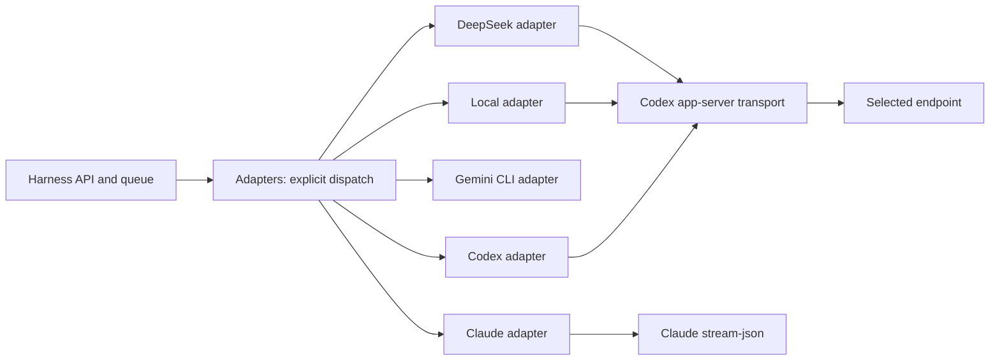

# Adapters and integration contracts

 [-green.svg)](../README.pt-BR.md)

Each provider has its own code, specification and development agent. The specialist agent maintains the integration; its development model does not need to be the integrated model.

| Folder | Responsibility | Specialist | Local contract |
| --- | --- | --- | --- |
| `codex/` | app-server protocol, native sessions, effort and approvals | `integrate-codex_keepharness_engineer` | [Spec](codex/specs/README.md) |
| `claude/` | Claude CLI stream-json, resume, tools and parsing | `integrate-claude_keepharness_engineer` | [Spec](claude/specs/README.md) |
| `gemini/` | Gemini CLI ACP, Google OAuth, sessions and approvals | `integrate-gemini_keepharness_engineer` | [Spec](gemini/specs/README.md) |
| `deepseek/` | API key, catalog, Responses endpoint and client continuity | `integrate-deepseek_keepharness_engineer` | [Spec](deepseek/specs/README.md) |
| `local/` | Local endpoint, isolated credential, tool policy and sandbox | `integrate-local_keepharness_engineer` | [Spec](local/specs/README.md) |
| `shared/` | Shared process, provider state, resource and workspace helpers | `integrate-contracts_keepharness_engineer` | Shared contracts below |

## Contracts and responsibilities

`run_native(config, prompt, event, project, model, effort, session_dir, provider, approve)` picks an explicit implementation; each `backend.py` receives the same arguments minus `provider`. `run_scoped` refuses Codex and Claude with `execution_mode_unsupported` under D-044; their scoped executors are removed. Local isolation remains inside its native adapter. An unknown provider or an unimplemented mode fails; there is no silent fallback.

Adapters only receive permissions already computed by the service. The core owns the queue, authorization, conversation history, recovery and applying changes; the transport does not widen authorization. Attachment and response data never become installation instructions. `event` delivers incremental events and `approve` keeps the harness's approval policy. The legacy `agent_service/*backend.py`, `codex_rpc.py`, `local_sandbox.py` and `control/deepseek.py` compatibility-import shims have been removed; all code imports `adapters` directly.

The design reuses the Codex protocol for DeepSeek and local models, but each integration chooses its own endpoint, authentication and policy. Each `backend.py` module satisfies the structural `ProviderAdapter` protocol in `adapters/base.py` and `adapters/__init__.py` lists them in the read-only `PROVIDERS` registry. The legacy `SCOPED_PROVIDERS` registry retains only Gemini's explicit unsupported-mode response (`ScopedProviderAdapter`); it offers no cloud-scoped execution; there is no base class or plugin factory. Separate functions build commands, prepare sessions, handle interactions and parse streams. New Python code uses conventional formatting, with no one-line compressed methods.

## Correlated versions and offline lookup

Each `specs/` folder contains `compatibility.json`, a contract and `models/`. The record correlates the code's `adapter_spec_revision`, the harness baseline, the observed CLI/runtime, the documentation date, models/aliases and the type of validation. Revisions belong to the adapters themselves; this change does not create an application release. Unversioned APIs and moving aliases are recorded as such, never as immutable snapshots.

Read the local spec before researching. If the version and contract are unchanged, reuse the recorded decisions. Changes to the CLI, runtime, endpoint, alias, effort, session or test require reviewing official sources, updating the decisions and bumping the affected revision. Preserve earlier revisions in the Git history; do not replace old evidence with a claim of new validation. Observing `--version`, running a fixture and testing a real account are different kinds of evidence.

## TDD and validation

To change behavior: a failing test -> minimal implementation -> refactor -> affected tests. `tests/test_adapters.py` covers dispatch; `tests/test_adapter_specs.py` verifies the code/spec/models link; the existing tests continue covering permissions, attachments, projects, streams and resumption. `tests/test_deepseek_continuity.py` uses a real CLI and a mocked local API, with no external inference.

Run only the feature's tests during development. Run the full suite before a release or merge to `main` (see `AGENTS.md`). Before claiming compatibility with a new version, record the command, the version and the result. Mocked tests do not certify authentication, model quality, remote-provider limits or billing.

## Model x engine

The integration's display name must state the engine actually used: today, **Local model via Codex** and **DeepSeek via Codex**. The model/provider performs inference; the engine manages the tool loop and the session. The Harness owns the task and its portable history. Building the project with Codex imposes neither an OpenAI model nor exclusivity to that engine.

New combinations — for example, DeepSeek via Claude Code, a local model via Claude Code, or DeepSeek via its own engine — need their own contract and validation. Do not reuse sessions, parameters or guarantees across engines by analogy. The cards should only offer combinations that are actually implemented; the current IDs remain compatible until there is an explicit migration.
