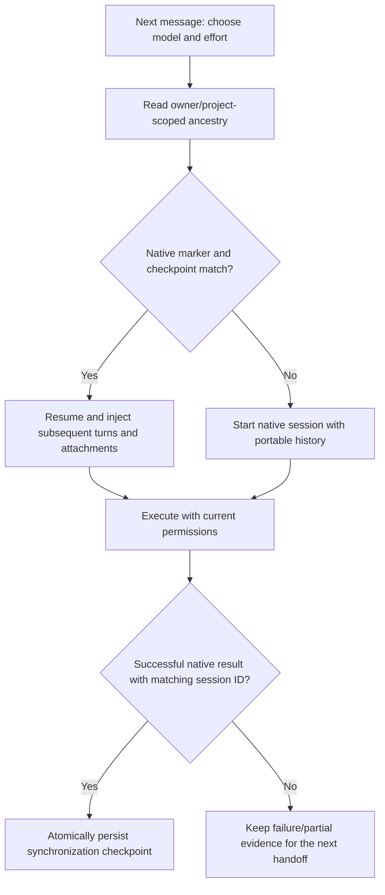

# Switching models within one task

Status: working-tree implementation on the existing 0.4.5 baseline; no new release.

## Behavior

Users can select another enabled provider, model or effort between turns. The next request keeps the conversation and parent job. An active turn must finish or be cancelled before the next execution. The existing model icons, permission controls and selected-project boundary remain in force.

The Harness owns the durable conversation in SQLite. Provider sessions are execution caches, not the only copy of that conversation. A new provider receives the preceding user/assistant turns, their provider/model/effort and terminal state, available tool and deployment evidence, and authorized attachments. Interrupted answers are recovered from persisted answer deltas. Reasoning deltas, approval requests and credentials are not added to the portable transcript. Tool evidence is limited to what each adapter actually emitted; an unfinished tool is not proof of either success or failure.

A successful session writes a private `harness-context.json` beside its native marker. This checkpoint records the last synchronized job, native session IDs and execution mode. Reuse requires matching markers and the latest completed turn for that provider. Changing model or effort alone does not invalidate that checkpoint: Codex receives the new values on `turn/start`.

On return to an existing provider, only subsequent turns and their attachments are injected. This includes images and files uploaded while another provider was active. Missing/replaced markers, legacy sessions without a checkpoint, an incompatible local isolation revision, mode changes or a failed/interrupted latest provider turn trigger a fresh native session and full portable replay. Old markers are retained with `.before-context-transfer`; the SQLite conversation is unchanged. A missing remote session can still cause the adapter to fail explicitly; there is no automatic retry after potentially executed tools.

## Acceptance criteria

- DeepSeek → local → Astra → DeepSeek stays in one conversation, including after a service restart.
- Astra low → Astra high → another Codex model changes the actual requested effort/model and preserves the native session.
- Returning providers receive attachments added during their absence without duplicating already synchronized turns.
- Cancelled/failed turns carry partial answers and available tool evidence, without transferring reasoning deltas.
- Replaced and legacy session markers cannot silently suppress prior conversation context.
- Current provider permissions and owner/project attachment checks still apply.
- Oversized portable history fails explicitly; this implementation does not silently truncate or generate an unverified summary. Existing context limits remain. Native compaction stays provider-specific.

## Migration and limits

No database migration, extra dependency, model download or runtime reconfiguration is needed. Existing native sessions without a checkpoint rebuild once on their next execution. This may cost more tokens than native resume. Existing files in the authorized project remain the source of truth for actual changes; transcripts are evidence, not a substitute for checking current files.

The implementation intentionally uses lossless replay within the existing limits. Model-specific token budgeting, retrieval archives and automatic cross-provider summarization are future work, not capabilities claimed by this change. No live model quality or remote account availability is certified by the tests. Python service changes require restarting the running service; this task does not restart a production instance.

## Validation

- Regression tests first reproduced six failures in attachment synchronization, portable partial/tool evidence, invalid markers and failed-turn recovery.
- Results: 67 distinct Python cases passed across the targeted runs, plus the browser fixture. The initial 63-case run passed; the expanded handoff/context selection passed 13 cases, and the updated native/DeepSeek selection passed 14 cases. Overlapping cases are counted once.
- Backend/contract selection: `tests/test_model_handoff.py`, `tests/test_context_recovery.py`, `tests/test_conversations.py`, `tests/test_model_permissions.py`, `tests/test_workspaces.py`, `tests/test_native.py`, `tests/test_deepseek_continuity.py`.
- Browser fixture: `tests/harness-model-handoff.spec.cjs` exercises six consecutive provider/model/effort choices and reload of the same conversation.
- The installed Codex CLI is exercised against a stateless localhost SSE fixture, including tool calls, process restart, model switch and effort switch. This spends no provider credits and does not run a real local model.
- Full regression suite is reserved for an authorized Git milestone; none was created here.

## References consulted

- [Codex App Server](https://learn.chatgpt.com/docs/app-server): `thread/resume` and model/effort overrides on `turn/start`; steering an active turn does not accept those overrides.
- [OpenAI conversation state](https://developers.openai.com/api/docs/guides/conversation-state): client-managed history.
- [OpenAI compaction](https://developers.openai.com/api/docs/guides/compaction): opaque compaction state is not a portable transcript.
- [Anthropic context engineering](https://www.anthropic.com/engineering/effective-context-engineering-for-ai-agents): retrieval and compaction tradeoffs.
