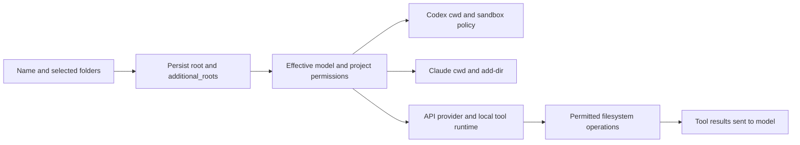

# Named multi-folder projects

Project creation accepts `POST /v1/projects` with `name` and `paths` (1–20 existing absolute directory paths). The first distinct canonical path becomes `root`; the rest become `additional_roots`. Names require at least three Unicode letters and at most 100 characters. Whitespace is normalized; case-insensitive NFKC comparison rejects duplicate names across registered/configured projects. Paths are all validated before persistence. Protected paths remain denied. Legacy single-root registration remains compatible.

The authenticated `GET /v1/project-directories` endpoint is available only when project registration is enabled. It accepts `root_id`, `path`, `q`, `start`, and `limit`. Search filters immediate directory names before pagination; it does not recursively crawl disks. Entries include canonical absolute paths. This picker is independent of file-upload/model permissions.

## Executor contracts

| Executor | Working directory and extra folders | File contents |
| --- | --- | --- |
| Codex native app-server | `thread/start` or `thread/resume` receives `cwd`; every `turn/start` also supplies `cwd`. Authorized additional roots join `sandboxPolicy.writableRoots` only when writing is allowed. All readable project directories appear in the turn's workspace context. | Native tools read files as needed. |
| Claude Code | Process `cwd` is the primary folder; `--add-dir` followed by all additional paths grants the additional directories. The same paths appear in each prompt's workspace context. | Configured Read/Glob/Grep and other permitted tools. |
| DeepSeek API | Existing Python adapter configures the Codex tool runtime with the DeepSeek Responses provider; the same turn directory/context/sandbox contract applies. API credentials stay in the process environment. | The runtime executes tools locally and sends tool results to the API. A local path by itself is not a file upload. |
| Local API models | Existing Responses-compatible provider through the Codex runtime, with the same folder context plus filesystem mounts restricted by `local_sandbox`. | Tools execute in the local sandbox and results return to the local model endpoint. |
| Scoped CLI mode | Existing project MCP mounts primary and additional directories under `/sources/project` and `/sources/extra-N`. | MCP list/read/search functions, with staged proposals for writes. |

No API protocol field pretending to grant remote access to local folders is introduced. No complete recursive folder content is added to prompts. Read-disabled models receive no project root context or additional directory grants. Selected workspace transfers retain their existing behavior of overriding project folders.

## UI

The current project's icon/name is shown on the right of the central conversation header; projectless conversations hide it. Search is a magnifier + Search action in the sidebar menu, opening a dialog that matches only conversation titles. Default sidebar/drawer widths are 280/400 px; saved explicit sizes are retained. The footer spacing is reduced. Settings offers two illustrated layouts: Conversations–Chat–Files/Activity (default), or Files/Activity–Chat–Conversations. The preference is saved locally and can be reset to the default.

## Research

Consulted on 2026-09-19:

- [OpenAI Codex App Server](https://learn.chatgpt.com/docs/app-server): turn working directory and sandbox policy, including writable roots.
- [Claude Code CLI reference](https://code.claude.com/docs/en/cli-reference): `--add-dir` grants additional working directories.
- [DeepSeek Tool Calls](https://api-docs.deepseek.com/guides/tool_calls/): the application implements the requested tool function and returns its result. The page was available through the search index; a direct fetch failed during research.
- [llama.cpp server](https://github.com/ggml-org/llama.cpp/blob/master/tools/server/README.md): Responses-compatible endpoints and tool use.

## Validation

Backend targeted checks: `tests/test_project_folders.py`, `tests/test_shared_projects.py`, `tests/test_native.py`, `tests/test_deepseek.py`, `tests/test_project_browser.py`, `tests/test_local_sandbox.py`, `tests/test_provider_quota.py`: 51 passed in the final combined targeted run, including the provider quota checks and the regression check that a removed project directory is not silently recreated. Includes mocked RPC contracts for Codex/DeepSeek/local, a fake Claude process receiving the real constructed arguments, persistence, uniqueness, directory search/pagination and read/write restrictions. No paid inference or GPU benchmark was performed.

Installed CLI checks: `claude --help` advertises `--add-dir`; the installed Codex-generated `TurnStartParams` schema includes `cwd` and `sandboxPolicy`. These checks do not invoke a model.

All three targeted Playwright scenarios passed: `tests/conversation-search.spec.cjs`, `tests/harness-layout.spec.cjs`, and `tests/harness-topbar.spec.cjs`. They cover folder selection, title search, project identification, saved panel order, responsive layouts, and provider quota display with fixtures. Desktop and narrow-layout screenshots were inspected. `node --check agent_service/ui.js` and `git diff --check` also passed.

## Persistent quota display

The selected model's quota indicator stays in the central header. The Codex account endpoint supplies `usedPercent`; the display uses `100 - usedPercent`, clamped to 0–100, for each available quota window. The account quota is shared rather than per conversation. Missing/null percentages are unavailable, not zero use. Historical turn snapshots must not overwrite a different currently selected provider. Visible-tab refresh and model changes refresh the display without opening a model turn.

Claude stream quota events are supported when their optional utilization field is present. The CLI fraction is normalized to a percentage; missing or invalid values are not estimated. Observations are isolated by client identity, labeled as observations and expire after five minutes or their reset time. `GET /v1/usage?backend=claude` reads only those observations, without invoking a model. DeepSeek uses account credits without a supplied percentage denominator; local inference has no cloud-provider account quota. These states are labeled rather than estimated. Context-window percentages remain a separately labeled metric.

Claude source: [official SDK RateLimitInfo and RateLimitEvent types](https://github.com/anthropics/claude-agent-sdk-python/blob/main/src/claude_agent_sdk/types.py). Nine targeted checks in `tests/test_provider_quota.py` passed for normalization, absent/invalid values, stream-to-endpoint integration, identity separation, and expiry. This tests the contract with fixtures; no live Claude quota event was requested.

Executor implementations live under `Adapters/`. Claude additional directories are passed as one variadic `--add-dir` list, verified with three project folders.
