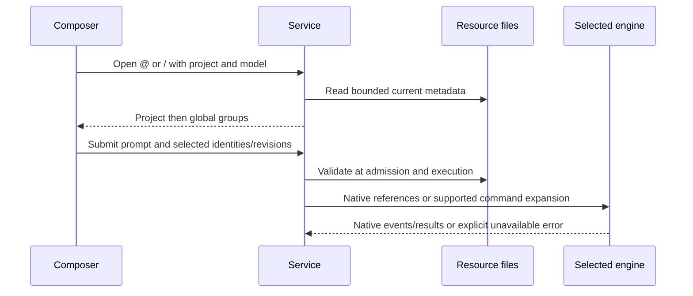

# Native resource discovery and explicit selection

## Scope and behavior

The composer uses `@` for native agents and `/` for native skills and commands.
`@@` and `//` are reserved for Tail-owned resources; authoring them in the
administrative panel is not part of this change.

Opening a selector requests fresh metadata for the selected project, backend and
model and conversation execution mode. The catalog and submission validation use
the effective conversation mode, independent of the service legacy default.
Scoped conversations do not offer native resources; changing the mode invalidates
selected references. Project resources precede global resources and are grouped by origin.
The inference model does not determine the resource format: the native local and
DeepSeek adapters run through Codex. There is no OpenCode execution adapter in
this checkout, so OpenCode resources are not advertised as executable.

The authenticated `/v1/resources` endpoint checks project, service, model and read
permissions. It returns names, descriptions, origin, scope, source path, content
revision and a stable identity. It never executes command templates or returns
source bodies. No-store responses and bounded filesystem scans avoid a persistent
stale catalog. Known global skill aliases are deduplicated by canonical path;
project symlinks cannot escape the authorized project root.

Locations:

| Engine | Project | Personal |
| --- | --- | --- |
| Codex agents | `.codex/agents/*.toml` | `$CODEX_HOME/agents` or `~/.codex/agents` |
| Codex skills | `.agents/skills`, `.codex/skills` | `~/.agents/skills`, `$CODEX_HOME/skills` |
| Codex legacy commands | none | `$CODEX_HOME/prompts/*.md` |
| Claude | `.claude/{agents,skills,commands}` | `$CLAUDE_CONFIG_DIR/{agents,skills,commands}` or `~/.claude/...` |
| Gemini | `.gemini/{agents,skills,commands}`, `.agents/skills` | `~/.gemini/{agents,skills,commands}`, `~/.agents/skills` |

A skill is identified by `SKILL.md`. Agents use native TOML (Codex) or Markdown
(Claude/Gemini); Gemini commands use TOML. Plugin caches are deliberately not
scanned as installed/enabled resource catalogs. Native runtime discovery may
reject a disk-discovered resource that the runtime has disabled or cannot load.

## Selection and execution

Selections carry `{id, revision, token}` with the user message. The service
resolves them again at admission and execution, rejecting deletion, changed
content, ambiguous token identities or unavailable resources. The stored user
prompt stays unchanged; expansion is only applied to the actual execution input.

Codex skills use `skills/list` with `forceReload: true` inside the process that
will execute the turn. Only an enabled matching path is accepted; `turn/start`
receives both `$name` text and a structured `skill` input. Codex agent selection
requests actual native delegation by registered name and points to the resolved
definition; it does not emulate delegation or certify that a model complied.
Each native run creates a fresh process, including when resuming a conversation.

Claude enables its native `Skill` tool only for explicit skill selections with
read permission. The existing permissions and hook settings remain in force.
Claude agent delegation and Gemini agents/skills remain disabled by their current
adapter contracts and are shown as unavailable. Isolated local/DeepSeek runs do
not expose host-global resources or agent profiles as callable.

Plain command templates support positional arguments, `$ARGUMENTS` and Gemini
`{{args}}`. Shell/file interpolation, named environment substitutions and special
Claude execution frontmatter are rejected rather than executed during discovery
or silently translated. Workspace-copy execution does not consume host resource
references. No configuration, permissions, model routing or host mounts are
expanded to make a resource available.

## Acceptance criteria

- Bare `@` and `/` open a fresh selector; typing filters names.
- Compatible project entries precede globals, with origin groups and icons.
- Switching project/model invalidates references and prevents stale responses.
- Keyboard selection does not submit the message; Escape closes the menu.
- Reserved Tail prefixes explain that Tail resources are not implemented.
- Disabled items explain why they cannot be selected.
- Create, edit and delete operations are reflected without a catalog restart.
- Changed or removed selected resources are rejected before inference.
- Exact IDs/revisions survive selection without inserting private source bodies
  into history; the runtime receives native skill references.

## Validation

Offline tests: `tests/test_resources.py`, `tests/test_native.py`,
`tests/test_adapters.py`, `tests/test_adapter_specs.py`, and
`tests/harness-resources.spec.cjs`. Codex CLI `0.155.0-alpha.9.2` and Claude Code
`2.1.258` were observed locally. The installed Codex generated schema confirms
`skill` input and `SkillsListParams.forceReload`. No live model inference,
GPU benchmark, Git milestone or complete regression suite was run.

No data migration or application version change is required. Existing user
resource files are not modified.
