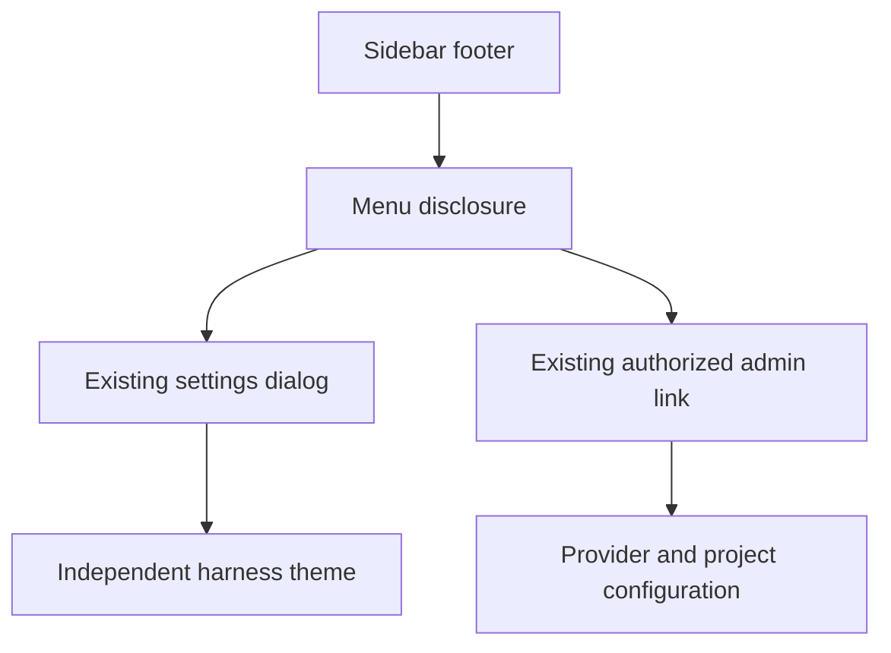

# Version 0.4.1 — Harness navigation and release documentation

Status: implemented in the source checkout; not published as a GitLab release.

## Scope

Remove the standalone Reload screen and Collapse buttons from the harness sidebar. Replace separate settings and administration controls with one bottom-left Menu disclosure. Preserve conversation state, streaming, attachments, approvals and provider APIs.

The administration entry retains its existing visibility policy. If no administrative URL is available to this browser, it remains hidden. This change does not expose the loopback-only administration over a VPN.

## Interaction

The Menu trigger is a native keyboard-operable disclosure. Its popup opens above the footer, outside the scrolling history. Settings opens the existing dialog; administration opens the existing URL. Selecting an action, clicking outside or pressing Escape closes the popup. Escape returns focus to the trigger. The responsive header navigation toggle remains available, especially on mobile.

Automatic version refresh remains deferred while execution, file transfer, attachments or a draft would be disrupted. The removed reload element must have no remaining JavaScript access.

## Acceptance criteria

- No standalone reload/collapse action in the sidebar.
- One bottom-left menu contains Settings and, when authorized/available, Administration.
- Existing conversation and draft are unchanged by opening the menu.
- Keyboard activation, Escape and outside-click dismissal work.
- Menu styling uses the existing theme variables for all six themes.
- README.md is Brazilian Portuguese and README.en.md is English; both link to each other and include architecture/navigation diagrams.

## Documentation policy

Every subsequent version requires `dossie/releases/v<VERSION>.md`. Record scope, acceptance criteria, compatibility/migration, relevant diagrams, and actual validation. Update both READMEs and version identifiers together. Never manufacture historical specifications or test results.

## Migration and validation

No database or preference migration. Private configuration and credentials remain unchanged. JavaScript syntax was checked; no inference, load tests or full browser suite were run for this change. Browser appearance remains unverified for this version.

