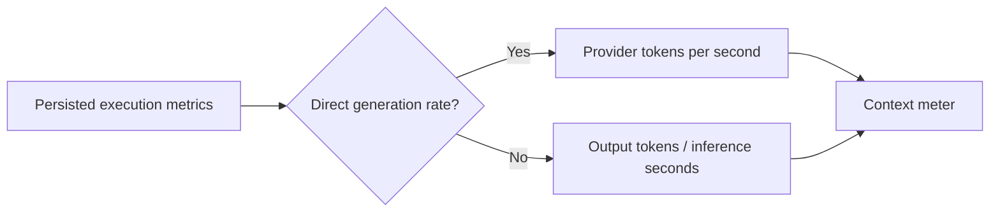

# Version 0.4.2 — Context throughput and quieter activity panel

Status: implemented in source; not published as a GitLab release.

## Behavior

Remove the activity-panel explanatory paragraph and the per-response “View execution details” button. Retain the existing activity panel, tool steps, metrics and references.

Append tokens/second to the context meter. Prefer a finite, nonnegative provider generation rate. Otherwise, when output-token and positive inference-duration metrics exist, show output tokens divided by inference seconds, explicitly labeled “execution average”. This includes prefill and tool-related time and must not be represented as pure decoding speed. While streaming without timing metrics, display a dash. Final results and reopened conversations use persisted metrics. Never infer token counts from character counts.

## Acceptance and compatibility

The removed text and button are absent. Context and accumulated consumption remain visible. Missing/zero-duration metrics never produce NaN or Infinity. Existing events, APIs, themes and session state are unchanged. No database migration or provider request is required.

## Validation

JavaScript syntax checked. No inference, load test or browser suite run for this change. Visual appearance remains unverified.
