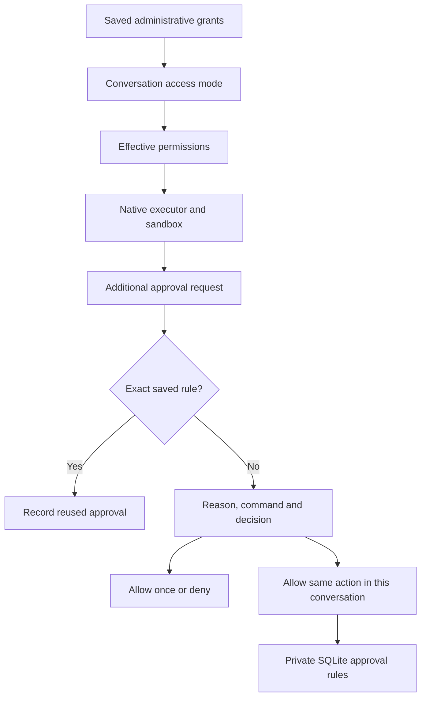
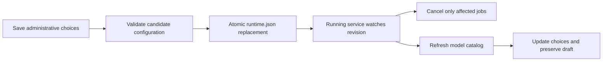

# Version 0.4.4 — Access modes and persistent action approvals

## Diagnosis

The deployed Qwen profile and generated runtime both retained `internet=true` and `shell=true`. The observed prompt was a native CLI escalation, not evidence of reset permissions. Effective grants are now included explicitly in the local agent instructions to discourage unnecessary preemptive escalation. Administrative grants remain authoritative.

## Modes

- Ask for approval (default): show additional CLI approval requests.
- Automatic within administrator limits: local command approvals may proceed inside the existing filesystem sandbox only when shell and internet are enabled. The external isolation layer remains active. Codex/Claude cloud executors use their no-prompt policy; actions requiring escalation may be denied rather than bypassing restrictions.
- Read only: remove write, shell, hooks and tests from the effective turn permissions; existing administrative denials remain denied.

The mode is stored with each task and inherited by follow-up tasks unless explicitly changed. The composer exposes the current selection, which applies to subsequent requests. Reopening a conversation restores its last mode.

## Remembered approvals

“Always allow in this conversation” stores an exact command approval in SQLite, scoped to owner, conversation, backend, model, working directory and effective permissions. It does not authorize different commands or unrelated conversations. Permission changes invalidate matching. The menu can clear remembered approvals. Generic questions, OAuth elicitation and arbitrary permission requests cannot become remembered command rules.

The approval card shows a reason and command first; protocol JSON is under technical details. Automatic and reused decisions are recorded as events. No global full-access or sandbox-bypass switch is introduced.

## Compatibility and acceptance

Additive SQLite table; old tasks default to Ask. Server restart must preserve stored grants and remembered action rules. Administrative permissions cannot be broadened through mode selection. Other identities cannot clear or respond to another user's approvals. Invalid modes and scopes must be rejected.

Validation: Python regression suite and JavaScript syntax; no cloud inference or provider benchmark. Native cloud no-prompt behavior is not verified against authenticated providers in this release.

## Working-tree addendum: provider adapters and live configuration

Provider implementations now live in `Adapters/codex`, `Adapters/claude`, `Adapters/deepseek` and `Adapters/local`. Shared filesystem preparation and Codex transport remain reusable; the queue, authorization and persistence stay in the service. Old module paths remain compatibility imports. Each provider has a development specialist, an adapter revision, a compatibility manifest and model-specific documentation; the local specialist owns Qwen as well as other local models. Specs describe observed CLI/runtime versions and rolling API assumptions rather than promising compatibility with future versions.

DeepSeek uses client-managed Responses history through the installed Codex CLI. Local session identifiers do not replace message, reasoning and tool-result replay. Missing BYOK configuration fails before execution, transport is HTTP, and `configured` effort maps to `high`. The regression fixture exercises a tool call and a later resumed process without remote API billing.

Administrative settings can update the live runtime. A removed model cancels its queued and active work; execution configuration or grant changes invalidate affected work and approvals. Adding a model preserves unrelated tasks. Registered projects and conversation history remain in SQLite. Invalid runtime files retain the last valid configuration. The UI refreshes its catalog and preserves drafts; asset reload also restores pending attachment references. It waits for active execution/uploads and does not reload if browser persistence fails.

Acceptance: model additions must not cancel existing jobs; removals must cancel affected queued/running jobs; invalid configuration must not destroy the last usable state; reload must preserve registered projects; the browser must keep unsent text and attachment references. Listening address/port changes still require process restart. Python server upgrades require one restart to load the new implementation; saving a CPU/GPU profile does not alter an already running inference engine.

Migration: no destructive database migration. Existing imports remain valid. Install the updated package or restart the updated editable installation once to enable the watcher; subsequent supported administrative changes do not restart the harness. Model files and credentials are not packaged.

Validation for the adapter addendum: 100 targeted Python tests and 2 subtests passed; the installed Codex CLI was exercised against a local simulated Responses endpoint, without remote inference. A wheel was built in an isolated temporary environment and all adapter modules/specifications were confirmed inside it. The browser regression for model additions/removals and asset reload passed, including text, attachment references and failed browser persistence. Final live-configuration validation: 42 targeted tests covering reload, model removal, permission revocation, registered projects, Maestro and adapter specs passed. Four browser feature files passed for administrative navigation, integrations, local profiles and reload. The reload fixture also verifies immediate draft restoration during an active job. The installed service was updated only after existing jobs finished; saving the same administrative choices then applied a new runtime revision with the harness process ID unchanged. No prompt was submitted during this live check.

### Server-side integration catalogue and automatic startup

The connector screen now invokes read-only CLI list commands through the authenticated administration server. Both providers use `plugin list --available --json`; Codex MCP uses JSON and Claude MCP uses conservative text parsing with an explicit empty-list case. Only safe metadata is returned. CLI subprocesses have bounded output, timeouts and cancellation cleanup. The UI distinguishes configured connectors, installed plugins and installable marketplace entries, with search and up to 40 visible results. Installation requires an explicit per-item action; querying does not install anything. Known marketplaces are not a universal service directory.

Manual start/stop controls are removed. Saving an enabled provider starts a stopped harness; administration startup resumes enabled providers. An empty configuration remains dormant. Existing live configuration updates remain unchanged.

Validation: 23 targeted Python tests passed, followed by 8 focused catalogue/startup tests including the newly added Claude empty-list case. Both administration browser feature files passed. A real authenticated server query returned Codex configured/installed/available entries and an empty Claude catalogue, without installation or inference. CLI guide commands now occupy separate lines.
