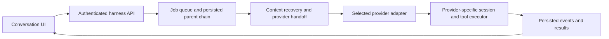

# Tail Harness 0.5.0 — conversation continuity and workspace usability

## Scope and semantic version

This minor release consolidates additive features since the committed 0.4.0
baseline: provider adapters, context handoff, multi-folder projects, conversation
search, file previews, access approvals, portable local runtime setup and UI
recovery. The intermediate 0.4.1–0.4.5 documents describe development snapshots.
No stable API removal or new database migration is intended by this release.

## Behavior

- Conversations retain their parent chain when the model, effort or supported
  provider changes; missing provider context is replayed explicitly.
- Inference provider and tool/session executor remain separate concepts. Local
  and DeepSeek integrations use Codex as their executor without an intermediary
  OpenAI model. No additional executor combinations are implied.
- Messages accept up to 20 attachments; the browser and API enforce the same
  boundary. File and folder icons use a locally served Material Icon Theme
  catalog with its license preserved.
- Projects can contain multiple authorized folders. Search, previews, attachment
  selection and drafts remain integrated with conversation navigation.
- Readiness blocks the UI until essential resources load. Recovery preserves
  drafts; request throttling is not represented as a disconnected server.
- Access approval choices remain constrained by administrator grants. Repeated
  submissions use idempotency keys and cancellation avoids duplicate requests.
- Composer guidance is visible. Dialogs have accessible names; Escape and focus
  restoration respect modal ownership. Search includes model identity icons.
- Startup readiness remains available to assistive technology without a toast
  obscuring mobile content.
- Gemini protocol code and fixtures remain experimental; the administration card
  is hidden. This release does not certify live Gemini authentication or policies.
- Distribution includes a generic CPU profile and the explicitly authorized
  author-suggested GPU profile. Other private deployment profiles,
  credentials, model weights, developer configuration, temporary test directories
  and private host audit reports are excluded from both source and wheel builds.



## Acceptance criteria

1. All Python regressions and every `tests/*.spec.cjs` browser regression pass.
2. Six synthetic personas complete ten browser scenarios each. The session
   handoff scenario preserves eight turns across executor/model selections and
   reload. These fixtures do not imply real provider inference validation.
3. Attachment references and drafts survive supported model changes; image
   preview tests work with an embedded synthetic image, without personal files.
4. Package and application identifiers consistently report 0.5.0.
5. Both README languages link to this specification and each other.
6. Source and wheel archive inventories contain no unapproved private profile, host audit,
   local development instructions, runtime, weights or credentials.

## Migration

Keep existing configuration and state directories. Install the updated package
in the application's environment and restart only the services intentionally
being upgraded. Refresh browser assets after the upgrade. This Git release does
not restart the running local services.

The author-suggested `profiles/qwen-author-profile.json` is explicitly approved
for distribution with its attribution and hardware-specific parameters. It
contains no credentials. Use `profiles/local-cpu-profile.json` as a generic
starting point, or review the GPU profile against the target host's memory,
CPU affinity, device and multimodal projector. Neither is a universal performance
recommendation. Other private configuration remains outside the distribution.

## Validation

Validation used a clean export of the staged release tree, without ignored
developer configuration, private host reports, model weights or runtime files.

- Python: 271 tests and 2 subtests passed; 20 dependency deprecation warnings.
- All 25 browser regression files passed across the complete run and the focused
  retest of the image-card fixture after adding its new icon dependency.
  The complete suite is repeated on the final tree before the release commit.
- The six-persona campaign passed 60/60 scenarios, including provider/model
  handoff, draft recovery, mobile layout and keyboard accessibility.
- New regressions reproduce and verify draft restoration before unlocking the UI,
  preservation of a new draft when an old watcher ends, cancellation controls,
  replay of the last completed response's activities, 20-attachment limits,
  and file browsing when the icon catalog is unavailable.
- Source and wheel builds succeeded. Archive inventories, both original profile
  payloads, bundled icon license/assets and isolated wheel imports were checked.
- Version identifiers, reciprocal README links and staged whitespace were checked.

```sh
python -m pytest -q
PYTHON=python ./scripts/test-ui.sh
python -m build --no-isolation
```

The build frontend came from the project environment and used the host's
installed setuptools; no build dependency was installed. Full browser regression
uses the preinstalled Playwright/Chromium runtime and temporary local servers.
No paid provider inference, GPU benchmark, runtime download or personal credential
validation was performed. Automated release validation used temporary local servers.
