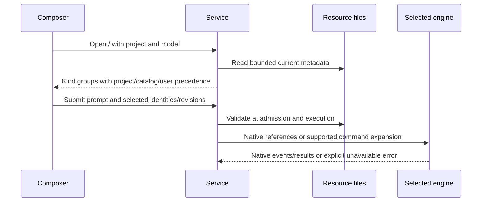

# Native resource discovery and explicit selection

## Scope and behavior

The composer uses `/` for agents, skills, commands, built-in controls and maintenance.
`@name` remains a legacy alias for agents.
`@@` and `//` are reserved for Harness-owned resources; authoring them in the
administrative panel is not part of this change. `@@id` selects a Harness agent (see
[Harness agents](../docs/harness-agents.md)); `//` and any other `@@` name stay unavailable.

Opening a selector requests fresh metadata for the selected project, backend and
model and conversation execution mode. The catalog and submission validation use
the effective conversation mode, independent of the service legacy default.
Scoped conversations do not offer native resources; changing the mode invalidates
selected references. Project resources precede trusted catalog resources, then user resources. The palette
groups by kind, shows source badges and supports fuzzy filtering and Tab selection.
The inference model does not determine the resource format: the native local and
DeepSeek adapters run through Codex. There is no OpenCode execution adapter in
this checkout, so OpenCode resources are not advertised as executable.

The authenticated `/v1/resources` endpoint checks project, service, model and read
permissions. It returns names, descriptions, origin, scope, source path, content
revision and a stable identity. It never executes command templates or returns
source bodies. No-store responses and bounded filesystem scans avoid a persistent
stale catalog. Known global skill aliases are deduplicated by canonical path;
symlinks cannot escape the project or explicitly trusted catalog roots.

Locations:

| Engine | Project | Personal |
| --- | --- | --- |
| Codex agents | `.codex/agents/*.toml` | `$CODEX_HOME/agents` or `~/.codex/agents` |
| Codex skills | `.agents/skills`, `.codex/skills` | `~/.agents/skills`, `$CODEX_HOME/skills` |
| Codex legacy commands | none | `$CODEX_HOME/prompts/*.md` |
| Claude | `.claude/{agents,skills,commands}` | `$CLAUDE_CONFIG_DIR/{agents,skills,commands}` or `~/.claude/...` |
| Gemini | `.gemini/{agents,skills,commands}`, `.agents/skills` | `~/.gemini/{agents,skills,commands}`, `~/.agents/skills` |

A skill is identified by `SKILL.md`. Agents use native TOML (Codex) or Markdown
(Claude/Gemini); Gemini commands use TOML. Plugin caches are deliberately not
scanned as installed/enabled resource catalogs. Native runtime discovery may
reject a disk-discovered resource that the runtime has disabled or cannot load.

## Selection and execution

Selections carry `{id, revision, token}` with the user message. The service
resolves them again at admission and execution, rejecting deletion, changed
content, ambiguous token identities or unavailable resources. The stored user
prompt stays unchanged; expansion is only applied to the actual execution input.

Codex skills use `skills/list` with `forceReload: true` inside the process that
will execute the turn. Only an enabled matching path is accepted; `turn/start`
receives both `$name` text and a structured `skill` input. Codex agent selection
requests actual native delegation by registered name and points to the resolved
definition; it does not emulate delegation or certify that a model complied.
Each native run creates a fresh process, including when resuming a conversation.

Claude enables its native `Skill` tool only for explicit skill selections with
read permission. The existing permissions and hook settings remain in force.
Claude agent delegation requires an explicit project `delegate` grant. Selected
catalog agents receive an execution-local definition; `Task` is the CLI allowlist
name and `Agent` the observed event name. Gemini agents/skills remain unavailable. Isolated local/DeepSeek runs do
not expose host-global resources or agent profiles as callable.

Plain command templates support positional arguments, `$ARGUMENTS` and Gemini
`{{args}}`. Only `!` followed by a backtick, `!{` and `@{` outside fenced examples block
command selection. Discovery never executes template content. Native Claude
commands retain their frontmatter when installed; catalog-only commands and
commands with attached context use an explicit inline fallback. Workspace-copy execution does not consume host resource
references. No configuration, permissions, model routing or host mounts are
expanded to make a resource available.

## Acceptance criteria

- Bare `/` opens a fresh selector; fuzzy typing filters names; `@` stays a legacy alias.
- Compatible project entries precede trusted catalogs and user entries, with source badges.
- Switching project/model invalidates references and prevents stale responses.
- Enter and Tab select without sending; Escape closes and restores focus.
- Reserved Harness prefixes that are not implemented (`//`, an unknown `@@`) explain that Harness resources are not available.
- Disabled items explain why they cannot be selected.
- Create, edit and delete operations are reflected without a catalog restart.
- Changed or removed selected resources are rejected before inference.
- Exact IDs/revisions survive selection without inserting private source bodies
  into history; the runtime receives native skill references.

## Validation

The original resource selector was checked against Codex CLI `0.155.0-alpha.9.2`
and Claude Code `2.1.258` without a release-wide campaign. Those historical checks
are superseded for P1 by [0.8.0 validation and migration notes](releases/v0.8.0.md)
and the recorded September compatibility probes. Existing user resource files
remain unchanged; execution fallbacks use private temporary copies.

## Trusted catalogs and P1 invocations

Admin settings accept `catalogs: [{id, root, kind: "folder"|"git", trusted: true,
namespace}]`; each project selects its catalog IDs in `catalogs`. Roots must be
absolute. Merely having a symlink does not register trust. Portable resource IDs
use `catalog/<id>/<relative path>`, `project/<id>/<relative path>` or
`user/<engine>/<relative path>`; revisions detect content changes.

Canonical invocations carry `kind`, `resource_id`, verbatim `args`, zero-based
`order`, `mode` and optional `requested_backend`. Composer references are
normalized at admission. Legacy Maestro steps remain accepted and normalize to
the same contract. A declared chain executes sequentially without planning;
conversational agents are standalone and remain active until released.

Rules and context are listed but cannot be selected. Metadata and body limits are
separate, so a 99 KB command remains discoverable. Maintenance commands stay
visible in a dedicated group. Claude account connector discovery under strict MCP is `unknown`.
See [0.8.0 validation and limitations](releases/v0.8.0.md).
