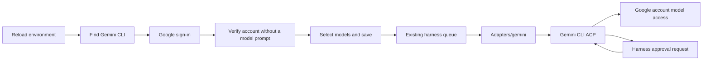

# KeepHarness 0.4.5 — Gemini CLI provider

**Current status:** Gemini is partially implemented and its administration card is hidden, including discovery and previously configured cards. Code is retained for future work; Antigravity migration is deferred.

## Scope

Add Google Gemini CLI as an explicit native executor alongside Codex, Claude,
DeepSeek and local models. Add the `provedor_gemini` development specialist,
provider specifications, administration discovery, account checks, model selection
and Gemini identity in the conversation UI. Gemini CLI is an external prerequisite;
installing KeepHarness does not silently install or authenticate it.

## Behavior

The provider uses the official CLI's ACP protocol. Google OAuth is the intended
subscription authentication method. An API key is not a replacement for Google
sign-in, and execution must not silently fall back to API billing. An installed
binary or an OAuth credential file is discovery evidence, not successful account
verification. The CLI owns credentials; no token values are returned by inventory.

Models use `configured` effort. The provider catalog is a CLI alias catalog,
not a guarantee of account entitlement. The harness reports observed execution
metrics and does not invent remaining subscription quotas. Native sessions remain
scoped to the existing owner/conversation/provider storage, including context
recovery. Gemini's `.gemini` credential directory is excluded from shared folders.

## Acceptance criteria

- Reloading discovery finds the installed Gemini command without enabling it.
- Existing settings acquire a disabled Gemini entry without changing other providers.
- Account verification never treats a file's presence as proof of authentication.
- Configuration and execution route `gemini` only to the Gemini adapter.
- Session continuity, incremental output, cancellation, errors and permission
  handling are covered by offline protocol fixtures.
- Model and provider presentation include the Gemini icon and identify the Google
  subscription route rather than ChatGPT billing.
- Unsupported scoped execution is rejected explicitly, without provider fallback.
- No provider inference or credentials are required by regression tests.

## Migration

No database migration is required. Gemini defaults to disabled and native mode.
Install the official CLI with `npm install -g @google/gemini-cli` using Node 20+
and make both the CLI and its Node runtime accessible to the administration
service. Restart the administration service after updating Python code, then use
**Reload environment**, add Gemini, sign in and verify the account. Existing
provider settings and conversations remain in place.

## Validation

- Official Gemini CLI 0.60.0 installed; version lookup passed with the administration service's minimal PATH through a user-local launcher.
- 76 focused Python tests passed across Gemini protocol, cancellation, session resume, image payloads, OAuth fixtures, policy enforcement, provider dispatch/specifications, discovery, login routing, control reload, protected folders and attachment formats.
- Playwright Gemini provider card/account-check/model-identity fixture passed.
- Installed CLI ACP initialization confirmed protocol version 1 and session-loading capability without a model request.
- Installed Gemini PolicyEngine accepted the generated admin policy: read_file asks at priority 5.95; shell, writes and unknown tools are denied at 5.9 in the read-only fixture. No tools or models were executed by this probe.
- Restarted the idle local service and verified HTTP 200 from Reload environment: Gemini CLI discovered at the user-local launcher, provider disabled until configured, administration page version 0.4.5.
- Full regression suite and Git milestones were not requested or performed.
- No live model inference was performed. OAuth sign-in and subscription access remain user actions and are not certified by fixture tests.
