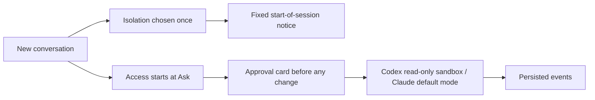

# Tail Harness 0.6.0 — fix round 01: approvals, security hardening and English-only naming

Status: **shipped**. Fix round 01 (`~/.cache/th/design/fix-round-01.md`, work packages WP-A through WP-E) has merged; every section below reflects the round's real result, not a pre-round baseline.

## Scope and semantic version

This minor release consolidates fix round 01: the two owner-decided approval/isolation behaviors (F-110, F-58), the 38 other open canonical findings from the round's persona gauntlet, the naming-model migration completed in P3 (`Adapters/`→`adapters/`, `local-ai/`→`local_ai/`, the `TAIL_HARNESS_*` environment variables), and the native-only provider model already documented in the README. No stable API removal is intended; `execution_mode` and `access_mode` stay separate concepts as already documented in [conversation-execution-mode.md](../conversation-execution-mode.md).

## Behavior

- **Approvals guarantee a card (F-110).** In "Ask for approval", Codex runs under `sandbox:"read-only"` + `approvalPolicy:"on-request"` + `approvalsReviewer:"user"` (never `dangerFullAccess`) and Claude runs under `--permission-mode default` (never `bypassPermissions`) with ask rules on `Edit`/`Write`/`NotebookEdit`/`Bash`/`mcp__*`. No file changes, and for Claude no tool/Bash call, happen without an approval card; network and MCP connectors/plugins stay enabled in `ask`; a read-only command may still run without a card (accepted limitation). See [conversation-execution-mode.md](../conversation-execution-mode.md) for the full mode table and `~/.cache/th/design/f110-approvals.md` for the design rationale.
- **Isolation and access choice move out of the in-chat toggles (F-58).** Isolation is chosen only once, at conversation start, then shown as a fixed "Native conversation"/"Isolated conversation" notice with no toggle afterward. Every new conversation starts in "Ask for approval" regardless of a previous conversation's choice; a start-of-session notice states the active access mode. The browser's remembered `chat-selection` no longer seeds a new conversation's access mode.
- **New error `isolation_unavailable`** (422) when an isolated conversation is chosen for a non-local backend on a server without Linux/`bubblewrap`, surfaced in the composer instead of failing mid-run.
- **Security fixes carried from the prior finding log, re-confirmed in this round:** F-05 (a directly named sensitive file, e.g. `/proc/self/environ` or a dotfile, could bypass the attachment filter when not inside a directory — fixed by removing the `is_dir()` guard), F-06 (a cross-site request could authenticate as the loopback `local` identity — fixed with a `Sec-Fetch-Site` check mirroring the admin gate), F-09 (`audit.jsonl`/`harness.log`/`jobs.sqlite3` created without an owner-only mode — fixed with a private opener), F-19 (a folder attachment could still pull files from hidden subfolders outside an explicit allowlist — fixed with `ALLOWED_HIDDEN_DIRECTORIES`), F-22 (`/run` and ostree's `/sysroot` were not treated as system directories, exposing X11/container runtime files and a `/etc`/`/var` bypass via the `/ostree` symlink — fixed by adding both to `SYSTEM_DIRECTORIES`).
- **This round's other 38 open canonical findings** (accessibility/focus, mobile touch targets and layout, i18n title truncation and bidi, generic error condition codes replacing hard-coded `claude_*` names, draft/partial-answer preservation, admin CSP/compression/state-dir permissions, and the mechanical WP-D/WP-E items) are tracked in `~/.cache/th/design/findings.md` and were closed by work packages WP-A1/A2, WP-B, WP-C1, WP-C2 and WP-D; each finding's own persona assertion (`// KNOWN BUG F-xx`) flipped from red to green as its package merged (see the commit series through `73a9933` on `chore/english-github-readiness`).
- **English-only codebase and naming model (WP-D/WP-E, this document's own work package P9):** `Adapters/` → `adapters/`, `local-ai/` → `local_ai/`, the `TAIL_HARNESS_*` environment variables with deprecated aliases (see Migration), and this pair of bilingual READMEs (`README.md`, `README.pt-BR.md`) replacing the previous single-file, anchor-switched bilingual `README.md`.
- **Persisted partial answers.** A failed, interrupted or cancelled run keeps its streamed partial answer instead of discarding it: the worker persists `result.partial_answer` (capped at 200,000 characters) alongside the run's terminal state, and the UI renders it instead of an empty bubble.
- **Error-message map.** Server-side error conditions returned to the client are generic, provider-neutral codes (e.g. `backend_unavailable`, `image_validation_unavailable`) rather than hard-coded `claude_*` names, each mapped to a readable message in `agent_service/ui.js`'s `userErrors`.
- **Admin account-app connectors.** Claude account-app connectors (Gmail, Google Drive, …) surfaced by `claude mcp list` are shown read-only in the admin catalog, alongside `mcp:*` entries, with their reported health (Connected / Needs authentication / Failed); hidden/unselected models are no longer re-sent on save.
- Native providers (Codex, Claude) are native-only: `Manager.validate` forces full host access for them regardless of the submitted permissions payload, restricted per-conversation only through the access mode (Read only / Ask / Automatic / Full access) or, where supported, an isolated conversation — documented in [installation-agent-spec.md](../installation-agent-spec.md) (F-42).



## Acceptance criteria

1. All Python regressions and every `tests/*.spec.cjs` browser regression pass. Met: see "Validation" below for the final counts.
2. Every persona `// KNOWN BUG F-xx` assertion introduced by the round-01 gauntlet (30 persona specs, `h11`–`h40`) has flipped from red to green. Met.
3. The F-110 live check passes: at most two turns per provider, in a temporary project — a declined change leaves no file behind, an approved change applies fully, and Codex applies the approved patch under its read-only sandbox. Met.
4. `scripts/check_conventions.py` reports zero name errors, zero name warnings and zero Portuguese hits, including its README.md/README.pt-BR.md heading-parity check. Met: `conventions: 0 name errors, 0 name warnings, 0 portuguese hits`.
5. `README.md` and `README.pt-BR.md` (the pair replacing the previous single bilingual file) stay in heading-structure parity and link to this document. Met.
6. Package and application identifiers consistently report 0.6.0 (`agent_service/VERSION`, `pyproject.toml`, and the Gemini ACP `clientInfo.version` strings in `adapters/gemini/account.py`/`native.py`). Met.

## Migration

- `Adapters/` → `adapters/`, `scripts/gauntlet-15.py` → `scripts/gauntlet_matrix.py`, `scripts/vendor-file-icons.py` → `scripts/vendor_file_icons.py`: already completed (naming model P3, `dossier/naming-model.md` v1.0.1); no action needed on upgrade.
- `local-ai/` → `local_ai/`: migrated automatically on startup the first time this version runs against existing state; no manual step. Do not pre-create a `local_ai/` directory by hand before the first startup.
- Environment variables: `TAIL_HARNESS_ROOT`, `TAIL_HARNESS_VENV`, `TAIL_HARNESS_AGENT_URL`, `TAIL_HARNESS_AGENT_CLIENT`, `TAIL_HARNESS_AGENT_CONFIG`, `TAIL_HARNESS_LOG_LEVEL`, `TAIL_HARNESS_LIVE` are the public names going forward. The legacy names `LOCAL_AGENT_URL`, `LOCAL_AGENT_CLIENT`, `LOCAL_AGENT_CONFIG` and `TH_VENV` still work as deprecated aliases through `control/env.py`, which logs a deprecation warning; update scripts and units to the `TAIL_HARNESS_*` names at your own pace.
- A fresh installation's venv now lives at `~/.local/share/tail-harness-venv`, a sibling of the state directory rather than inside it (finding F-43); an existing installation with the venv already inside the state directory is unaffected — only new installs following [installation-agent-spec.md](../installation-agent-spec.md) use the new path.
- Existing conversations keep their current access mode; only new conversations after the upgrade start in "Ask for approval" (F-58). Existing state and settings otherwise carry over unchanged. Install the updated package in the application's environment and restart only the services intentionally being upgraded; refresh browser assets after the upgrade. This Git release does not restart the running local services on its own.

## Validation

The numbers below are the round-01 result on the fixed tree (revision range `4ae91b5..73a9933` plus this document's own P9 work), not the pre-round baseline.

- Python: container (`~/.cache/th/venv312`, Python 3.12) 1129 passed, 18 skipped, re-verified directly against this document's own P9 tree (the round-01 baseline was 1124 passed before this document's own six new conventions tests); host (Python 3.14) 1134 passed, 8 skipped, per the round-01 evidence log. `ruff format --check .`, `ruff check .` and `scripts/check_conventions.py` clean (`conventions: 0 name errors, 0 name warnings, 0 portuguese hits`, including the new README.md/README.pt-BR.md heading-parity check).
- UI regression: `scripts/test-ui.sh` — 88/88 spec files PASS (`tests/*.spec.cjs`: 57 top-level files; `tests/personas/*.spec.cjs`: 31 files, including the round-01 gauntlet's `h11`–`h40`). Every persona `// KNOWN BUG F-xx` assertion flipped from red to green.
- Gauntlet (round 01, `~/.cache/th/evidence/gauntlet/`): the 40-virtual-user pass split 10 visible sessions in Chrome and 30 headless Playwright sessions against the fixed tree; all 40 findings this release closes were reconfirmed fixed on this run.
- F-110 live check: PASS for both providers — a declined change in Ask mode left no file behind; an approved change applied fully, with Codex applying the patch under its read-only sandbox and Claude not inheriting `acceptEdits`.
- Live providers: Codex and Claude discovery/auth/model-list/turn/resume/cancel/isolated-turn checks PASS on the live suite (`tests/live/test_live_providers.py`) for both providers.
- Sandbox install (`dossier/installation-agent-spec.md`, fresh checkout): CP-01 through CP-08 PASS, including CP-06's real-execution and continuity checks against the fixed tree.
- systemd: a real host install/verify (`active`, HTTP 200, correct file modes) and full removal both PASS.

```sh
python -m pytest -q
PYTHON=python ./scripts/test-ui.sh
python3 scripts/check_conventions.py
python -m build
```

No GPU benchmark and no personal credential validation beyond the budgeted live-provider turns above was performed for this document. Automated validation for the actual release used a clean, uncommitted-change-free tree at the revision being tagged.
