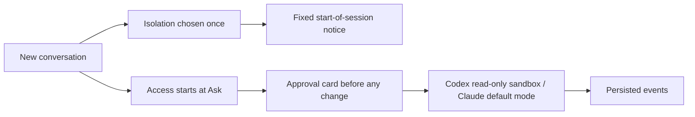

# Tail Harness 0.6.0 — fix round 01: approvals, security hardening and English-only naming

Status: **draft, TBD (fix round 01)**. Fix round 01 (`~/.cache/th/design/fix-round-01.md`, work packages WP-A through WP-E) is in progress at the time this document was written; sections that depend on its still-unmerged packages are marked `TBD (fix round 01)` below and must be filled in with the real result before this release ships.

## Scope and semantic version

This minor release consolidates fix round 01: the two owner-decided approval/isolation behaviors (F-110, F-58), the 38 other open canonical findings from the round's persona gauntlet, the naming-model migration completed in P3 (`Adapters/`→`adapters/`, `local-ai/`→`local_ai/`, the `TAIL_HARNESS_*` environment variables), and the native-only provider model already documented in the README. No stable API removal is intended; `execution_mode` and `access_mode` stay separate concepts as already documented in [conversation-execution-mode.md](../conversation-execution-mode.md).

## Behavior

- **Approvals guarantee a card (F-110).** In "Ask for approval", Codex runs under `sandbox:"read-only"` + `approvalPolicy:"on-request"` + `approvalsReviewer:"user"` (never `dangerFullAccess`) and Claude runs under `--permission-mode default` (never `bypassPermissions`) with ask rules on `Edit`/`Write`/`NotebookEdit`/`Bash`/`mcp__*`. No file changes, and for Claude no tool/Bash call, happen without an approval card; network and MCP connectors/plugins stay enabled in `ask`; a read-only command may still run without a card (accepted limitation). See [conversation-execution-mode.md](../conversation-execution-mode.md) for the full mode table and `~/.cache/th/design/f110-approvals.md` for the design rationale.
- **Isolation and access choice move out of the in-chat toggles (F-58).** Isolation is chosen only once, at conversation start, then shown as a fixed "Native conversation"/"Isolated conversation" notice with no toggle afterward. Every new conversation starts in "Ask for approval" regardless of a previous conversation's choice; a start-of-session notice states the active access mode. The browser's remembered `chat-selection` no longer seeds a new conversation's access mode.
- **New error `isolation_unavailable`** (422) when an isolated conversation is chosen for a non-local backend on a server without Linux/`bubblewrap`, surfaced in the composer instead of failing mid-run.
- **Security fixes carried from the prior finding log, re-confirmed in this round:** F-05 (a directly named sensitive file, e.g. `/proc/self/environ` or a dotfile, could bypass the attachment filter when not inside a directory — fixed by removing the `is_dir()` guard), F-06 (a cross-site request could authenticate as the loopback `local` identity — fixed with a `Sec-Fetch-Site` check mirroring the admin gate), F-09 (`audit.jsonl`/`harness.log`/`jobs.sqlite3` created without an owner-only mode — fixed with a private opener), F-19 (a folder attachment could still pull files from hidden subfolders outside an explicit allowlist — fixed with `ALLOWED_HIDDEN_DIRECTORIES`), F-22 (`/run` and ostree's `/sysroot` were not treated as system directories, exposing X11/container runtime files and a `/etc`/`/var` bypass via the `/ostree` symlink — fixed by adding both to `SYSTEM_DIRECTORIES`).
- **This round's other 38 open canonical findings** (accessibility/focus, mobile touch targets and layout, i18n title truncation and bidi, generic error condition codes replacing hard-coded `claude_*` names, draft/partial-answer preservation, admin CSP/compression/state-dir permissions, and the mechanical WP-D/WP-E items) are tracked in `~/.cache/th/design/findings.md` and closed by work packages WP-A1/A2, WP-B, WP-C1, WP-C2 and WP-D. **TBD (fix round 01):** list each closed finding's id and fix commit once every package has merged; do not mark a finding closed here before its own test has flipped from red to green.
- Native providers (Codex, Claude) are native-only: `Manager.validate` forces full host access for them regardless of the submitted permissions payload, restricted per-conversation only through the access mode (Read only / Ask / Automatic / Full access) or, where supported, an isolated conversation — documented in [installation-agent-spec.md](../installation-agent-spec.md) (F-42).



## Acceptance criteria

1. All Python regressions and every `tests/*.spec.cjs` browser regression pass. **TBD (fix round 01):** record the final counts once WP-A through WP-D have merged; see "Validation" below for the last known pre-round baseline.
2. Every persona `// KNOWN BUG F-xx` assertion introduced by the round-01 gauntlet (30 persona specs, `h11`–`h40`) has flipped from red to green.
3. The F-110 live check passes: at most two turns per provider, in a temporary project — a declined change leaves no file behind, an approved change applies fully, and Codex applies the approved patch under its read-only sandbox.
4. `scripts/check_conventions.py` reports zero name errors, zero name warnings and zero Portuguese hits (verified while writing this document: `conventions: 0 name errors, 0 name warnings, 0 portuguese hits`).
5. Both README languages stay in parity (H2/H3 heading counts and order) and link to this document.
6. Package and application identifiers consistently report 0.6.0. **TBD (fix round 01):** this document is drafted before the version bump; `agent_service/VERSION` and `pyproject.toml` still read `0.5.0` at the time of writing and must be updated together with the release commit.

## Migration

- `Adapters/` → `adapters/`, `scripts/gauntlet-15.py` → `scripts/gauntlet_matrix.py`, `scripts/vendor-file-icons.py` → `scripts/vendor_file_icons.py`: already completed (naming model P3, `dossier/naming-model.md` v1.0.1); no action needed on upgrade.
- `local-ai/` → `local_ai/`: migrated automatically on startup the first time this version runs against existing state; no manual step. Do not pre-create a `local_ai/` directory by hand before the first startup.
- Environment variables: `TAIL_HARNESS_ROOT`, `TAIL_HARNESS_VENV`, `TAIL_HARNESS_AGENT_URL`, `TAIL_HARNESS_AGENT_CLIENT`, `TAIL_HARNESS_AGENT_CONFIG`, `TAIL_HARNESS_LOG_LEVEL`, `TAIL_HARNESS_LIVE` are the public names going forward. The legacy names `LOCAL_AGENT_URL`, `LOCAL_AGENT_CLIENT`, `LOCAL_AGENT_CONFIG` and `TH_VENV` still work as deprecated aliases through `control/env.py`, which logs a deprecation warning; update scripts and units to the `TAIL_HARNESS_*` names at your own pace.
- A fresh installation's venv now lives at `~/.local/share/tail-harness-venv`, a sibling of the state directory rather than inside it (finding F-43); an existing installation with the venv already inside the state directory is unaffected — only new installs following [installation-agent-spec.md](../installation-agent-spec.md) use the new path.
- Existing conversations keep their current access mode; only new conversations after the upgrade start in "Ask for approval" (F-58). Existing state and settings otherwise carry over unchanged. Install the updated package in the application's environment and restart only the services intentionally being upgraded; refresh browser assets after the upgrade. This Git release does not restart the running local services on its own.

## Validation

**TBD (fix round 01):** the numbers below are the last known validated baseline, taken before this round's changes landed, not a validation of the round-01 result. Replace this whole section with the round's own numbers (a clean tree, the full suites, the F-110 live check and a fresh gauntlet pass) before this release ships.

- Python (host, Python 3.14, pre-round baseline from `~/.cache/th/evidence/live-providers.md`): 1090 passed, 8 skipped. Container (Python 3.12), same baseline: 1080 passed, 18 skipped. `ruff check .`, `ruff format --check .` and `scripts/check_conventions.py` clean.
- Live providers (pre-round baseline, same file): Claude Code 2.1.281 and Codex CLI 0.150.1, both discovery/auth/model-list/turn/resume/cancel/isolated-turn checks PASS on the live suite (`tests/live/test_live_providers.py`); an end-to-end handoff between Claude and Codex in the same conversation confirmed context carried across providers. Total live turns spent: 6 (Claude), 7 (Codex), within the ≤10-per-provider budget. Codex CLI auto-updated during round-01 validation, observed at `0.150.1` then `0.157.1` a few minutes apart with no explicit upgrade command (`adapters/codex/specs/README.md`); re-verify the CLI version at round-01 close rather than reusing this baseline's number.
- Sandbox install (pre-round baseline, `~/.cache/th/evidence/install-evidence.md`, P6): CP-01 through CP-05 and CP-08 PASS or PASS-with-caveat; CP-06 PARTIAL (package/fixture/readiness/restart tests pass; real execution/continuity/permissions deferred to a live pass); CP-07 PASS as recorded (F-40 diagnosed, host repaired same day). This predates F-41/F-42/F-43's fixes in this round; rerun the sandbox install against the round-01 tree before citing it as current evidence.
- systemd part B (real host install, same file, rerun 2026-09-26 after the F-40 host repair): PASS — install, verify (`active`, HTTP 200, correct file modes) and full removal all succeeded, unit list identical to baseline afterward.
- UI regression: `tests/` holds 55 top-level `*.spec.cjs` files today (verified directly: `ls tests/*.spec.cjs | wc -l` → 55) plus the round-01 persona gauntlet's 30 files under `tests/personas/` (`h11`–`h40`). **TBD (fix round 01):** no evidence file yet records a full `scripts/test-ui.sh` pass against the round-01 tree; do not report "UI 55/55" as achieved until that run exists and every persona `// KNOWN BUG F-xx` assertion has flipped.
- Gauntlet (round 01, `~/.cache/th/evidence/gauntlet/`): 30 persona specs (`h11`–`h40`) ran against the pre-round tree and produced the 40 open canonical findings this release fixes, recorded in `findings-batch-a.md` through `findings-batch-e.md` and `findings.md`. This is the finding-generating pass, not a post-fix confirmation; **TBD (fix round 01)** for the re-run that confirms every flipped assertion is green on the fixed tree.

```sh
python -m pytest -q
PYTHON=python ./scripts/test-ui.sh
python3 scripts/check_conventions.py
python -m build
```

No paid provider inference beyond the budgeted live-provider turns above, no GPU benchmark, and no personal credential validation was performed for this document. Automated validation for the actual release must use a clean, uncommitted-change-free tree at the revision being tagged.
